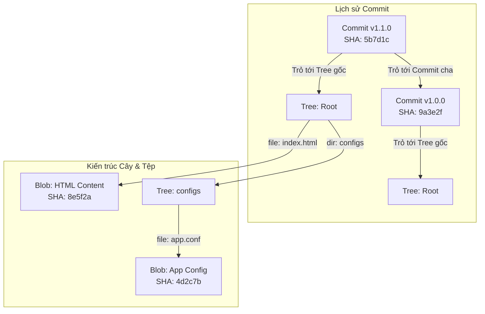

# 🐙 Sub-module 03: Git Workflow — Cơ Chế Lưu Trữ Lõi Git & Quy Trình Làm Việc Phân Nhánh Bảo Mật

> **Mục tiêu (Objectives)**: Hiểu sâu sắc cơ chế lưu trữ đối tượng bên dưới của Git, làm chủ phương pháp xác thực bảo mật (SSH, GPG Sign) và áp dụng chiến lược phân nhánh an toàn (Gitflow, Protected Branches) trong quy trình phát triển phần mềm hiện đại.

---

## 1. Cơ chế Lưu trữ Nội bộ của Git (Git Internals — Deep Dive)

Không giống như các hệ thống quản lý mã nguồn truyền thống lưu trữ dữ liệu dưới dạng các bản vá lỗi (diffs), Git coi dữ liệu như một **chuỗi ảnh chụp nhanh (Snapshots)** của toàn bộ hệ thống file dự án. Bên trong thư mục ẩn `.git/objects/`, Git lưu trữ tất cả mã nguồn và lịch sử dưới dạng một cơ sở dữ liệu định địa chỉ bằng nội dung (**Content-Addressable Database**) sử dụng mã băm mã hóa **SHA-1 (160-bit)** làm chìa khóa.

Có 3 loại đối tượng cốt lõi cấu thành nên mọi dự án Git:

### A. Ba đối tượng cốt lõi (Blobs, Trees, and Commits)
1.  **Đối tượng dữ liệu thô (Blob Object — Binary Large Object)**:
    *   *Bản chất:* Chỉ lưu trữ duy nhất nội dung thô (raw content) của một tệp tin (dưới dạng các byte nhị phân được nén). Blob **hoàn toàn không chứa** tên tệp tin, đường dẫn thư mục, hay phân quyền file.
2.  **Đối tượng cây thư mục (Tree Object)**:
    *   *Bản chất:* Đóng vai trò như một thư mục trong hệ điều hành. Một đối tượng Tree chứa danh sách các bản ghi trỏ tới: tên file, phân quyền file, mã băm SHA-1 của các đối tượng Blob tương ứng, hoặc trỏ tới các đối tượng Tree con khác (thư mục con).
3.  **Đối tượng ảnh chụp lịch sử (Commit Object)**:
    *   *Bản chất:* Lưu trữ thông tin siêu dữ liệu (Metadata) bao gồm: Tên tác giả (Author), ngày giờ commit, thông điệp giải thích (Commit Message), một con trỏ trỏ tới đối tượng **Tree gốc** (ảnh chụp toàn bộ dự án tại thời điểm đó), và các con trỏ trỏ tới **Commit cha** (Parent Commits) để xâu chuỗi lịch sử lịch trình.

---

### B. Sơ đồ liên kết đối tượng trong Cơ sở dữ liệu Git



---

## 2. Xác thực & Bảo mật trong Git (Git Security & Authentication)

Mã nguồn là tài sản trí tuệ tối quan trọng của doanh nghiệp. Bảo vệ quyền truy cập và xác thực danh tính người đóng góp mã nguồn (Contributors) là bắt buộc trong DevSecOps:

### A. Xác thực bằng SSH Keys bất đối xứng (SSH Authentication)
Tránh sử dụng giao thức HTTPS đăng nhập bằng mật khẩu hoặc Personal Access Token dễ bị rò rỉ. Hãy sử dụng giao thức **SSH (Secure Shell)**:
*   **Nguyên lý mã hóa bất đối xứng**: Bạn tạo ra một cặp khóa gồm:
    *   `id_ed25519` (**Private Key - Khóa bí mật**): Lưu giữ tuyệt mật trên máy cá nhân của bạn, phân quyền nghiêm ngặt (`chmod 600`) ngăn chặn copy trái phép.
    *   `id_ed25519.pub` (**Public Key - Khóa công khai**): Đăng ký cấu hình lên GitHub/GitLab.
*   Khi bạn push code, Git sử dụng thuật toán ký số Ed25519 hoặc RSA để chứng thực danh tính mà không bao giờ gửi khóa bí mật qua mạng internet.

### B. Ký số Commit bằng khóa GPG (GPG Signing Commits)
*   *Lỗ hổng giả mạo:* Mặc định, Git cho phép bạn tự khai báo tên và email qua lệnh `git config user.email`. Kẻ tấn công có thể dễ dàng viết script commit mạo danh email của CEO hoặc Trưởng dự án để đưa mã độc vào hệ thống.
*   *Giải pháp:* Sử dụng **GPG (GNU Privacy Guard)** để tạo khóa ký số cá nhân. Mỗi khi bạn commit, Git sẽ dùng khóa GPG của bạn để đóng dấu chữ ký điện tử lên commit đó. GitHub/GitLab sẽ hiển thị nhãn **Verified (Đã xác thực)** màu xanh lá cây kế bên commit để bảo đảm mã nguồn không bị mạo danh hay can thiệp.

---

## 3. Chiến lược Phân nhánh Bảo mật (Gitflow & Protected Branches)

Để nhiều kỹ sư cùng phát triển dự án mà không gây xung đột mã nguồn và đảm bảo mã nguồn đưa lên Production luôn an toàn, ta áp dụng mô hình phân nhánh **Gitflow**:

```
[ Nhánh main ]      -----------------------●-------------------> (Production)
                                          ^ (Hotfix/Merge)
[ Nhánh develop ]   ---------●-------------●-------------------> (Staging)
                            / \           /
[ Nhánh feature ]  --------●---●---------●---------------------> (Local Development)
```

### A. Các nhánh tiêu chuẩn trong Gitflow
*   **Nhánh `main` (hoặc `master`)**: Nhánh lưu trữ mã nguồn chạy thực tế trên Production. Chỉ chứa các commit hoàn toàn ổn định và được gắn tag phiên bản (v.d. `v1.0.0`).
*   **Nhánh `develop`**: Nhánh tích hợp mã nguồn của tất cả các tính năng mới phục vụ chạy thử nghiệm (Staging/UAT).
*   **Nhánh `feature/*`**: Các nhánh phụ độc lập do lập trình viên tự tạo để phát triển tính năng riêng lẻ (v.d. `feature/login-page`), sau khi hoàn thành sẽ gộp ngược lại develop.
*   **Nhánh `hotfix/*`**: Nhánh vá lỗi khẩn cấp trực tiếp từ `main` để sửa lỗi Production lập tức, sau đó gộp vào cả `main` và `develop`.

### B. Cơ chế Bảo vệ Nhánh (Protected Branches Rule)
Trong DevSecOps, ta bắt buộc phải cấu hình quy tắc bảo vệ nhánh (**Branch Protection Rules**) cho nhánh `main` và `develop` trên GitHub/GitLab:
1.  **Cấm Push trực tiếp (Block Direct Push)**: Không cho phép bất kỳ ai, kể cả Admin, được push code trực tiếp lên `main`/`develop`.
2.  **Bắt buộc thông qua Pull Request (Require PR/Merge Request)**: Mọi thay đổi mã nguồn phải được gửi dưới dạng đề xuất PR từ nhánh feature.
3.  **Ký duyệt mã nguồn (Require Code Review)**: PR chỉ được phép gộp (merge) sau khi có tối thiểu **1 đến 2 kỹ sư cao cấp** xem xét, phản biện và bấm nút phê duyệt (Approve).
4.  **Tích hợp quét bảo mật tự động (Require Status Checks)**: Bắt buộc hệ thống CI/CD phải chạy thành công (bao gồm quét lỗ hổng bảo mật SAST/SCA và chạy Unit Tests) trước khi cho phép merge code (Shift-left Security).

---

## 4. Sổ Tay Git & GitHub Căn Bản (Git CLI Handbook Từ Zero)

Để làm việc chuyên nghiệp trong ngành DevOps/SecOps, bạn không thể chỉ phụ thuộc vào giao diện kéo thả trực quan (như VS Code Git UI hay SourceTree) mà bắt buộc phải hiểu rõ và làm chủ dòng lệnh Git CLI. Dưới đây là hướng dẫn từng bước từ con số 0.

### A. Khởi tạo & Thiết lập Ban đầu (Initialization & Configuration)

*   `git init`:
    *   *Ý nghĩa:* Khởi tạo một kho lưu trữ Git cục bộ (**Local Repository**) ngay tại thư mục hiện hành. Lệnh này sẽ tạo ra một thư mục ẩn có tên `.git/` để bắt đầu quản lý lịch sử dự án.
*   `git config`: Thiết lập thông tin cá nhân. Đây là việc đầu tiên bạn phải làm sau khi cài đặt Git để hệ thống ghi nhận chính xác danh tính tác giả của mỗi commit.
    *   *Cú pháp chuyên dụng:*
        ```bash
        git config --global user.name "Nguyen Van A"
        git config --global user.email "a.nguyen@company.com"
        ```
    *   *Giải thích cờ:* Cờ `--global` áp dụng cấu hình này cho mọi dự án Git trên máy tính cá nhân của bạn. Nếu muốn cấu hình riêng cho một dự án cụ thể, hãy bỏ cờ `--global` đi.

### B. Vòng đời Tập tin trong Git & Lưu trữ Cục bộ (Git File Lifecycle)

Để quản lý code hiệu quả, bạn cần nắm vững quy trình luân chuyển tệp tin qua **3 khu vực cốt lõi** của Git:

```
[ Working Directory ]  --- git add --->  [ Staging Area ]  --- git commit --->  [ Local Repository ]
(Thư mục làm việc thực tế)              (Khu vực chuẩn bị)                     (Kho lưu trữ lịch sử)
```

1.  **Trạng thái 1: Working Directory (Thư mục làm việc)**:
    *   Là nơi bạn đang trực tiếp tạo mới, sửa đổi hoặc xóa các file code trên máy tính. Các file mới tạo ở đây được gọi là **Untracked files** (Git chưa theo dõi).
2.  **Trạng thái 2: Staging Area (Khu vực chuẩn bị)**:
    *   Nơi tập hợp các thay đổi được bạn lựa chọn để chuẩn bị đóng gói thành một phiên bản. Bạn sử dụng lệnh `git add` để đưa file từ Working Directory vào Staging Area.
    *   *Cú pháp thông dụng:*
        *   `git add file_name.py`: Chỉ đưa duy nhất file cụ thể vào danh sách chuẩn bị.
        *   `git add .`: Đưa **toàn bộ** các file có thay đổi hoặc file mới tạo trong thư mục hiện tại và các thư mục con vào Staging Area.
3.  **Trạng thái 3: Local Repository (Kho lưu trữ cục bộ)**:
    *   Khi bạn đã gom đủ các thay đổi cần thiết vào Staging Area, bạn tiến hành "đóng dấu ảnh chụp nhanh" để lưu vĩnh viễn vào lịch sử bằng lệnh `git commit`.
    *   *Cú pháp chuyên dụng:* `git commit -m "feat: add secure authentication login module"`
    *   *Mẹo viết commit:* Tham số `-m` viết tắt của *Message*. Thông điệp commit nên ngắn gọn, súc tích và tuân theo tiêu chuẩn Conventional Commits (ví dụ: `feat:` cho tính năng mới, `fix:` cho sửa lỗi, `docs:` cho cập nhật tài liệu).

### C. Quản lý Nhánh Cục bộ (Branching & Merging)

*   `git branch`: Quản lý các nhánh độc lập.
    *   `git branch`: Liệt kê tất cả các nhánh hiện có trong dự án local của bạn (nhánh bạn đang đứng sẽ có dấu sao `*` và tô màu xanh).
    *   `git branch <branch-name>`: Tạo một nhánh mới từ nhánh hiện tại nhưng **chưa** chuyển sang nhánh đó.
*   `git checkout`: Chuyển đổi qua lại giữa các nhánh hoặc khôi phục tệp tin.
    *   `git checkout <branch-name>`: Chuyển Terminal làm việc sang nhánh chỉ định.
    *   *Cú pháp kết hợp chuyên dụng:* `git checkout -b feature/jwt-login`
        *   *Ý nghĩa:* Cờ `-b` (branch) cho phép bạn **vừa tạo mới nhánh vừa chuyển sang nhánh đó ngay lập tức** chỉ với 1 câu lệnh duy nhất.
*   `git merge`: Gộp các thay đổi từ một nhánh khác vào nhánh hiện tại.
    *   *Ví dụ:* Khi bạn đang đứng ở nhánh `develop` và muốn gộp code từ nhánh `feature/jwt-login` về, bạn chạy lệnh: `git merge feature/jwt-login`.

### D. Tương tác với Remote Repository (GitHub/GitLab)

Để đưa mã nguồn từ máy cá nhân lên các nền tảng lưu trữ đám mây hoặc máy chủ trung tâm:

*   `git remote`: Quản lý các liên kết đến máy chủ từ xa (Remote Repositories).
    *   *Cú pháp chuyên dụng:* `git remote add origin git@github.com:username/repo-name.git`
    *   *Ý nghĩa:* Liên kết Local Repository của bạn với một Remote Repository và đặt tên định danh cho nó là `origin` (đây là tên mặc định tiêu chuẩn trong Git).
*   `git push`: Đẩy toàn bộ các commit từ máy cá nhân lên máy chủ từ xa.
    *   *Cú pháp chuyên dụng:* `git push -u origin develop`
    *   *Giải thích cờ:* Cờ `-u` (upstream) giúp thiết lập mối liên kết theo dõi mặc định giữa nhánh `develop` local và nhánh `develop` trên remote `origin`. Ở những lần push/pull tiếp theo trên nhánh này, bạn chỉ cần gõ đơn giản là `git push` hoặc `git pull` mà không cần ghi rõ tên remote hay tên nhánh.
*   `git pull`: Kéo toàn bộ các thay đổi mới nhất từ máy chủ từ xa về máy cá nhân của bạn và tự động thực hiện gộp (merge) vào nhánh hiện tại. Nên chạy lệnh này thường xuyên trước khi bắt đầu viết code mới để tránh xung đột mã nguồn (Merge Conflict).

### E. Lệnh Cứu Hộ Git Tiêu Biểu (Git Rescue & Inspection)

*   `git status`: Người bạn thân thiết nhất của mọi lập trình viên. Cho biết bạn đang đứng ở nhánh nào, các file nào đang bị thay đổi chưa add, các file nào đã add vào Staging Area và sẵn sàng commit. Hãy chạy lệnh này liên tục sau mỗi thao tác!
*   `git log`: Xem lịch sử commit của dự án.
    *   *Cú pháp chuyên dụng:* `git log --oneline -n 5`
    *   *Ý nghĩa:* In ra danh sách lịch sử commit rút gọn (chỉ hiển thị 7 ký tự SHA-1 đầu tiên và commit message) giới hạn đúng 5 commit gần nhất, giúp giao diện Terminal cực kỳ gọn gàng.
*   `git restore`: Hủy bỏ các thay đổi tạm thời trên file ở Working Directory.
    *   *Ví dụ:* Bạn lỡ tay sửa bậy vào file `config.py` và muốn khôi phục lại trạng thái cũ giống như commit gần nhất, hãy chạy: `git restore config.py`.
*   `git reset`: Rút file ra khỏi Staging Area hoặc quay ngược lịch sử commit.
    *   `git reset HEAD config.py`: Đưa file từ Staging Area quay lại Working Directory (hủy lệnh `git add` nhầm).
    *   ⚠️ *Lệnh quay ngược thời gian nâng cao:* `git reset --soft HEAD~1` và `git reset --hard HEAD~1` (Quay ngược dự án về trước 1 commit):
        *   `--soft`: Giữ nguyên toàn bộ code bạn đã viết của commit bị hủy ở Working Directory/Staging để bạn sửa lại và commit mới. Cực kỳ an toàn.
        *   `--hard`: **Xóa vĩnh viễn** toàn bộ code bạn đã viết của commit bị hủy, khôi phục cứng về commit cũ. Hãy hết sức cẩn thận, chạy lệnh này sai sẽ làm mất code vĩnh viễn!

---

## 5. Câu hỏi tự ôn tập & Kiểm tra kiến thức
1. *Tại sao đối tượng Blob trong Git lại không lưu trữ tên tệp tin? Cấu trúc nào trong Git đảm nhận nhiệm vụ liên kết tên file với nội dung Blob?*
2. *Nguy cơ an ninh gì xảy ra nếu bạn vô tình chia sẻ hoặc bị rò rỉ khóa bí mật Private Key SSH của mình lên mạng internet?*
3. *Tại sao quy tắc bảo vệ nhánh Protected Branch kết hợp bắt buộc Code Review lại là tấm khiên phòng thủ vững chắc ngăn chặn mã độc lọt vào Production?*
4. *Giải thích sự khác biệt cốt lõi giữa hai lệnh `git reset --soft HEAD~1` và `git reset --hard HEAD~1`. Trong tình huống nào bạn tuyệt đối KHÔNG được dùng `--hard`?*

---

## 6. Tài nguyên Đọc thêm Chất lượng cao (Recommended Blog Readings)

### 🇻🇳 [Mô Hình Quản Lý Nhánh Git Thành Công (A Successful Git Branching Model - Git Flow)](./blog/git-flow-branching-model.md)
*   **Chi tiết**: Bản dịch thuật & trình bày chuyên sâu 100% tiếng Việt của bài blog kinh điển toàn cầu về mô hình phân nhánh Git Flow bởi tác giả Vincent Driessen, lưu trữ cục bộ.
*   **Giá trị thực tiễn**: Nắm vững nguyên lý tổ chức các nhánh `main`, `develop`, `feature/*`, `release/*` và `hotfix/*` để cộng tác nhóm an toàn trong môi trường DevSecOps doanh nghiệp.
*   **Liên kết nguồn gốc**: [nvie.com - A successful Git branching model](https://nvie.com/posts/a-successful-git-branching-model/)

