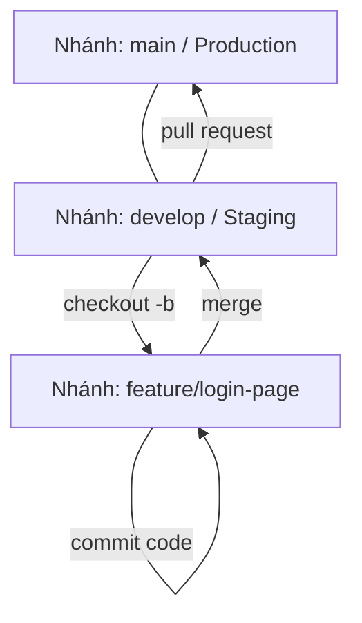

# 🧪 Lab 1.3: Quy Trình Phân Nhánh Git Flow An Toàn (Git Flow Collaboration Lab)

## 📌 Lý do bài thực hành này tồn tại (Why this Lab?)
Trong môi trường phát triển dự án thực tế, nhiều kỹ sư cùng làm việc chung trên một kho lưu trữ (repository). Nếu không có quy trình phân nhánh rõ ràng, mã nguồn sẽ dễ dàng bị xung đột (conflict), mã nguồn thử nghiệm chưa ổn định có thể vô tình được đẩy thẳng lên môi trường Production gây treo hệ thống.
Bài lab này hướng dẫn bạn cách áp dụng mô hình phân nhánh **Git Flow** kinh điển để cộng tác phát triển tính năng an toàn, phân chia rõ rệt các môi trường phát triển (Development) và phát hành (Production).

---

## ⚙️ Sơ đồ Quy trình Git Flow


---

## 🛠️ Các bước Thực hành Chi tiết

### Bước 1: Khởi tạo Repository Local
Chúng ta sẽ bắt đầu tạo một thư mục trống và khởi tạo môi trường Git:
```bash
# Khởi tạo repo Git mới và di chuyển vào trong
git init secure-project && cd secure-project

# Tạo file README đầu tiên
echo "# Secure Project" > README.md
git add README.md
git commit -m "initial commit"
```
*Lúc này, nhánh mặc định ban đầu là `main` (hoặc `master` tùy cấu hình Git).*

### Bước 2: Khởi tạo Nhánh Phát triển (develop)
Nhánh `develop` là nơi tích hợp toàn bộ các tính năng mới đang được phát triển trước khi sẵn sàng phát hành.
```bash
# Tạo và chuyển sang nhánh develop
git checkout -b develop
```

### Bước 3: Phát triển Tính năng trên Nhánh feature độc lập
Khi cần làm một nhiệm vụ cụ thể (ví dụ: xây dựng giao diện đăng nhập), bạn **tuyệt đối không được code trực tiếp trên `develop` hay `main`**, mà phải tạo một nhánh tính năng riêng:
```bash
# Tạo nhánh tính năng từ develop
git checkout -b feature/login-page

# Viết mã nguồn cho tính năng (Ví dụ tạo giao diện login)
echo "<h1>Secured Login Page</h1>" > login.html

# Lưu trữ các thay đổi
git add login.html
git commit -m "feat: add login page web interface"
```

### Bước 4: Tích hợp Tính năng về Nhánh develop
Sau khi hoàn thành và kiểm thử tính năng hoạt động tốt, tiến hành tích hợp mã nguồn về nhánh phát triển chung:
```bash
# Quay trở lại nhánh phát triển
git checkout develop

# Tiến hành gộp (merge) nhánh tính năng
git merge feature/login-page
```
*Kết quả: Nhánh `develop` đã chứa file `login.html` an toàn.*

### Bước 5: Dọn dẹp Nhánh Tính năng
Để giữ cho repository gọn gàng, hãy xóa nhánh tính năng sau khi đã merge thành công:
```bash
git branch -d feature/login-page
```

---

## 🎯 Tổng kết Bài học
Qua bài thực hành này, bạn đã:
*   Hiểu rõ cấu trúc phân nhánh cơ bản của **Git Flow**.
*   Sử dụng thành thạo các câu lệnh điều phối nhánh: `git checkout -b`, `git merge`, `git branch -d`.
*   Xây dựng tư duy làm việc nhóm an toàn: Cô lập các tính năng đang phát triển để bảo vệ sự ổn định của luồng code chính.
