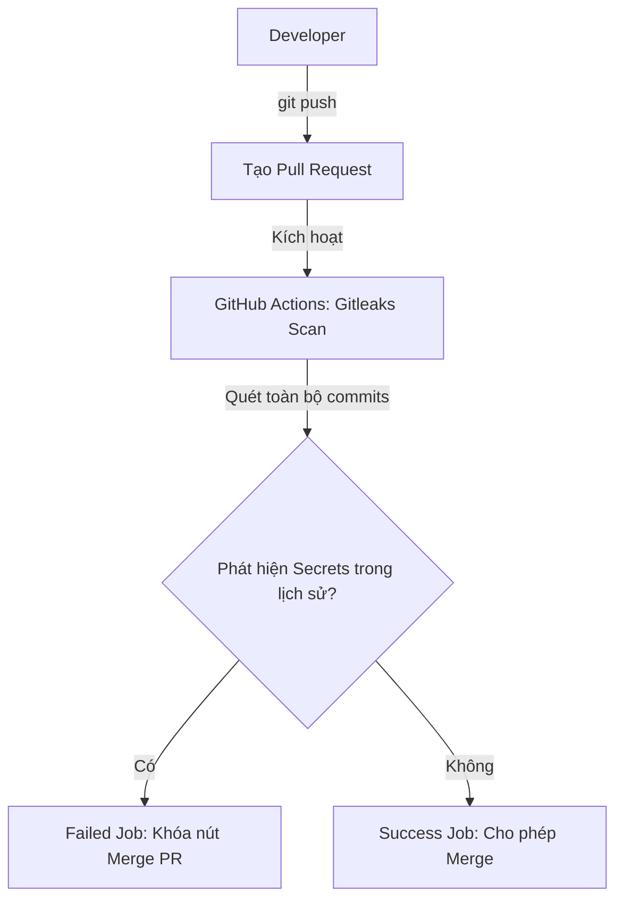

# 🧪 Lab 1.5: Pipeline Tự Động Quét Secrets Trên Toàn Bộ Lịch Sử Git (Gitleaks Action Pipeline)

## 📌 Lý do bài thực hành này tồn tại (Why this Lab?)
Mặc dù Git Hook cục bộ (pre-commit) hoạt động rất tốt, nhưng lập trình viên vẫn có thể bỏ qua (bypass) nó bằng lệnh `git commit --no-verify`, hoặc quên cấu hình hook trên máy mới.
Vì vậy, hệ thống **CI/CD Pipeline** đóng vai trò là **Chốt chặn Bảo vệ Cuối cùng (Last Line of Defense)**. Khi lập trình viên tạo Pull Request (PR) đẩy code lên GitHub, pipeline sẽ tự động quét toàn bộ lịch sử commit của PR đó. Nếu phát hiện bất kỳ API Key hay mật khẩu nào (kể cả đã bị commit từ lâu trong quá khứ), pipeline sẽ báo lỗi đỏ (Failed) và chặn không cho phép merge nhánh code.

---

## ⚙️ Sơ đồ Quy trình Pipeline Security


---

## 🛠️ Các bước Thực hành Chi tiết

### Bước 1: Chuẩn bị Repository trên GitHub
1. Truy cập [GitHub](https://github.com/) và tạo một repository mới (ví dụ: `devsecops-secret-scan`).
2. Clone repository đó về máy cục bộ của bạn và di chuyển vào thư mục dự án:
```bash
git clone https://github.com/<your-username>/devsecops-secret-scan.git
cd devsecops-secret-scan
```

### Bước 2: Tạo Cấu hình Workflow GitHub Actions
Chúng ta sẽ tạo file định nghĩa Pipeline chạy tự động trên môi trường GitHub.
1. Tạo cấu trúc thư mục workflow của GitHub:
```bash
mkdir -p .github/workflows
```
2. Tạo file cấu hình `.github/workflows/secret-scan.yml` và sao chép cấu hình chuyên nghiệp dưới đây:
```yaml
name: Gitleaks Secret Scanner

on:
  push:
    branches: [ main, develop ]
  pull_request:
    branches: [ main, develop ]

jobs:
  gitleaks-scan:
    name: Scan Commits for Secrets
    runs-on: ubuntu-latest
    steps:
      - name: Checkout Code
        uses: actions/checkout@v3
        with:
          fetch-depth: 0 # QUAN TRỌNG: Kéo toàn bộ lịch sử commit để quét triệt để, không chỉ commit cuối cùng!

      - name: Run Gitleaks Security Scan
        uses: gitleaks/gitleaks-action@v2
        env:
          GITHUB_TOKEN: ${{ secrets.GITHUB_TOKEN }}
```

### Bước 3: Đẩy cấu hình Pipeline lên GitHub
```bash
git add .github/workflows/secret-scan.yml
git commit -m "feat: add Gitleaks secret scanner pipeline"
git push origin main
```
*Hãy truy cập vào tab **Actions** trên giao diện Web của repository GitHub, bạn sẽ thấy pipeline đầu tiên đang khởi chạy quét lịch sử và báo trạng thái xanh thành công (Success) do chưa có lỗi.*

### Bước 4: Giả lập Tình huống Rò rỉ Secrets trong Lịch sử Commit
Bây giờ, chúng ta sẽ mô phỏng hành vi của một developer vô ý commit key nhạy cảm, sau đó nhận ra lỗi và cố gắng xóa key đi ở commit tiếp theo nhằm "qua mặt" kiểm duyệt.

1. **Commit 1: Vô ý hardcode Secrets:**
```bash
git checkout -b feature/payment-gateway
echo "STRIPE_SECRET_KEY = \"sk_test_51HjhFSD908123490FDSKJDHF\"" > payment-config.js
git add payment-config.js
git commit -m "feat: integrate stripe payment gateway keys"
```

2. **Commit 2: Xóa key đi để che giấu:**
```bash
# Sửa đổi file, xóa key đi
echo "// Stripe key has been removed for security" > payment-config.js
git add payment-config.js
git commit -m "refactor: remove raw api key from config"
```
*Lúc này, ở trạng thái hiện tại (Working directory), file code của bạn đã hoàn toàn sạch sẽ, không còn key nữa.*

3. **Đẩy nhánh lên GitHub và tạo Pull Request:**
```bash
git push origin feature/payment-gateway
```
*Truy cập GitHub giao diện Web, tạo một **Pull Request (PR)** từ nhánh `feature/payment-gateway` về nhánh `main`.*

### Bước 5: Quan sát chốt chặn bảo mật hoạt động
Ngay khi PR được tạo, GitHub Actions sẽ tự động kích hoạt job **Scan Commits for Secrets**.
1. Đợi khoảng 10-15 giây, bạn sẽ thấy job quét bị báo đỏ thất bại (**Failed**).
2. Click vào chi tiết log của Gitleaks Action, bạn sẽ thấy nó in ra chính xác:
   - **Lỗi phát hiện**: `Stripe API Key`
   - **Vị trí rò rỉ**: Ở file `payment-config.js`
   - **Commit dính lỗi**: Chính là commit đầu tiên `feat: integrate stripe payment gateway keys` mặc dù file hiện tại đã xóa key.
3. Nút **Merge Pull Request** trên GitHub sẽ bị khóa (hoặc hiển thị cảnh báo đỏ tùy cấu hình bảo mật của repo), ngăn chặn tuyệt đối mã nguồn dính lỗi đi vào nhánh chính.

---

## 🎯 Tổng kết Bài học
Qua bài thực hành này, bạn đã:
*   Xây dựng thành công Pipeline **GitHub Actions** tự động quét mã nguồn.
*   Hiểu rõ tầm quan trọng của cấu hình `fetch-depth: 0` để kéo và quét toàn bộ lịch sử Git.
*   Thực chứng được khả năng "nhìn thấu khứu giác" của Gitleaks khi nó phát hiện được secrets nằm sâu trong các commits cũ đã bị ghi đè.
*   Hiện thực hóa chốt chặn an toàn vững chắc nhất cho dự án phần mềm cộng tác doanh nghiệp.
