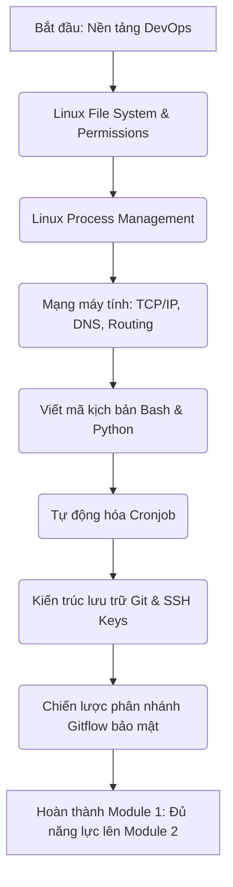

# 🎯 Module 01: Nền Tảng DevOps (DevOps Fundamentals)

> **"Một ngôi nhà cao tầng không thể đứng vững trên một nền móng yếu ớt."** 
> Trước khi bước vào thế giới phức tạp của Containerization, CI/CD, Infrastructure as Code, hay Kubernetes, một kỹ sư DevSecOps bắt buộc phải làm chủ các kỹ năng nền tảng: Sử dụng hệ điều hành Linux, hiểu bản chất mạng máy tính, có khả năng viết mã tự động hóa (scripting), và kiểm soát lịch sử mã nguồn (Git) một cách an toàn.

---

## 📌 Tại sao DevSecOps cần Nền tảng này?

1.  **Hệ điều hành Linux (Linux OS)**: Hơn 90% container chạy trên môi trường Linux. Bạn không thể gia cố bảo mật container nếu không hiểu về phân quyền tập tin (File Permissions), kiến trúc phân cấp thư mục (Filesystem Hierarchy Standard), và cách quản lý tiến trình.
2.  **Mạng máy tính (Networking)**: Mọi cuộc tấn công mạng đều bắt đầu từ luồng traffic. Nắm vững mô hình TCP/IP, DNS, Routing, và các cổng giao thức (Ports) giúp bạn thiết lập tường lửa và cô lập mạng an toàn.
3.  **Tự động hóa (Scripting & Automation)**: Triết lý của DevOps là tự động hóa mọi tác vụ lặp đi lặp lại. Viết mã kịch bản Bash/Python giúp bạn tự động hóa việc quét mã độc, backup dữ liệu và giám sát hệ thống.
4.  **Quản lý mã nguồn (Git Workflow)**: Git là "nguồn gốc của sự thật" (Source of Truth). Toàn bộ hạ tầng và mã nguồn của bạn nằm trên Git. Bảo vệ mã nguồn khỏi rò rỉ khóa bí mật (secrets leaks) và quản lý phân nhánh an toàn là bước đầu tiên của Shift-left Security.

---

## 🗺️ Bản đồ Lộ trình học tập (Roadmap)

---

## 📂 Danh sách các bài học & Thực hành chi tiết

Bạn sẽ được dẫn dắt qua 3 Sub-module lớn từ lý thuyết sâu đến các bài Lab thực hành local tự thao tác 100%:

### 1. Sub-module 01: [linux-networking](file:///e:/VSC/DevSecOps_Tutorials_Vietnamese-version/01-fundamentals/linux-networking/linux-networking-guide.md) (Hệ điều hành & Mạng máy tính)
*   **Lý thuyết chuyên sâu**: Cấu trúc thư mục Linux, phân quyền nâng cao (Chown, Chmod, SUID/SGID), cơ chế phân giải tên miền (DNS Resolution), quá trình bắt tay 3 bước (TCP Three-way Handshake).
*   🧪 **Thực hành Lab**: [Phân tích & Xử lý sự cố mạng nội bộ (Linux Networking Troubleshooting)](file:///e:/VSC/DevSecOps_Tutorials_Vietnamese-version/01-fundamentals/linux-networking/labs/lab-linux-troubleshooting/lab-instructions.md).

### 2. Sub-module 02: [scripting-automation](file:///e:/VSC/DevSecOps_Tutorials_Vietnamese-version/01-fundamentals/scripting-automation/scripting-automation-guide.md) (Tự động hóa bằng Bash/Python)
*   **Lý thuyết chuyên sâu**: Cú pháp kịch bản Bash (Variables, Loops, Conditions), lập trình tự động hóa Python cơ bản, và cơ chế lập lịch tác vụ tự động (Cron Utility/Crontab).
*   🧪 **Thực hành Lab**: [Viết script tự động sao lưu cấu hình & Lập lịch định kỳ an toàn](file:///e:/VSC/DevSecOps_Tutorials_Vietnamese-version/01-fundamentals/scripting-automation/labs/lab-auto-backup-script/lab-instructions.md).

### 3. Sub-module 03: [git-workflow](file:///e:/VSC/DevSecOps_Tutorials_Vietnamese-version/01-fundamentals/git-workflow/git-workflow-guide.md) (Quản lý mã nguồn & Gitflow bảo mật)
*   **Lý thuyết chuyên sâu**: Cơ chế lưu trữ nội bộ của Git (Git Internals - Blobs, Trees, Commits), xác thực an toàn bằng SSH Keys, chiến lược phân nhánh bảo mật (Gitflow branching strategy) và ký số Commit bằng GPG.
*   🧪 **Thực hành Lab**: [Giả lập quy trình làm việc nhóm & Xử lý xung đột mã nguồn (Git Collaboration & Conflict Resolution)](file:///e:/VSC/DevSecOps_Tutorials_Vietnamese-version/01-fundamentals/git-workflow/labs/lab-git-collaboration/lab-instructions.md).
