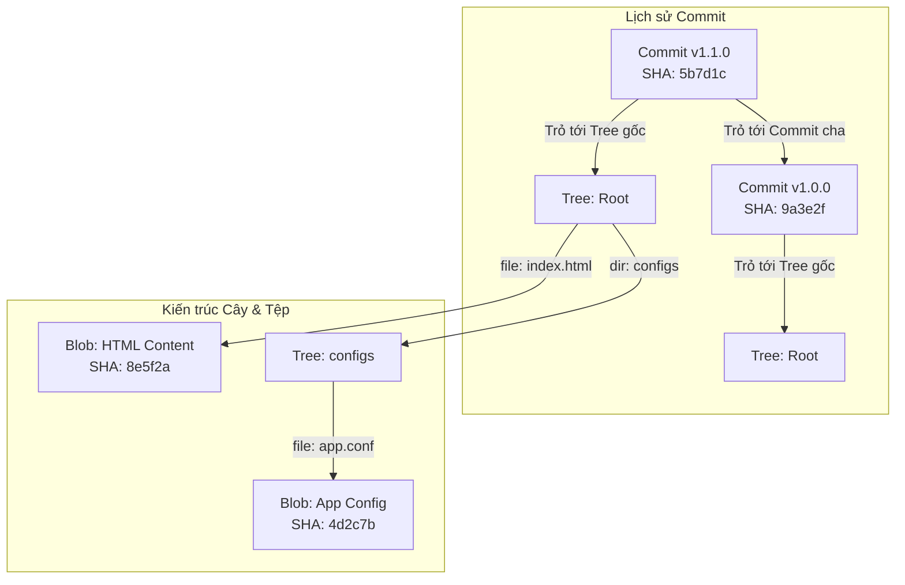

# 🐙 Sub-module 03: Git Workflow — Cơ Chế Lưu Trữ Lõi Git & Quy Trình Làm Việc Phân Nhánh Bảo Mật

> **Mục tiêu (Objectives)**: Hiểu sâu sắc cơ chế lưu trữ đối tượng bên dưới của Git, làm chủ phương pháp xác thực bảo mật (SSH, GPG Sign) và áp dụng chiến lược phân nhánh an toàn (Gitflow, Protected Branches) trong quy trình phát triển phần mềm hiện đại.

---

## 1. Cơ chế Lưu trữ Nội bộ của Git (Git Internals — Deep Dive)

Không giống như các hệ thống quản lý mã nguồn truyền thống lưu trữ dữ liệu dưới dạng các bản vá lỗi (diffs), Git coi dữ liệu như một **chuỗi ảnh chụp nhanh (Snapshots)** của toàn bộ hệ thống file dự án. Bên trong thư mục ẩn `.git/objects/`, Git lưu trữ tất cả mã nguồn và lịch sử dưới dạng một cơ sở dữ liệu định địa chỉ bằng nội dung (**Content-Addressable Database**) sử dụng mã băm mã hóa **SHA-1 (160-bit)** làm chìa khóa.

Có 3 loại đối tượng cốt lõi cấu thành nên mọi dự án Git:

### A. Ba đối tượng cốt lõi (Blobs, Trees, and Commits)
1.  **Đối tượng dữ liệu thô (Blob Object — Binary Large Object)**:
    *   *Bản chất:* Chỉ lưu trữ duy nhất nội dung thô (raw content) của một tệp tin (dưới dạng các byte nhị phân được nén). Blob **hoàn toàn không chứa** tên tệp tin, đường dẫn thư mục, hay phân quyền file.
2.  **Đối tượng cây thư mục (Tree Object)**:
    *   *Bản chất:* Đóng vai trò như một thư mục trong hệ điều hành. Một đối tượng Tree chứa danh sách các bản ghi trỏ tới: tên file, phân quyền file, mã băm SHA-1 của các đối tượng Blob tương ứng, hoặc trỏ tới các đối tượng Tree con khác (thư mục con).
3.  **Đối tượng ảnh chụp lịch sử (Commit Object)**:
    *   *Bản chất:* Lưu trữ thông tin siêu dữ liệu (Metadata) bao gồm: Tên tác giả (Author), ngày giờ commit, thông điệp giải thích (Commit Message), một con trỏ trỏ tới đối tượng **Tree gốc** (ảnh chụp toàn bộ dự án tại thời điểm đó), và các con trỏ trỏ tới **Commit cha** (Parent Commits) để xâu chuỗi lịch sử lịch trình.

---

### B. Sơ đồ liên kết đối tượng trong Cơ sở dữ liệu Git



---

## 2. Xác thực & Bảo mật trong Git (Git Security & Authentication)

Mã nguồn là tài sản trí tuệ tối quan trọng của doanh nghiệp. Bảo vệ quyền truy cập và xác thực danh tính người đóng góp mã nguồn (Contributors) là bắt buộc trong DevSecOps:

### A. Xác thực bằng SSH Keys bất đối xứng (SSH Authentication)
Tránh sử dụng giao thức HTTPS đăng nhập bằng mật khẩu hoặc Personal Access Token dễ bị rò rỉ. Hãy sử dụng giao thức **SSH (Secure Shell)**:
*   **Nguyên lý mã hóa bất đối xứng**: Bạn tạo ra một cặp khóa gồm:
    *   `id_ed25519` (**Private Key - Khóa bí mật**): Lưu giữ tuyệt mật trên máy cá nhân của bạn, phân quyền nghiêm ngặt (`chmod 600`) ngăn chặn copy trái phép.
    *   `id_ed25519.pub` (**Public Key - Khóa công khai**): Đăng ký cấu hình lên GitHub/GitLab.
*   Khi bạn push code, Git sử dụng thuật toán ký số Ed25519 hoặc RSA để chứng thực danh tính mà không bao giờ gửi khóa bí mật qua mạng internet.

### B. Ký số Commit bằng khóa GPG (GPG Signing Commits)
*   *Lỗ hổng giả mạo:* Mặc định, Git cho phép bạn tự khai báo tên và email qua lệnh `git config user.email`. Kẻ tấn công có thể dễ dàng viết script commit mạo danh email của CEO hoặc Trưởng dự án để đưa mã độc vào hệ thống.
*   *Giải pháp:* Sử dụng **GPG (GNU Privacy Guard)** để tạo khóa ký số cá nhân. Mỗi khi bạn commit, Git sẽ dùng khóa GPG của bạn để đóng dấu chữ ký điện tử lên commit đó. GitHub/GitLab sẽ hiển thị nhãn **Verified (Đã xác thực)** màu xanh lá cây kế bên commit để bảo đảm mã nguồn không bị mạo danh hay can thiệp.

---

## 3. Chiến lược Phân nhánh Bảo mật (Gitflow & Protected Branches)

Để nhiều kỹ sư cùng phát triển dự án mà không gây xung đột mã nguồn và đảm bảo mã nguồn đưa lên Production luôn an toàn, ta áp dụng mô hình phân nhánh **Gitflow**:

```
[ Nhánh main ]      -----------------------●-------------------> (Production)
                                          ^ (Hotfix/Merge)
[ Nhánh develop ]   ---------●-------------●-------------------> (Staging)
                            / \           /
[ Nhánh feature ]  --------●---●---------●---------------------> (Local Development)
```

### A. Các nhánh tiêu chuẩn trong Gitflow
*   **Nhánh `main` (hoặc `master`)**: Nhánh lưu trữ mã nguồn chạy thực tế trên Production. Chỉ chứa các commit hoàn toàn ổn định và được gắn tag phiên bản (v.d. `v1.0.0`).
*   **Nhánh `develop`**: Nhánh tích hợp mã nguồn của tất cả các tính năng mới phục vụ chạy thử nghiệm (Staging/UAT).
*   **Nhánh `feature/*`**: Các nhánh phụ độc lập do lập trình viên tự tạo để phát triển tính năng riêng lẻ (v.d. `feature/login-page`), sau khi hoàn thành sẽ gộp ngược lại develop.
*   **Nhánh `hotfix/*`**: Nhánh vá lỗi khẩn cấp trực tiếp từ `main` để sửa lỗi Production lập tức, sau đó gộp vào cả `main` và `develop`.

### B. Cơ chế Bảo vệ Nhánh (Protected Branches Rule)
Trong DevSecOps, ta bắt buộc phải cấu hình quy tắc bảo vệ nhánh (**Branch Protection Rules**) cho nhánh `main` và `develop` trên GitHub/GitLab:
1.  **Cấm Push trực tiếp (Block Direct Push)**: Không cho phép bất kỳ ai, kể cả Admin, được push code trực tiếp lên `main`/`develop`.
2.  **Bắt buộc thông qua Pull Request (Require PR/Merge Request)**: Mọi thay đổi mã nguồn phải được gửi dưới dạng đề xuất PR từ nhánh feature.
3.  **Ký duyệt mã nguồn (Require Code Review)**: PR chỉ được phép gộp (merge) sau khi có tối thiểu **1 đến 2 kỹ sư cao cấp** xem xét, phản biện và bấm nút phê duyệt (Approve).
4.  **Tích hợp quét bảo mật tự động (Require Status Checks)**: Bắt buộc hệ thống CI/CD phải chạy thành công (bao gồm quét lỗ hổng bảo mật SAST/SCA và chạy Unit Tests) trước khi cho phép merge code (Shift-left Security).

---

## 📖 Câu hỏi tự ôn tập & Kiểm tra kiến thức
1. *Tại sao đối tượng Blob trong Git lại không lưu trữ tên tệp tin? Cấu trúc nào trong Git đảm nhận nhiệm vụ liên kết tên file với nội dung Blob?*
2. *Nguy cơ an ninh gì xảy ra nếu bạn vô tình chia sẻ hoặc bị rò rỉ khóa bí mật Private Key SSH của mình lên mạng internet?*
3. *Tại sao quy tắc bảo vệ nhánh Protected Branch kết hợp bắt buộc Code Review lại là tấm khiên phòng thủ vững chắc ngăn chặn mã độc lọt vào Production?*

---

## 📚 Tài nguyên Đọc thêm Chất lượng cao (Recommended Blog Readings)

### 🇬🇧 [Gitflow Workflow: Best Practices for Team Collaboration (Quy Trình Làm Việc Gitflow: Thực Tiễn Tốt Nhất Để Làm Việc Nhóm An Toàn)](./blog/gitflow-workflow-best-practices.md)
*   **Chi tiết**: Bản dịch thuật & tóm tắt chuyên sâu 100% tiếng Việt của bài blog uy tín về mô hình Gitflow từ Atlassian được lưu trữ cục bộ.
*   **Giá trị thực tiễn**: Chi tiết cách phân chia và quản lý các nhánh `main`, `develop`, `feature`, `release`, và `hotfix` để cộng tác nhóm an toàn trong môi trường DevSecOps.
*   **Liên kết nguồn gốc**: [Atlassian Git Blog - Gitflow Workflow](https://www.atlassian.com/git/tutorials/comparing-workflows/gitflow-workflow)

