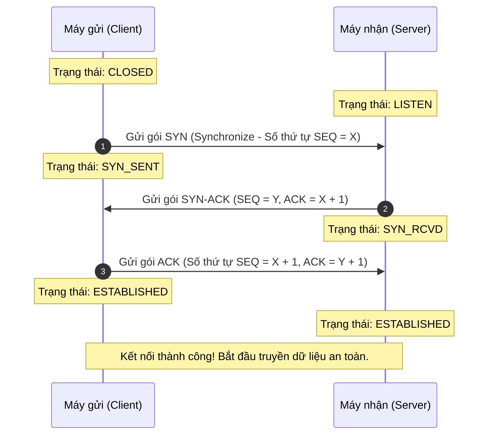

# 🐧 Linux & Networking — Hệ Điều Hành & Mạng Máy Tính Căn Bản

> **Mục tiêu (Objectives)**: Làm chủ kiến trúc hệ điều hành Linux, cơ chế phân quyền tập tin bảo mật nâng cao và các khái niệm mạng cốt lõi (TCP/IP, DNS, Routing) phục vụ trực tiếp cho việc vận hành container và cụm Kubernetes.

---

## 1. Hệ thống tập tin Linux & Tiêu chuẩn Phân cấp (Linux Filesystem & FHS)

Trong Linux, mọi thực thể từ file cấu hình, tiến trình, card mạng, đến ổ cứng vật lý đều được hệ điều hành coi là **Tập tin (Everything is a file)**. Hệ thống tập tin của Linux được tổ chức theo cấu trúc cây phân cấp tiêu chuẩn **FHS (Filesystem Hierarchy Standard)**:

```
                  / (Thư mục gốc - Root Directory)
     +------------+------------+------------+------------+
     |            |            |            |            |
   /bin         /etc         /var         /usr         /proc
(Binary lệnh) (Cấu hình)  (Log/Dữ liệu) (Thư viện) (Tiến trình ảo)
```

*   **`/` (Thư mục gốc — Root Directory)**: Điểm bắt đầu của toàn bộ hệ thống tập tin.
*   **`/bin` và `/sbin` (Thư mục mã máy — User & System Binaries)**: Chứa các tệp thực thi dòng lệnh cơ bản (v.d. `ls`, `cd`, `ping`, `ip`).
*   **`/etc` (Thư mục cấu hình — System Configuration)**: Chứa toàn bộ tệp tin cấu hình của hệ thống và các dịch vụ (v.d. `/etc/passwd` lưu user, `/etc/resolv.conf` cấu hình DNS).
*   **`/var` (Thư mục dữ liệu biến đổi — Variable Data)**: Chứa dữ liệu thay đổi liên tục trong quá trình chạy, đặc biệt là các tệp nhật ký hệ thống ảo (**System Logs** ở `/var/log/`) và cơ sở dữ liệu.
*   **`/usr` (Thư mục ứng dụng người dùng — User Binaries & Libraries)**: Chứa các thư viện chia sẻ và chương trình ứng dụng do người dùng cài thêm.
*   **`/proc` (Thư mục tiến trình ảo — Process Information)**: Không tồn tại trên ổ cứng thực tế. Đây là một hệ thống tập tin ảo do kernel tạo ra trong bộ nhớ RAM để quản lý và hiển thị thông số hoạt động của các tiến trình đang chạy (v.d. CPU, Memory).

---

## 2. Cơ chế Phân quyền Tập tin (Linux File Permissions)

Mỗi tệp tin và thư mục trong Linux đều đi kèm với một bộ thuộc tính phân quyền an toàn nhằm kiểm soát ai có thể truy cập và thao tác:

```
- rwx r-x r--   1 owner group size date filename
|  |   |   |
|  |   |   +-- Quyền của người dùng khác (Others) -> Chỉ đọc
|  |   +------ Quyền của nhóm sở hữu (Group)  -> Đọc & Thực thi
|  +---------- Quyền của chủ sở hữu (Owner)  -> Đọc, Ghi & Thực thi
+------------- Loại tệp (-: file thường, d: thư mục)
```

### A. Ba nhóm đối tượng và ba loại quyền cơ bản
*   **Ba nhóm đối tượng**:
    *   **User (u)**: Chủ sở hữu trực tiếp của tệp tin (Owner).
    *   **Group (g)**: Nhóm người dùng được gán quyền sở hữu chung.
    *   **Others (o)**: Tất cả những tài khoản người dùng khác trong hệ thống.
*   **Ba loại quyền cơ bản**:
    *   **Read (r - Giá trị số: 4)**: Cho phép xem nội dung file hoặc liệt kê file trong thư mục.
    *   **Write (w - Giá trị số: 2)**: Cho phép chỉnh sửa nội dung file hoặc tạo mới/xóa file trong thư mục.
    *   **Execute (x - Giá trị số: 1)**: Cho phép chạy file thực thi hoặc truy cập chui vào bên trong thư mục.
*   *Ví dụ lệnh chuyển đổi quyền:* `chmod 755 script.sh` (Owner: rwx = 7, Group: r-x = 5, Others: r-x = 5).

---

### B. Quyền đặc biệt & Nguy cơ leo thang đặc quyền (Special Permissions & Privilege Escalation)
Ngoài các quyền cơ bản, Linux hỗ trợ 3 loại quyền đặc biệt cực kỳ nhạy cảm về an ninh:
1.  **SUID (Set User ID — Giá trị số: 4000)**:
    *   *Nguyên lý:* Khi gán thuộc tính SUID cho một tệp thực thi, bất kỳ user thường nào khi chạy tệp này cũng sẽ tạm thời được nâng quyền tương đương với quyền của **chủ sở hữu tệp** (thường là `root`).
    *   *Ký hiệu:* Hiển thị chữ `s` thay cho chữ `x` ở nhóm Owner (v.d. `-rwsr-xr-x`). Ví dụ kinh điển là lệnh `/usr/bin/passwd` (cho phép user thường tự đổi mật khẩu của mình bằng cách ghi đè trực tiếp vào file của hệ thống `/etc/shadow` thuộc quyền root).
    *   ⚠️ *Nguy cơ bảo mật:* Nếu một file thực thi có thuộc tính SUID thuộc về root bị cấu hình lỗi hoặc dính lỗ hổng bảo mật, kẻ tấn công có thể lợi dụng để chạy các mã độc dưới quyền root tối cao (**Privilege Escalation - Leo thang đặc quyền**).
2.  **SGID (Set Group ID — Giá trị số: 2000)**:
    *   *Nguyên lý:* Khi gán cho thư mục, bất kỳ file mới nào tạo ra bên trong thư mục đó cũng sẽ tự động kế thừa Group sở hữu của thư mục cha, thay vì lấy Group mặc định của user tạo file.
3.  **Sticky Bit (Giá trị số: 1000)**:
    *   *Nguyên lý:* Thường áp dụng cho thư mục chia sẻ chung (v.d. `/tmp`). Chỉ duy nhất chủ sở hữu của một file mới có quyền xóa file đó trong thư mục, ngăn chặn tình trạng các user thường xóa nhầm file của nhau. Hiển thị chữ `t` ở nhóm Others (v.d. `drwxrwxrwt`).

---

## 3. Kiến thức Mạng Cốt lõi (Networking Essentials)

### A. Lớp mạng TCP/IP so với mô hình OSI
Mô hình **TCP/IP Model** là bộ giao thức nền tảng tạo nên mạng Internet ngày nay, được chia làm 4 lớp nhiệm vụ chính:
1.  **Lớp ứng dụng (Application Layer)**: Giao tiếp trực tiếp với phần mềm ứng dụng (v.d. HTTP, HTTPS, SSH, DNS).
2.  **Lớp vận chuyển (Transport Layer)**: Đảm bảo truyền tải dữ liệu giữa các tiến trình của 2 máy trạm (v.d. TCP - truyền tin cậy có kết nối, UDP - truyền nhanh không kết nối).
3.  **Lớp mạng (Network Layer)**: Định tuyến, tìm đường đi tối ưu cho gói tin qua các mạng khác nhau nhờ địa chỉ IP (v.d. IPv4, IPv6, ICMP).
4.  **Lớp liên kết dữ liệu / Vật lý (Link Layer)**: Đóng gói dữ liệu thành khung (Frames) và truyền tải trực tiếp trên phần cứng (v.d. Ethernet, Wi-Fi).

---

### B. Quá trình Bắt tay 3 bước của TCP (TCP Three-way Handshake)
Giao thức TCP (Transmission Control Protocol) là giao thức truyền tin tin cậy, bắt buộc phải thiết lập một kết nối logic trước khi gửi nhận dữ liệu thông qua quy trình **Bắt tay 3 bước**:



*   **Bước 1 (SYN)**: Máy khách (Client) gửi một gói tin mang cờ **SYN (Synchronize)** kèm một số thứ tự ngẫu nhiên `X` sang Máy chủ (Server) để yêu cầu mở kết nối.
*   **Bước 2 (SYN-ACK)**: Máy chủ nhận được, xác nhận yêu cầu bằng cách gửi lại gói tin mang cờ **SYN-ACK (Synchronize-Acknowledgment)**. Gói tin này chứa số thứ tự ngẫu nhiên `Y` của Server, đồng thời phản hồi `ACK = X + 1` báo hiệu đã nhận thành công gói SYN của khách.
*   **Bước 3 (ACK)**: Máy khách gửi lại một gói tin mang duy nhất cờ **ACK (Acknowledgment)** với số hiệu `ACK = Y + 1` để xác nhận đã nhận gói SYN-ACK của chủ. Trạng thái kết nối chuyển thành **ESTABLISHED**.

---

### C. Giao thức DNS & Quá trình Phân giải Tên miền (DNS Resolution)
Máy tính chỉ hiểu địa chỉ IP (v.d. `142.250.190.46`), trong khi con người chỉ nhớ tên miền (v.d. `google.com`). Giao thức **DNS (Domain Name System)** hoạt động như một danh bạ điện thoại toàn cầu để chuyển đổi tên miền thành IP.

Luồng ưu tiên phân giải tên miền trên Linux:
1.  **Kiểm tra File cấu hình Local (`/etc/hosts`)**: 
    *   Hệ điều hành sẽ tìm kiếm tên miền trong file `/etc/hosts` trước tiên. Đây là nơi bạn có thể ghi đè thủ công địa chỉ IP cho bất kỳ tên miền nào để test local nhanh.
2.  **Truy vấn DNS Server nội bộ (`/etc/resolv.conf`)**:
    *   Nếu không tìm thấy trong `/etc/hosts`, hệ thống sẽ đọc cấu hình địa chỉ IP của các máy chủ DNS công cộng/nội bộ tại `/etc/resolv.conf` (v.d. `nameserver 8.8.8.8`) để thực hiện gửi truy vấn DNS ra internet.

---

### D. Định tuyến Mạng (Routing & Routing Tables)
Khi một gói tin được gửi đi, máy tính sử dụng **Bảng định tuyến (Routing Table)** để quyết định cổng ra (Interface) và trạm trung chuyển tiếp theo (**Gateway/Next Hop**):
*   **Địa chỉ Local IP**: Nếu đích đến nằm chung dải mạng ảo (v.d. `192.168.1.0/24`), gói tin được truyền trực tiếp qua card mạng mà không cần qua router.
*   **Cổng mặc định (Default Gateway)**: Nếu đích đến nằm ngoài dải mạng local (v.d. `google.com` ở internet), gói tin sẽ được chuyển thẳng tới địa chỉ IP của Default Gateway (v.d. `192.168.1.1` - chính là địa chỉ IP của Router nhà bạn) để Router định tuyến tiếp ra ngoài thế giới.

---

## 📖 Câu hỏi tự ôn tập & Kiểm tra kiến thức
1. *Tại sao một tệp thực thi mang thuộc tính SUID của user `root` lại là mục tiêu tấn công hàng đầu của tin tặc khi đột nhập vào máy chủ Linux?*
2. *Mô tả chi tiết hậu quả xảy ra nếu một trong ba bước của quá trình bắt tay TCP (TCP Three-way Handshake) bị gián đoạn hoặc thất bại?*
3. *Làm thế nào để cấu hình file `/etc/hosts` trên máy Linux local của bạn trỏ tên miền `vulnerable-app.local` về địa chỉ loopback `127.0.0.1`?*
