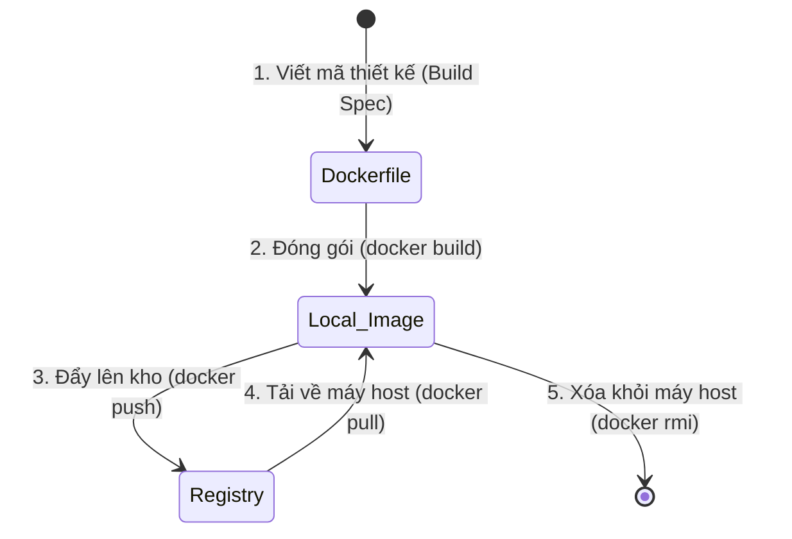
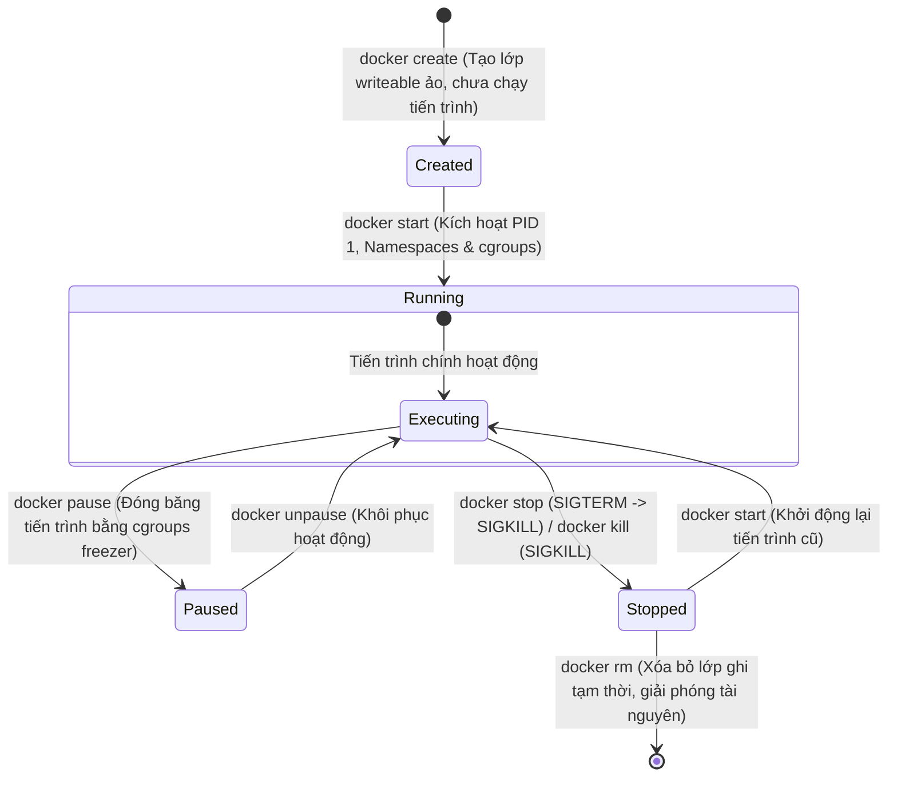

# ⚙️ Các Thành Phần Kiến Trúc Cấp Thấp & Hệ Thống Câu Lệnh Docker (Docker Low-Level Architecture & CLI Deep-Dive)

> **Mục tiêu (Objectives)**: Giúp người học làm chủ bản chất vận hành ở cấp độ thấp (low-level) của Docker Engine, hiểu rõ luồng giao tiếp API Client-Server, phân biệt chi tiết Vòng đời Docker Image và Vòng đời Container, đồng thời nắm vững cơ chế hoạt động thực tế bên dưới của hệ thống câu lệnh Docker CLI.

---

## 1. Kiến trúc Docker Cấp Thấp (Docker Low-Level Architecture)

Nhiều người thường nghĩ Docker là một chương trình đơn lẻ chạy container. Thực chất, Docker Engine hiện đại là một tập hợp các công cụ chuyên biệt, hoạt động độc lập và giao tiếp với nhau qua các giao thức chuẩn hóa.

### A. Sơ đồ Tương tác Kiến trúc Cấp thấp (Low-Level Architecture Flowchart)

Sơ đồ dưới đây mô tả chính xác cách một yêu cầu gõ từ bàn phím của bạn đi qua các thành phần dịch vụ để tạo ra một container cách ly chạy dưới nhân Linux:

```mermaid
flowchart TD
    subgraph Host_OS["Máy chủ Host (Host OS)"]
        subgraph Docker_Engine["Nhân Docker (Docker Engine)"]
            Client["Trình điều khiển Docker CLI\n(Docker Client)"]
            
            Socket["Unix Socket\n(/var/run/docker.sock)"]
            
            Daemon["Tiến trình Dịch vụ Docker\n(dockerd daemon)"]
            
            Containerd["Tiến trình Điều phối Container\n(containerd)"]
            
            Shim["Bộ đệm Tiến trình\n(containerd-shim)"]
            
            Runc["Trình thực thi Container siêu nhẹ\n(runc)"]
        end
        
        subgraph Kernel["Nhân Hệ Điều Hành (Linux Kernel)"]
            Namespaces["Tách biệt không gian tên\n(Linux Namespaces)"]
            Cgroups["Nhóm kiểm soát tài nguyên\n(Control Groups / cgroups)"]
            OverlayFS["Hệ thống tệp tin xếp chồng\n(OverlayFS / UnionFS)"]
        end
    end
    
    Client -- "1. Gửi REST API HTTP" --> Socket
    Socket --> Daemon
    Daemon -- "2. Yêu cầu gRPC" --> Containerd
    Containerd -- "3. Khởi tạo Shim cho Container" --> Shim
    Shim -- "4. Triển khai cấu hình OCI" --> Runc
    Runc -- "5. Cấu hình trực tiếp nhân hệ điều hành" --> Namespaces
    Runc -- "5. Cấu hình trực tiếp nhân hệ điều hành" --> Cgroups
    Runc -- "5. Cấu hình trực tiếp nhân hệ điều hành" --> OverlayFS
    Runc -. "6. Tự kết thúc sau khi khởi chạy xong PID 1" .-> Containerd
    Shim -- "7. Duy trì theo dõi PID 1 thay thế runc" --> Namespaces
```



---

### B. Bản chất vai trò của 5 Thành phần cốt lõi

Để hiểu sâu hệ thống, chúng ta cần phân tích nhiệm vụ độc lập của từng thực thể bên dưới:

1.  **Docker Client (Trình điều khiển dòng lệnh):**
    *   *Thuật ngữ kỹ thuật:* **Docker Client (CLI)**.
    *   *Bản chất:* Là giao diện dòng lệnh tương tác trực tiếp với bạn. Nó **không trực tiếp chạy hay quản lý container**. Khi bạn gõ một lệnh (ví dụ: `docker run`), Docker Client sẽ biên dịch lệnh đó thành một yêu cầu **REST API HTTP** và gửi qua cổng kết nối **Unix Socket** (`unix:///var/run/docker.sock`) của máy host.
2.  **Docker Daemon (Tiến trình dịch vụ nền):**
    *   *Thuật ngữ kỹ thuật:* **Docker Daemon (dockerd)**.
    *   *Bản chất:* Là một dịch vụ chạy ngầm (background daemon) trên máy host. Nhiệm vụ chính của `dockerd` là tiếp nhận yêu cầu REST API từ Client, xử lý xác thực quyền, quản lý mạng ảo (networks), ổ đĩa ảo (volumes), lưu trữ cấu hình và điều phối các tác vụ cao cấp hơn. Tuy nhiên, kể từ phiên bản Docker 1.11, **dockerd không còn trực tiếp tạo và chạy container nữa**, mà chuyển giao việc đó cho `containerd`.
3.  **Containerd (Tiến trình quản lý vòng đời container):**
    *   *Thuật ngữ kỹ thuật:* **containerd (Container Daemon)**.
    *   *Bản chất:* Là một dự án mã nguồn mở chuẩn CNCF độc lập. Nó đóng vai trò quản lý toàn bộ vòng đời của container: tải image từ registry (push/pull), quản lý việc lưu trữ các layer của image trên đĩa, giám sát trạng thái hoạt động của container, và chuẩn bị môi trường chạy. Khi cần chạy container, `containerd` gọi sang `runc`.
4.  **Containerd-Shim (Bộ đệm giám sát tiến trình):**
    *   *Thuật ngữ kỹ thuật:* **containerd-shim**.
    *   *Bản chất:* Là một tiến trình siêu nhẹ được tạo ra riêng biệt cho **mỗi container** đang chạy. Vai trò của `shim` cực kỳ quan trọng:
        *   Nó cho phép `containerd` hoặc `dockerd` có thể restart hay nâng cấp (upgrade) mà các container đang chạy bên dưới vẫn hoạt động bình thường, không bị ngắt quãng (Daemonless containers).
        *   Nó giữ các luồng nhập xuất tiêu chuẩn `stdin`/`stdout`/`stderr` và thu thập mã thoát (exit codes) của container khi tiến trình kết thúc để báo cáo về cho `containerd`.
5.  **Runc (Trình thực thi runtime cấp thấp nhất):**
    *   *Thuật ngữ kỹ thuật:* **runc (Open Container Initiative - OCI Runtime)**.
    *   *Bản chất:* Là một công cụ dòng lệnh (CLI tool) siêu tối giản tuân thủ chuẩn công nghiệp OCI. Nhiệm vụ duy nhất của `runc` là tiếp nhận cấu hình định dạng JSON từ `containerd`, tương tác trực tiếp với nhân Linux Kernel để thiết lập **Namespaces**, **cgroups**, mount hệ thống tệp tin xếp chồng **OverlayFS** và kích hoạt tiến trình chính (PID 1) của container. **Sau khi container khởi động thành công, runc sẽ lập tức tự kết thúc (exit)**, nhường quyền theo dõi tiến trình lại cho `containerd-shim`.

---

## 2. Vòng đời Docker Image & Vòng đời Container (Lifecycle Deep-Dive)

Để tránh nhầm lẫn nghiêm trọng khi vận hành hệ thống, học viên bắt buộc phải phân biệt rõ sự khác nhau giữa thực thể tĩnh (Image) và thực thể động chạy thực tế (Container).

### A. Vòng đời của Docker Image (Docker Image Lifecycle)
Một **Docker Image** là một tập hợp các lớp tệp tin chỉ đọc (Read-only Layers) xếp chồng lên nhau. Vòng đời của nó xoay quanh quá trình thiết kế, đóng gói và lưu trữ:



---

### B. Vòng đời của Docker Container (Docker Container Lifecycle)
Một **Docker Container** là một thực thể động (instance) được sinh ra từ một Image tĩnh, phủ thêm một **Lớp ghi tạm thời (Container Layer / Writeable Layer)** trên cùng. Vòng đời của nó trải qua các trạng thái biến đổi liên tục dưới sự điều khiển của hệ điều hành máy host:



#### Bảng tra cứu Trạng thái Container chuyên sâu:

| Trạng thái (State) | Bản chất ở mức Hệ điều hành (Kernel/FHS Level) | Câu lệnh CLI tác động |
|:---|:---|:---|
| **Created** *(Đã khởi tạo)* | Docker đã tạo ra lớp ghi tạm thời (writeable layer) và gán ID, cấu hình IP ảo nhưng **chưa hề chạy bất kỳ tiến trình nào** bên trong. Không tiêu tốn CPU/RAM máy host. | `docker create` |
| **Running** *(Đang hoạt động)* | Tiến trình chính (PID 1) đang chạy bên trong các không gian cách ly (Namespaces). CPU, RAM và Network được cấp phát và hoạt động đầy đủ. | `docker start` <br> `docker run` |
| **Paused** *(Tạm ngưng)* | Tiến trình bên trong container bị **đóng băng (frozen)** hoàn toàn. Nhân Linux sử dụng cơ chế `cgroups freezer` để tạm dừng lập lịch CPU cho tiến trình này. Container vẫn giữ nguyên RAM nhưng không tiêu thụ CPU. | `docker pause` <br> `docker unpause` |
| **Stopped** *(Đã dừng)* | Tiến trình chính (PID 1) đã bị kết thúc (terminated). Toàn bộ Namespaces, cgroups bị hủy bỏ, RAM/CPU được giải phóng 100%. Tuy nhiên, **lớp ghi tạm thời (writeable layer) vẫn tồn tại trên đĩa cứng máy host**, dữ liệu tạm thời chưa bị mất. | `docker stop` <br> `docker kill` |
| **Deleted** *(Đã xóa hoàn toàn)* | Lớp ghi tạm thời (writeable layer) trên đĩa bị xóa bỏ hoàn toàn. Mọi dữ liệu phát sinh trong quá trình container chạy (nếu không lưu vào Volume) sẽ **bị mất vĩnh viễn**. | `docker rm` |

---

## 3. Phân tích Bản chất Cơ chế các Nhóm câu lệnh CLI cốt lõi

Chúng ta không chỉ ghi nhớ cú pháp câu lệnh, mà phải hiểu sâu cơ chế hoạt động thực tế của chúng dưới nền:

### 🛡️ Nhóm 1: Khởi chạy Container (`docker run` vs `docker exec`)

```
+------------------------------------------------------------------------+
| Gõ lệnh: docker run -d nginx                                           |
| -> Tạo mới một container hoàn toàn, xin cấp Namespaces/cgroups từ đầu, |
|    khởi chạy nginx làm PID 1 bên trong môi trường mới toanh đó.         |
+------------------------------------------------------------------------+

+------------------------------------------------------------------------+
| Gõ lệnh: docker exec -it <container-id> /bin/sh                       |
| -> Không tạo container mới. Chỉ chui vào container đang chạy, tạo ra    |
|    tiến trình phụ /bin/sh sử dụng chung bộ Namespaces/cgroups của PID 1.|
+------------------------------------------------------------------------+
```

*   **Bản chất `docker run`:**
    *   *Cơ chế:* Là câu lệnh kết hợp của `docker create` và `docker start`. Nó tải image về (nếu chưa có), tạo lớp ghi tạm thời, yêu cầu kernel cấp bộ Namespaces/cgroups mới, và kích hoạt tiến trình PID 1.
    *   *Tham số quan trọng:*
        *   `-d` (detached mode): Cho phép container chạy ngầm dưới nền, trả lại quyền điều khiển terminal cho bạn.
        *   `-p <host_port>:<container_port>` (port forwarding): Thiết lập luật định tuyến của iptables trên máy host để chuyển tiếp traffic vào mạng ảo của container.
*   **Bản chất `docker exec`:**
    *   *Cơ chế:* Thường dùng để gỡ lỗi. Nó gọi hàm hệ thống `setns` của Linux Kernel để gán một tiến trình mới (v.d. `/bin/sh`) vào các không gian cách ly (Namespaces) hiện tại của một container đang chạy.

---

### 🛡️ Nhóm 2: Kết thúc tiến trình (`docker stop` vs `docker kill`)

Rất nhiều kỹ sư DevOps gặp lỗi tắt ứng dụng gây rò rỉ dữ liệu hoặc hỏng index cơ sở dữ liệu do dùng sai lệnh stop. Hãy hiểu bản chất:

*   **`docker stop` (Dừng từ tốn - Graceful Shutdown):**
    1.  Docker Daemon gửi tín hiệu hệ thống **`SIGTERM` (Signal Terminate - Mã số 15)** vào tiến trình PID 1 trong container.
    2.  Tiến trình PID 1 nhận được tín hiệu sẽ dừng nhận request mới, hoàn tất các request đang xử lý dở dang, đóng các kết nối database an toàn, ghi đệm log lên đĩa (dọn dẹp tài nguyên).
    3.  Docker Daemon khởi động một đồng hồ đếm ngược (timeout mặc định là **10 giây**).
    4.  Nếu sau 10 giây, tiến trình PID 1 vẫn cứng đầu không chịu tắt, Docker Daemon sẽ gửi tín hiệu cưỡng chế dừng lập tức **`SIGKILL` (Signal Kill - Mã số 9)** để giải phóng container.
*   **`docker kill` (Dừng lập tức - Force Shutdown):**
    *   *Cơ chế:* Docker Daemon **không chờ đợi**, lập tức gửi thẳng tín hiệu cưỡng chế **`SIGKILL` (Mã số 9)** tới PID 1. Tiến trình bị hủy ngay lập tức bởi hệ điều hành máy host mà không kịp thực hiện bất kỳ bước dọn dẹp nào. Cực kỳ nguy hiểm cho database (PostgreSQL, MySQL, Redis) vì dễ gây hỏng dữ liệu (corruption).

---

### 🛡️ Nhóm 3: Dọn dẹp bộ nhớ đĩa (`docker rm` vs `docker rmi`)

*   **`docker rm` (Remove Container):** Xóa bỏ lớp ghi tạm thời của các container đã dừng (`Stopped`). Muốn xóa container đang chạy bắt buộc phải thêm cờ `-f` (Docker gửi `SIGKILL` trước rồi xóa).
*   **`docker rmi` (Remove Image):** Xóa bỏ các layer chỉ đọc của Image khỏi bộ nhớ đĩa máy host. Bạn **không thể xóa một Image nếu đang có container (kể cả container đã dừng) tham chiếu đến nó**. Bắt buộc phải xóa container trước rồi mới xóa image.

---

## 📖 Bảng tra cứu nhanh CLI chuẩn hóa (Cheat Sheet)

| Mục đích | Câu lệnh CLI | Tham số phổ biến & Giải thích |
|---|---|---|
| **Chạy Container** | `docker run [options] image [command]` | `-d`: Chạy ngầm.<br>`-p 8080:80`: Ánh xạ cổng host:container.<br>`--name app-web`: Đặt tên container.<br>`--restart unless-stopped`: Tự khởi động lại nếu lỗi. |
| **Kiểm tra trạng thái** | `docker ps` | `-a`: Xem tất cả container (kể cả đã tắt).<br>`-q`: Chỉ hiển thị Container IDs. |
| **Kiểm tra nhật ký** | `docker logs container_name` | `-f`: Theo dõi log real-time.<br>`--tail 100`: Chỉ xem 100 dòng cuối cùng. |
| **Gỡ lỗi trực tiếp** | `docker exec -it container_name sh` | `-it`: Mở terminal tương tác ảo (`-i` interactive, `-t` tty). |
| **Dọn dẹp hệ thống** | `docker system prune` | `-a`: Xóa tất cả image không sử dụng.<br>`--volumes`: Dọn sạch cả ổ đĩa mồ côi (cần cực kỳ cẩn thận). |

---

## 📝 Câu hỏi ôn tập chuyên sâu (Deep-dive Quiz)

1.  *Tại sao tiến trình `runc` lại tự kết thúc (exit) ngay sau khi khởi chạy xong container, và vai trò của `containerd-shim` sau thời điểm đó là gì?*
2.  *Nếu ứng dụng Node.js/Python chạy trong container làm PID 1 không được cấu hình bắt các tín hiệu hệ thống, chuyện gì xảy ra khi ta gõ `docker stop`? Ứng dụng sẽ tắt thế nào?*
3.  *Tại sao bạn không thể thực hiện lệnh `docker rmi` trên một image đang có một container ở trạng thái `Stopped` tham chiếu tới? Lớp ghi của container ảnh hưởng gì đến image?*
