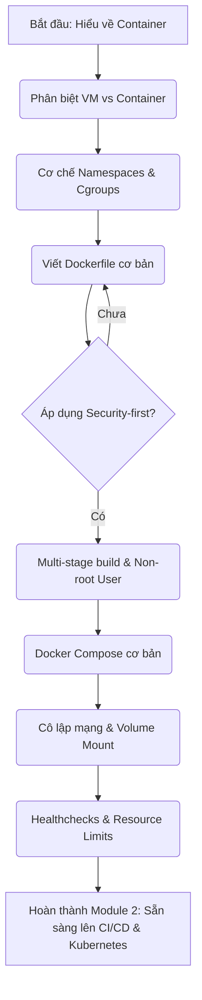

# 🐳 Module 02: Công nghệ Container (Containerization)

> **"Không có containerization, không có DevSecOps hiện đại."** 
> Containerization là nền tảng cốt lõi giúp đóng gói ứng dụng cùng toàn bộ môi trường chạy của nó thành một thực thể duy nhất, nhất quán trên mọi môi trường từ máy Local của lập trình viên cho tới cụm Production hàng ngàn node.

---

## 📌 Tổng quan Module

Trong kỷ nguyên DevSecOps, Containerization đóng vai trò cực kỳ quan trọng trong chiến lược **Shift-left Security** (Bảo mật từ gốc). Thay vì cấu hình bảo mật trực tiếp trên máy chủ vật lý hoặc máy ảo (VM) sau khi triển khai, lập trình viên và kỹ sư DevSecOps có thể định nghĩa và gia cố an toàn môi trường chạy của ứng dụng ngay từ khâu viết mã nguồn (thông qua `Dockerfile` và `docker-compose.yml`).

Module này sẽ dẫn dắt bạn qua hai Sub-module lớn từ cơ bản đến nâng cao:
1. **Sub-module 01: Docker Basics (Docker Cơ bản & Tối ưu hóa Image)** — Hiểu sâu về cách thức hoạt động của container, phân biệt với VM, làm quen với Multi-stage build và các kỹ thuật gia cố an toàn cho Docker Image (Non-root user, Minimal base images).
2. **Sub-module 02: Docker Compose (Ứng dụng đa container)** — Học cách phối hợp nhiều container (Frontend, Backend, Database) bằng Docker Compose, thiết lập mạng cô lập, quản lý lưu trữ bền vững (volumes) và kiểm tra sức khỏe dịch vụ (healthchecks).

---

## 🗺️ Bản đồ lộ trình học (Roadmap)



---

## 💻 So sánh kiến trúc: Virtual Machine vs Container

Để hiểu tại sao container lại nhẹ và khởi động nhanh đến vậy, hãy nhìn vào sự khác biệt trong kiến trúc phần mềm:

### 1. Kiến trúc Virtual Machine (VM)
Mỗi máy ảo chạy một hệ điều hành khách (Guest OS) riêng biệt, hoàn chỉnh, dẫn đến tiêu tốn hàng GB tài nguyên RAM/Disk và khởi động mất vài phút.
```
+-------------------------------------------------+
|  App A (NodeJS)  |  App B (Java)  |  App C (Go) |
+------------------+----------------+-------------+
|    Guest OS      |    Guest OS    |   Guest OS  |
+------------------+----------------+-------------+
|                  Hypervisor                     |
+-------------------------------------------------+
|                  Host OS                        |
+-------------------------------------------------+
|                  Hardware                       |
+-------------------------------------------------+
```

### 2. Kiến trúc Container
Tất cả container chia sẻ chung nhân hệ điều hành của máy host (Shared Host OS Kernel) thông qua Docker Engine. Container chỉ đóng gói ứng dụng và các thư viện cần thiết, giúp dung lượng chỉ từ vài chục MB và khởi động trong vài mili-giây.
```
+-------------------------------------------------+
|  App A (NodeJS)  |  App B (Java)  |  App C (Go) |
+------------------+----------------+-------------+
|                Docker Engine                    |
+-------------------------------------------------+
|             Host OS Kernel (Shared)             |
+-------------------------------------------------+
|                  Hardware                       |
+-------------------------------------------------+
```

---

## 🎯 Mục tiêu đạt được sau Module này

*   **Tư duy Security-first**: Không bao giờ sử dụng image không rõ nguồn gốc hoặc chạy container bằng quyền `root`.
*   **Kỹ năng viết Dockerfile chuyên nghiệp**: Tận dụng Multi-stage build để giảm kích thước image tới 90% và tăng tốc độ CI/CD pipeline.
*   **Làm chủ Docker Compose**: Thiết lập được môi trường phát triển local hoàn chỉnh cho các dự án microservices phức tạp chỉ bằng một câu lệnh `docker-compose up -d`.
*   **Khả năng tự vận hành và gỡ lỗi**: Hiểu rõ cơ chế logging, port forwarding, volume mount, và troubleshoot sự cố container nhanh chóng.

---

## 📚 Danh sách tài liệu chi tiết

*   📖 **Lý thuyết Sub-module 01**: [Docker Basics & Image Hardening](file:///e:/VSC/DevSecOps_Tutorials_Vietnamese-version/02-containerization/docker-basics/docker-basics-guide.md)
    *   🧪 *Thực hành Lab 01*: [Dockerize ứng dụng AI Chatbot Gemma an toàn](file:///e:/VSC/DevSecOps_Tutorials_Vietnamese-version/02-containerization/docker-basics/labs/lab-dockerize-ai-app/lab-instructions.md)
*   📖 **Lý thuyết Sub-module 02**: [Docker Compose & Đa Container](file:///e:/VSC/DevSecOps_Tutorials_Vietnamese-version/02-containerization/docker-compose/docker-compose-guide.md)
    *   🧪 *Thực hành Lab 02*: [Dựng cụm Microservices local bằng Docker Compose](file:///e:/VSC/DevSecOps_Tutorials_Vietnamese-version/02-containerization/docker-compose/labs/lab-compose-microservices/lab-instructions.md)

---

## 📚 Tài nguyên Đọc thêm Chất lượng cao (Recommended Blog Readings)

Khám phá các bài blog thực tế và kinh nghiệm nâng cao từ cộng đồng DevOps để làm chủ Docker:

### 1. 🇻🇳 [Tìm hiểu sâu về Docker: Namespaces và Cgroups](https://viblo.asia/p/tim-hieu-sau-ve-docker-namespaces-va-cgroups-ByEZk6nxlQ0)
*   **Nguồn**: Cộng đồng Viblo.asia (Đạt 12k+ views, 150+ upvotes).
*   **Giá trị thực tiễn**: Bài viết giải thích bản chất cấp thấp của container. Tác giả chỉ rõ container không phải là máy ảo ảo hóa phần cứng, mà bản chất là **một tiến trình (Process) Linux bình thường** nhưng được bao bọc bởi 2 tính năng của nhân Linux Kernel:
    *   **Namespaces**: Cô lập tầm nhìn của tiến trình (PID namespace cô lập danh sách tiến trình, NET namespace cô lập card mạng, MNT namespace cô lập hệ thống file ảo, v.v.).
    *   **Control Groups (cgroups)**: Giới hạn và đong đếm lượng tài nguyên (CPU, RAM, Disk I/O) mà tiến trình đó được phép sử dụng.
*   **Lý do cần đọc**: Giúp bạn gạt bỏ hoàn toàn tư duy mơ hồ về container và hiểu rõ cơ chế ảo hóa mức hệ điều hành hoạt động ra sao.

### 2. 🇬🇧 [Docker Container Security: Hardening Checklist (Bảo mật Docker Container: Danh sách Gia cố)](https://dev.to/snyk/docker-container-security-hardening-checklist-52b8)
*   **Tác giả**: Chuyên gia phân tích bảo mật tại Snyk.
*   **Bản dịch & Tóm tắt cốt lõi**: Bài viết đưa ra danh sách checklist 7 bước thực tế bắt buộc phải làm khi đưa container lên Production:
    1.  **Dùng Base Image tối giản (Minimal Base Image)**: Ưu tiên dùng Alpine Linux hoặc Distroless để giảm thiểu bề mặt tấn công (Attack Surface).
    2.  **Cấm Tuyệt Đối Chạy quyền Root (Non-root User)**: Khai báo rõ UID/GID của user thường trong Dockerfile (`USER 10001`) để nếu container bị tấn công RCE, kẻ xâm nhập cũng không thể chiếm quyền root của máy chủ host.
    3.  **Hạn chế quyền hạn Linux Capabilities**: Mặc định container nhận một số đặc quyền kernel. Hãy vô hiệu hóa chúng nếu không dùng bằng cờ `--cap-drop=all`.
    4.  **Bật Read-only Root Filesystem**: Sử dụng cờ `--read-only` để ngăn chặn kẻ tấn công sửa đổi mã nguồn hoặc ghi đè shell script độc hại.
    5.  **Giới hạn Tài nguyên (Cgroups limits)**: Luôn giới hạn Memory và CPU để ngăn chặn tấn công từ chối dịch vụ (DoS) phá hoại máy host vật lý.
    6.  **Không cắm Docker Socket vô tội vạ**: Tránh việc mount `/var/run/docker.sock` vào container vì nó tương đương cấp toàn quyền root trên máy host.
    7.  **Quét Image thường xuyên (Continuous Vulnerability Scanning)**: Tích hợp Trivy, Snyk hoặc Anchore vào pipeline để phát hiện các lỗ hổng gói thư viện kịp thời.
