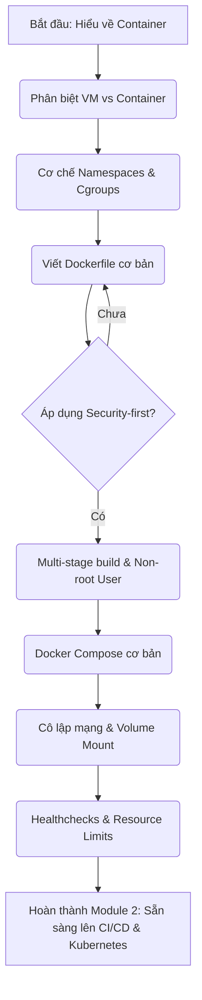

# 🐳 Module 02: Công nghệ Container (Containerization)

> **"Không có containerization, không có DevSecOps hiện đại."** 
> Containerization là nền tảng cốt lõi giúp đóng gói ứng dụng cùng toàn bộ môi trường chạy của nó thành một thực thể duy nhất, nhất quán trên mọi môi trường từ máy Local của lập trình viên cho tới cụm Production hàng ngàn node.

---

## 📌 Tổng quan Module

Trong kỷ nguyên DevSecOps, Containerization đóng vai trò cực kỳ quan trọng trong chiến lược **Shift-left Security** (Bảo mật từ gốc). Thay vì cấu hình bảo mật trực tiếp trên máy chủ vật lý hoặc máy ảo (VM) sau khi triển khai, lập trình viên và kỹ sư DevSecOps có thể định nghĩa và gia cố an toàn môi trường chạy của ứng dụng ngay từ khâu viết mã nguồn (thông qua `Dockerfile` và `docker-compose.yml`).

Module này sẽ dẫn dắt bạn qua hai Sub-module lớn từ cơ bản đến nâng cao:
1. **Sub-module 01: Docker Basics (Docker Cơ bản & Tối ưu hóa Image)** — Hiểu sâu về cách thức hoạt động của container, phân biệt với VM, làm quen với Multi-stage build và các kỹ thuật gia cố an toàn cho Docker Image (Non-root user, Minimal base images).
2. **Sub-module 02: Docker Compose (Ứng dụng đa container)** — Học cách phối hợp nhiều container (Frontend, Backend, Database) bằng Docker Compose, thiết lập mạng cô lập, quản lý lưu trữ bền vững (volumes) và kiểm tra sức khỏe dịch vụ (healthchecks).

---

## 🗺️ Bản đồ lộ trình học (Roadmap)



---

## 💻 So sánh kiến trúc: Virtual Machine vs Container

Để hiểu tại sao container lại nhẹ và khởi động nhanh đến vậy, hãy nhìn vào sự khác biệt trong kiến trúc phần mềm:

### 1. Kiến trúc Virtual Machine (VM)
Mỗi máy ảo chạy một hệ điều hành khách (Guest OS) riêng biệt, hoàn chỉnh, dẫn đến tiêu tốn hàng GB tài nguyên RAM/Disk và khởi động mất vài phút.
```
+-------------------------------------------------+
|  App A (NodeJS)  |  App B (Java)  |  App C (Go) |
+------------------+----------------+-------------+
|    Guest OS      |    Guest OS    |   Guest OS  |
+------------------+----------------+-------------+
|                  Hypervisor                     |
+-------------------------------------------------+
|                  Host OS                        |
+-------------------------------------------------+
|                  Hardware                       |
+-------------------------------------------------+
```

### 2. Kiến trúc Container
Tất cả container chia sẻ chung nhân hệ điều hành của máy host (Shared Host OS Kernel) thông qua Docker Engine. Container chỉ đóng gói ứng dụng và các thư viện cần thiết, giúp dung lượng chỉ từ vài chục MB và khởi động trong vài mili-giây.
```
+-------------------------------------------------+
|  App A (NodeJS)  |  App B (Java)  |  App C (Go) |
+------------------+----------------+-------------+
|                Docker Engine                    |
+-------------------------------------------------+
|             Host OS Kernel (Shared)             |
+-------------------------------------------------+
|                  Hardware                       |
+-------------------------------------------------+
```

---

## 🎯 Mục tiêu đạt được sau Module này

*   **Tư duy Security-first**: Không bao giờ sử dụng image không rõ nguồn gốc hoặc chạy container bằng quyền `root`.
*   **Kỹ năng viết Dockerfile chuyên nghiệp**: Tận dụng Multi-stage build để giảm kích thước image tới 90% và tăng tốc độ CI/CD pipeline.
*   **Làm chủ Docker Compose**: Thiết lập được môi trường phát triển local hoàn chỉnh cho các dự án microservices phức tạp chỉ bằng một câu lệnh `docker-compose up -d`.
*   **Khả năng tự vận hành và gỡ lỗi**: Hiểu rõ cơ chế logging, port forwarding, volume mount, và troubleshoot sự cố container nhanh chóng.

---

## 📚 Danh sách tài liệu chi tiết

*   📖 **Lý thuyết Sub-module 01**: [Docker Basics & Image Hardening](file:///e:/VSC/DevSecOps_Tutorials_Vietnamese-version/02-containerization/docker-basics/docker-basics-guide.md)
    *   🧪 *Thực hành Lab 01*: [Dockerize ứng dụng AI Chatbot Gemma an toàn](file:///e:/VSC/DevSecOps_Tutorials_Vietnamese-version/02-containerization/docker-basics/labs/lab-dockerize-ai-app/lab-instructions.md)
*   📖 **Lý thuyết Sub-module 02**: [Docker Compose & Đa Container](file:///e:/VSC/DevSecOps_Tutorials_Vietnamese-version/02-containerization/docker-compose/docker-compose-guide.md)
    *   🧪 *Thực hành Lab 02*: [Dựng cụm Microservices local bằng Docker Compose](file:///e:/VSC/DevSecOps_Tutorials_Vietnamese-version/02-containerization/docker-compose/labs/lab-compose-microservices/lab-instructions.md)
