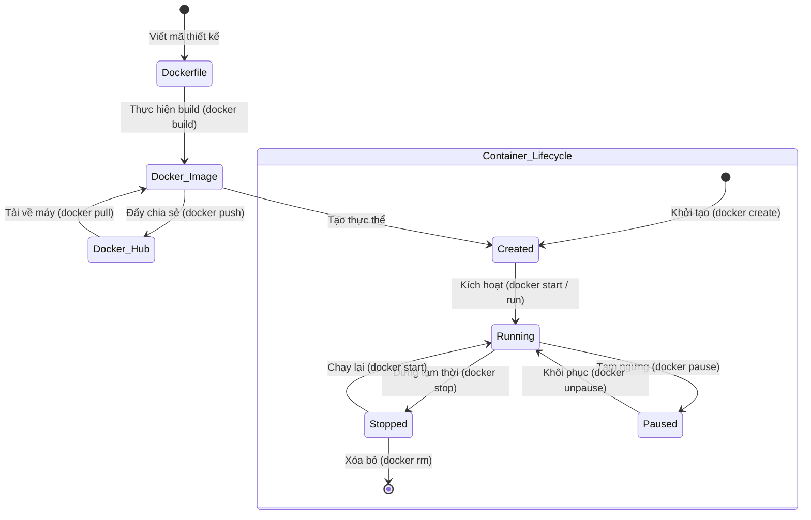

# 🐳 Sub-module 01: Docker Basics — Kiến Thức Nền Tảng Lõi & Gia Cố An Toàn Docker Image

> **Mục tiêu (Objectives)**: Hiểu sâu sắc bản chất vận hành ở mức độ nhân hệ điều hành của Container, cấu trúc hệ thống tập tin xếp chồng của Docker Image, nắm vững vòng đời của Docker Image và làm chủ các kỹ thuật xây dựng Dockerfile an toàn tuyệt đối (Security-first) chuẩn Production.

---

## 🔗 Tài nguyên học tập bổ trợ (Recommended Learning Paths)
*   ➡️ **Kiến trúc chi tiết & Hệ thống câu lệnh Docker**: [docker-components-commands.md](file:///e:/VSC/DevSecOps_Tutorials_Vietnamese-version/02-containerization/docker-basics/docker-components-commands.md) — *Đọc tệp này đầu tiên để làm quen với các thành phần dockerd, CLI và bảng tra cứu câu lệnh đầy đủ.*

---

## 1. Bản chất của Container ở cấp độ Nhân hệ điều hành (Host Kernel Level)

Nhiều người thường lầm tưởng Container là một "máy ảo thu nhỏ". Thực tế, Container không chạy trên bất kỳ phần cứng giả lập (Hypervisor) nào. Chúng chỉ là các **tiến trình thường (regular processes)** chạy trực tiếp trên nhân (**Host OS Kernel**) của máy Host, được bảo vệ và cách ly (isolated) cực kỳ nghiêm ngặt nhờ hai tính năng lõi của Linux Kernel:

### A. Tách biệt Không gian tên (Linux Namespaces — Cách ly tài nguyên)
**Linux Namespaces** quy định những gì một container **có thể nhìn thấy (Visibility)**. Khi khởi chạy, Docker Engine sẽ gán cho mỗi container một bộ Namespaces riêng biệt để cô lập chúng hoàn toàn khỏi máy host và các container khác:
*   **PID Namespace (Process ID)**: Cách ly bảng tiến trình. Tiến trình chính của ứng dụng khởi chạy trong container luôn mang mã định danh **PID = 1**, hoàn toàn độc lập với các PID trên máy host.
*   **NET Namespace (Network)**: Cách ly tài nguyên mạng. Mỗi container sở hữu card mạng ảo (virtual network interface), địa chỉ IP ảo và bảng định tuyến riêng.
*   **MNT Namespace (Mount)**: Cách ly điểm gắn kết hệ thống tập tin. Container chỉ nhìn thấy cây thư mục ảo của riêng nó mà không thấy file hệ thống của máy host.
*   **IPC Namespace (Inter-Process Communication)**: Cách ly bộ nhớ chia sẻ và hàng đợi tin nhắn giữa các tiến trình của các container khác nhau.
*   **UTS Namespace (Unix Timesharing System)**: Cách ly tên máy tính (Hostname) và tên miền (Domainname).
*   **USER Namespace (User/Group ID)**: Cách ly tài khoản người dùng và phân quyền. Quyền quản trị tối cao `root` (UID 0) bên trong container có thể được ánh xạ thành một user thường không có đặc quyền trên máy host để bảo vệ an toàn.

---

### B. Nhóm kiểm soát tài nguyên (Control Groups / cgroups — Giới hạn tài nguyên)
Nếu Namespaces chịu trách nhiệm cách ly tầm nhìn, thì **Control Groups (cgroups)** chịu trách nhiệm giới hạn những gì một container **có thể sử dụng (Resource Limitation)**. Tính năng này cực kỳ quan trọng để ngăn chặn các cuộc tấn công Từ chối dịch vụ (DoS - Denial of Service) do container bị chiếm quyền điều khiển và ngốn sạch tài nguyên máy chủ:
*   **CPU Limitation**: Giới hạn tỷ lệ phần trăm CPU hoặc chỉ định rõ số nhân CPU (v.d. 1.5 nhân) container được phép sử dụng.
*   **Memory Limitation**: Thiết lập lượng RAM tối đa (v.d. 512MB). Nếu ứng dụng trong container bị rò rỉ bộ nhớ (memory leak) vượt quá ngưỡng này, nhân Linux sẽ kích hoạt cơ chế tự hủy tiến trình **OOM Killer (Out Of Memory Killer)** để bảo vệ máy host.
*   **I/O Limitation (Input/Output)**: Giới hạn băng thông đọc/ghi đĩa cứng của container để tránh việc làm nghẽn ổ đĩa.

---

## 2. Hệ thống tập tin xếp chồng (Union File System - UFS) & Vòng đời Docker Image

Docker Image được xây dựng dựa trên cơ chế hệ thống tập tin xếp chồng **Union File System (UFS)** hoặc **OverlayFS**.

```
+-------------------------------------------------------------+
| Container Layer (Đọc/Ghi - Temporary Writeable Layer)       | <- Tạo ra khi "docker run"
+-------------------------------------------------------------+
| Layer 3: COPY mã nguồn ứng dụng (Chỉ đọc - Read-only Layer)   | <- Tạo bởi lệnh COPY
+-------------------------------------------------------------+
| Layer 2: Cài đặt Dependencies (Chỉ đọc - Read-only Layer)    | <- Tạo bởi lệnh RUN npm install
+-------------------------------------------------------------+
| Layer 1: Base Image (NodeJS Alpine - Read-only Layer)       | <- Tạo bởi lệnh FROM node:alpine
+-------------------------------------------------------------+
```

### A. Cơ chế Copy-on-Write (CoW - Sao chép khi chỉnh sửa)
Mọi lớp (Layers) định nghĩa trong Docker Image đều ở trạng thái **Chỉ đọc (Read-only)** và không bao giờ thay đổi. 
Khi bạn chạy một container từ Image (lệnh `docker run`), Docker Engine sẽ phủ lên trên cùng một lớp mỏng gọi là **Lớp ghi tạm thời (Container Layer / Writeable Layer)**. 
*   Nếu container muốn đọc một file có sẵn, nó sẽ đọc trực tiếp từ lớp dưới.
*   Nếu container muốn chỉnh sửa file đó, cơ chế **Copy-on-Write (CoW)** sẽ sao chép file từ lớp chỉ đọc lên lớp ghi tạm thời của container và thực hiện sửa đổi tại đó. File gốc ở lớp dưới vẫn hoàn toàn không bị ảnh hưởng.
*   Khi container bị xóa, toàn bộ dữ liệu trên lớp ghi tạm thời này sẽ biến mất vĩnh viễn!

### B. Vòng đời của Docker Image & Container (Image & Container Lifecycle)

Sơ đồ dưới đây biểu diễn luồng chuyển đổi trạng thái từ tệp tin thiết kế đến container chạy thực tế:



---

## 3. Kỹ thuật Đóng gói Đa tầng (Multi-stage Build)

### A. Vấn đề của phương pháp đóng gói truyền thống (Single-stage Build)
Thông thường để biên dịch hoặc đóng gói ứng dụng (Node.js, Go, Java), ta cần cài đặt trình biên dịch (compilers), các thư viện phát triển (dev dependencies), package managers. Nếu tất cả các công cụ nặng nề này bị giữ lại ở sản phẩm cuối cùng:
*   Kích thước Image siêu nặng (thường từ 800MB - 1.5GB).
*   Chứa nhiều công cụ CLI nguy hiểm (như git, curl, compilers...), tăng đáng kể **Bề mặt tấn công (Attack Surface)**. Kẻ tấn công có thể lợi dụng trực tiếp các công cụ này để tải mã độc về máy chủ.

### B. Giải pháp Multi-stage Build (Xây dựng đa tầng)
Cho phép phân chia quá trình build thành các giai đoạn (stages) độc lập. Ta dùng một môi trường build mạnh mẽ để compile/install dependencies, sau đó sao chép (copy) duy nhất các file thực thi gọn nhẹ sang một Base Image siêu tối giản chạy thực tế trên Production.

*Hãy so sánh 2 cách viết Dockerfile dưới đây:*

❌ **Cách viết truyền thống (Kém bảo mật, dung lượng lớn ~ 900MB):**
```dockerfile
# Sử dụng base image đầy đủ thư viện của NodeJS
FROM node:20

WORKDIR /app
COPY . .

# Cài đặt tất cả dependencies bao gồm cả thư viện phát triển (dev dependencies)
RUN npm install

EXPOSE 3000
CMD ["node", "server.js"]
```

✅ **Cách viết Multi-stage Build chuyên nghiệp (Bảo mật, siêu gọn nhẹ ~ 120MB):**
```dockerfile
# ==============================================================================
# GIAI ĐOẠN 1: Môi trường Build (Build Stage)
# ==============================================================================
FROM node:20-alpine AS builder
WORKDIR /app
COPY package*.json ./

# Cài đặt toàn bộ dependencies phục vụ compile
RUN npm ci

COPY . .

# Chỉ giữ lại thư viện production, loại bỏ dev dependencies
RUN npm prune --production

# ==============================================================================
# GIAI ĐOẠN 2: Môi trường Chạy (Production Stage)
# ==============================================================================
FROM node:20-alpine
WORKDIR /app

# Chỉ sao chép thư mục node_modules và mã nguồn tối giản từ stage builder sang
COPY --from=builder /app/node_modules ./node_modules
COPY --from=builder /app/package.json ./package.json
COPY --from=builder /app/server.js ./server.js

EXPOSE 3000
CMD ["node", "server.js"]
```

---

## 4. Bảo mật Docker Image (Image Hardening - Gia cố hệ thống)

Để bảo vệ container khỏi các cuộc tấn công khai thác lỗi hổng kernel và leo thang đặc quyền (**Container Breakout**), bạn phải tuân thủ 3 nguyên lý vàng sau:

### 🛡️ Nguyên lý 1: Bắt buộc chạy bằng Tài khoản không đặc quyền (Non-root User)
Mặc định, nếu bạn không khai báo, Docker sẽ khởi chạy tiến trình bên trong container dưới quyền quản trị tối cao `root` (UID 0). Nếu kẻ tấn công khai thác thành công một lỗi bảo mật ứng dụng, chúng sẽ có đặc quyền `root` của container và dễ dàng tìm cách trốn thoát để chiếm quyền kiểm soát máy Host (Container Breakout).

**Cách gia cố trong Dockerfile:**
```dockerfile
# Tạo group và user thường không có đặc quyền
RUN addgroup -g 10001 -S appgroup && \
    adduser -u 10001 -S appuser -G appgroup

WORKDIR /app
COPY --from=builder --chown=appuser:appgroup /app /app

# Chuyển quyền thực thi sang user thường
USER 10001
```

### 🛡️ Nguyên lý 2: Sử dụng Base Image tối giản (Minimal Base Image)
Loại bỏ hoàn toàn các OS cồng kềnh như `ubuntu`, `debian`. Hãy ưu tiên:
*   `alpine`: Hệ điều hành Linux tối giản chỉ nặng ~5MB, giúp giảm thiểu tối đa lỗ hổng bảo mật hệ thống.
*   `distroless` (của Google): Image **không chứa package manager (apt/apk), không chứa shell (/bin/sh hoặc /bin/bash)**. Kẻ tấn công nếu đột nhập vào container sẽ hoàn toàn bị cô lập vì không có bất kỳ công cụ dòng lệnh nào để thực thi phá hoại.

### 🛡️ Nguyên lý 3: Khởi chạy với hệ thống tệp tin chỉ đọc (Read-Only Root Filesystem)
Đây là lá chắn phòng thủ tuyệt vời. Bằng cách khóa quyền ghi đĩa của container, ta đảm bảo không một mã độc nào có thể tự tải về và lưu trữ lâu dài trên container.

Khi chạy container, hãy truyền thêm cờ `--read-only` kết hợp với đĩa RAM ảo tạm thời `--tmpfs /tmp` để ứng dụng ghi log đệm an toàn:
```bash
docker run --read-only --tmpfs /tmp -p 3000:3000 devsecops-gemma-app
```

---

## 📖 Câu hỏi tự ôn tập & Kiểm tra kiến thức
1. *Tại sao việc chia sẻ chung Kernel của máy Host lại khiến Container khởi động nhanh hơn rất nhiều so với Virtual Machine?*
2. *Cơ chế Copy-on-Write (CoW) hoạt động như thế nào khi container thực hiện chỉnh sửa một file cấu hình nằm ở Layer 1 của Image?*
3. *Tại sao Dockerfile Multi-stage Build lại đóng vai trò cực kỳ quan trọng trong việc bảo vệ an toàn thông tin cho Pipeline CI/CD?*

---

## 📚 Tài nguyên Đọc thêm Chất lượng cao (Recommended Blog Readings)

### 🇬🇧 [Optimizing Docker Images for Production: Multi-stage Builds and Distroless (Tối Ưu Hóa Docker Image Cho Môi Trường Production: Multi-stage Builds và Distroless)](./blog/optimizing-docker-images.md)
*   **Chi tiết**: Bản dịch thuật & tóm tắt chuyên sâu 100% tiếng Việt của bài blog uy tín từ Snyk Blog được lưu trữ cục bộ.
*   **Giá trị thực tiễn**: Khám phá kỹ thuật đóng gói đa tầng (*Multi-stage builds*) để giảm kích thước image tới 90% và cơ chế bảo mật tối thượng của *Distroless Images* của Google.
*   **Liên kết nguồn gốc**: [Snyk Blog - Optimizing Docker Images for Production](https://snyk.io/blog/optimizing-docker-images-for-production/)

