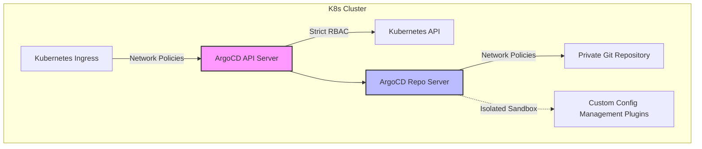

# 🛡️ Bảo Mật Hệ Thống GitOps Với ArgoCD: Các Thực Tiễn Hardening Tốt Nhất

*   **Tác giả gốc:** Argo Project Security Committee & Dev.to DevOps
*   **Dịch thuật & Biên soạn:** Đội ngũ DevSecOps Tutorials (Vietnamese version)
*   **Liên kết bài viết gốc:** [Argo Project - Security Hardening Guidelines](https://argo-cd.readthedocs.io/en/stable/operator-manual/security/)

---

## 📌 Giới thiệu

**GitOps** đã trở thành quy chuẩn thực tế (de facto standard) cho việc triển khai ứng dụng liên tục (CD) trên cụm Kubernetes. Bằng cách khai báo trạng thái mong muốn của hạ tầng và ứng dụng trong kho lưu trữ Git, các công cụ GitOps như **ArgoCD** sẽ tự động đồng bộ hóa và duy trì trạng thái đó trên cluster.

Tuy nhiên, vì ArgoCD nắm giữ quyền lực tối cao trên cluster (thường chạy dưới tài khoản `cluster-admin` để khởi tạo Pods, Services, Secrets...), nó trở thành **mục tiêu tấn công hàng đầu** của hacker. Nếu ArgoCD bị xâm nhập, kẻ tấn công lập tức chiếm toàn quyền kiểm soát toàn bộ hạ tầng K8s của doanh nghiệp.

Bài viết này tổng hợp và hướng dẫn chi tiết quy trình **Gia cố bảo mật ArgoCD (Hardening)** ở mức độ doanh nghiệp, giúp bạn xây dựng một pipeline GitOps an toàn tuyệt đối.

---

## ⚙️ 8 Thực Tiễn Gia Cố Bảo Mật ArgoCD Thực Chiến



---

### 1. Vô hiệu hóa tài khoản `admin` mặc định
Mặc định, ArgoCD đi kèm tài khoản `admin` sở hữu quyền tối cao trên toàn hệ thống. Việc sử dụng tài khoản tĩnh này tạo ra rủi ro rất cao trước các cuộc tấn công brute-force mật khẩu.

✅ **Giải pháp tối ưu:** Vô hiệu hóa tài khoản `admin` và bắt buộc mọi kỹ sư phải đăng nhập thông qua cơ chế đăng nhập một lần (Single Sign-On - SSO) như Keycloak, Okta, Azure AD hoặc GitHub OAuth.

Cấu hình sửa đổi trong ConfigMap `argocd-cm`:
```yaml
apiVersion: v1
kind: ConfigMap
metadata:
  name: argocd-cm
  namespace: argocd
data:
  # Vô hiệu hóa tài khoản admin tĩnh
  admin.enabled: "false"
  
  # Cấu hình tích hợp SSO OIDC (Ví dụ kết nối Okta/Keycloak)
  oidc.config: |
    name: Keycloak SSO
    issuer: https://sso.company.local/realms/master
    clientID: argocd-client
    clientSecret: $oidc.keycloak.clientSecret
    requestedScopes: ["openid", "profile", "email", "groups"]
```

---

### 2. Cưỡng chế phân quyền tối thiểu bằng AppProjects
Theo mặc định, ArgoCD cho phép các ứng dụng được tạo ra dưới dự án mặc định (`default` project). Điều này rất nguy hiểm vì ứng dụng có thể deploy lên bất kỳ namespace nào và tạo ra mọi loại tài nguyên trên cụm Kubernetes.

✅ **Giải pháp tối ưu:** Sử dụng Custom Resource Definition (CRD) **AppProject** để cô lập và giới hạn quyền hạn của từng nhóm phát triển:
*   Chỉ được phép deploy lên danh sách Namespace chỉ định.
*   Chỉ được phép kết nối với các Git Repository cụ thể.
*   Chỉ được phép tạo ra các tài nguyên Kubernetes an toàn (cấm tạo ClusterRole, ClusterRoleBinding, v.v.).

*Mẫu tệp cấu hình AppProject an toàn cho Team Frontend:*
```yaml
apiVersion: argoproj.io/v1alpha1
kind: AppProject
metadata:
  name: frontend-project
  namespace: argocd
spec:
  description: "Dự án cô lập an toàn dành riêng cho Team Frontend"
  
  # Chỉ cho phép kéo mã nguồn từ Repo Git của team Frontend
  sourceRepos:
  - "https://github.com/company-frontend/*.git"
  
  # Chỉ cho phép deploy ứng dụng lên Namespace frontend-prod
  destinations:
  - namespace: frontend-prod
    server: https://kubernetes.default.svc
    
  # Cấm tạo các tài nguyên mức Cluster (như Namespace, ClusterRole) để tránh leo thang quyền
  clusterResourceWhitelist:
  - group: ''
    kind: Namespace
    
  # Danh sách các tài nguyên mức Namespace được phép tạo
  namespaceResourceWhitelist:
  - group: 'apps'
    kind: Deployment
  - group: ''
    kind: Service
  - group: 'networking.k8s.io'
    kind: Ingress
```

---

### 3. Cấu hình phân quyền RBAC nghiêm ngặt (Strict RBAC policies)
Nếu tích hợp SSO, bạn cần chuyển đổi các nhóm người dùng (groups) từ SSO sang các quyền hạn tương ứng trong ArgoCD thông qua ConfigMap `argocd-rbac-cm`.

⚠️ **Lỗi phổ biến:** Cấp quyền ghi hoặc quyền quản trị `admin` bừa bãi cho mọi thành viên.

✅ **Giải pháp tối ưu:** Thiết lập chính sách RBAC phân cấp rõ ràng (ReadOnly, Developer, ProjectAdmin) dựa trên nguyên tắc đặc quyền tối thiểu:
```yaml
apiVersion: v1
kind: ConfigMap
metadata:
  name: argocd-rbac-cm
  namespace: argocd
data:
  # Cấu hình chính sách phân quyền mặc định là Read Only
  policy.default: role:readonly
  
  # Định nghĩa chính sách phân quyền chi tiết
  policy.csv: |
    # Cho phép Nhóm DevOps có quyền quản trị toàn bộ hệ thống
    g, devops-team, role:admin
    
    # Cho phép Kỹ sư Frontend có quyền đọc/ghi trên dự án frontend-project
    p, role:frontend-developer, applications, create, frontend-project/*, allow
    p, role:frontend-developer, applications, update, frontend-project/*, allow
    p, role:frontend-developer, applications, sync, frontend-project/*, allow
    g, frontend-team-sso-group, role:frontend-developer
```

---

### 4. Thiết lập Network Policies cô lập ArgoCD Components
Kiến trúc ArgoCD gồm 3 thành phần chính: `argocd-server` (UI & API), `argocd-application-controller` (đồng bộ trạng thái), và `argocd-repo-server` (kết nối Git và sinh Manifests). Trong đó, `repo-server` là nơi dễ bị tổn thương nhất nếu hacker chèn mã độc vào Git repo.

✅ **Giải pháp tối ưu:** Cài đặt **Network Policies** để hạn chế tối đa giao tiếp mạng:
*   Chỉ cho phép `argocd-server` giao tiếp với `repo-server`.
*   Chặn hoàn toàn kết nối từ `repo-server` ra mạng internet, ngoại trừ cổng kết nối tới Git Server (GitHub/GitLab qua cổng 443 hoặc 22).
*   Chặn đứng `repo-server` kết nối tới các tài nguyên nội bộ khác trong Kubernetes cluster.

*Mẫu NetworkPolicy cô lập `argocd-repo-server`:*
```yaml
apiVersion: networking.k8s.io/v1
kind: NetworkPolicy
metadata:
  name: argocd-repo-server-policy
  namespace: argocd
spec:
  podSelector:
    matchLabels:
      app.kubernetes.io/name: argocd-repo-server
  policyTypes:
  - Ingress
  - Egress
  ingress:
  # Chỉ cho phép Server và Controller kết nối tới Repo Server qua cổng 8081
  - from:
    - podSelector:
        matchLabels:
          app.kubernetes.io/name: argocd-server
    - podSelector:
        matchLabels:
          app.kubernetes.io/name: argocd-application-controller
    ports:
    - protocol: TCP
      port: 8081
  egress:
  # Chỉ cho phép kết nối DNS (cổng 53) để phân giải tên miền Git
  - ports:
    - protocol: UDP
      port: 53
    - protocol: TCP
      port: 53
  # Chỉ cho phép kết nối HTTPS (cổng 443) tới GitHub/GitLab
  - to:
    - ipBlock:
        cidr: 0.0.0.0/0
    ports:
    - protocol: TCP
      port: 443
```

---

### 5. Chạy Custom Plugins trong môi trường hộp cát (Isolated Sandbox)
ArgoCD hỗ trợ cài đặt các Plugins cấu hình tùy biến (Config Management Plugins - CMP) để biên dịch file Manifest. Nếu plugin chạy các script tự chế dưới quyền quản trị của pod repo-server, hacker có thể chiếm đoạt pod thông qua lỗi Remote Code Execution.

✅ **Giải pháp tối ưu:** Từ ArgoCD v2.6+, bắt buộc phải chạy các custom plugins dưới dạng sidecar containers riêng biệt thay vì tích hợp trực tiếp trên pod repo-server chính. Thiết lập filesystem của sidecar là `readOnlyRootFilesystem: true` và chạy dưới quyền non-root.

---

### 6. Cấm gỡ lỗi và truy xuất Shell trực tiếp trên UI (Disable Terminal Feature)
ArgoCD có tính năng hiển thị Terminal trực tiếp trên giao diện Web UI hỗ trợ gỡ lỗi nhanh. Đây là tính năng cực kỳ nguy hiểm vì hacker có thể dùng giao diện Web để tương tác gõ lệnh trích xuất Secrets từ container.

✅ **Giải pháp tối ưu:** Vô hiệu hóa triệt để tính năng Terminal bằng cách cập nhật tham số khởi động của `argocd-server`:
```yaml
spec:
  template:
    spec:
      containers:
      - name: argocd-server
        command:
        - argocd-server
        # Đảm bảo KHÔNG truyền cờ --enable-terminal-feature
```

---

### 7. Bật mã hóa Secrets lưu trữ trên Kubernetes (Encryption at Rest)
Mặc định, các tài nguyên `Secret` trong Kubernetes chỉ được mã hóa dạng Base64 đơn giản. ArgoCD khi đồng bộ các secrets từ Git (sử dụng công cụ mã hóa như **Helm Secrets**, **Sealed Secrets**, hoặc **External Secrets Operators**) cần đảm bảo cụm Kubernetes đã kích hoạt cơ chế mã hóa tĩnh nâng cao **KMS Envelope Encryption** (AWS KMS, HashiCorp Vault) để tránh rò rỉ dữ liệu khi database ETCD của K8s bị đánh cắp.

---

### 8. Thực thi cơ chế ghi vết kiểm toán (Comprehensive Auditing)
Hãy luôn cấu hình ghi log tập trung cho toàn bộ các hành động tương tác với ArgoCD (ai đăng nhập, ai thay đổi cấu hình, ai bấm đồng bộ ứng dụng).
*   Gửi log của `argocd-server` về ELK/Loki.
*   Cấu hình cơ chế cảnh báo tự động qua Slack/Teams mỗi khi phát hiện trạng thái ứng dụng bị lệch (Drift Detection) hoặc đồng bộ hóa thất bại liên tục.

---

## 📝 Tổng kết Check-list Bảo Mật ArgoCD Đạt Chuẩn Enterprise

Để kiểm tra hệ thống ArgoCD của bạn đã an toàn hay chưa, hãy rà soát lại bảng kiểm tra (Checklist) dưới đây:

| STT | Biện pháp bảo mật | Mức độ ưu tiên | Trạng thái |
|---|---|:---:|:---:|
| 1 | Vô hiệu hóa tài khoản `admin` mặc định, tích hợp SSO | `CRITICAL` | [ ] |
| 2 | Phân tách quyền của các team bằng `AppProject` riêng biệt | `CRITICAL` | [ ] |
| 3 | Khóa tính năng Terminal truy xuất Pod trên giao diện Web | `HIGH` | [ ] |
| 4 | Cài đặt Network Policy chặn giao tiếp không an toàn của `repo-server` | `HIGH` | [ ] |
| 5 | Phân quyền RBAC tối giản, chính sách default là `readonly` | `HIGH` | [ ] |
| 6 | Ký số mã hóa Secrets trước khi đẩy lên Git (GitOps Secrets) | `HIGH` | [ ] |
| 7 | Chạy Custom Plugins dưới dạng Sidecar Containers an toàn | `MEDIUM` | [ ] |
| 8 | Bật TLS bắt buộc trên toàn bộ các giao tiếp Ingress/API Server | `MEDIUM` | [ ] |

Gia cố an ninh cho hệ thống phân phối mã nguồn CD là bước đi quan trọng nhất trong chiến lược bảo vệ chuỗi cung ứng phần mềm (Software Supply Chain Security). Hãy gia cố hệ thống của bạn ngay hôm nay để đón đầu các mối đe dọa an ninh mạng nguy hiểm!
