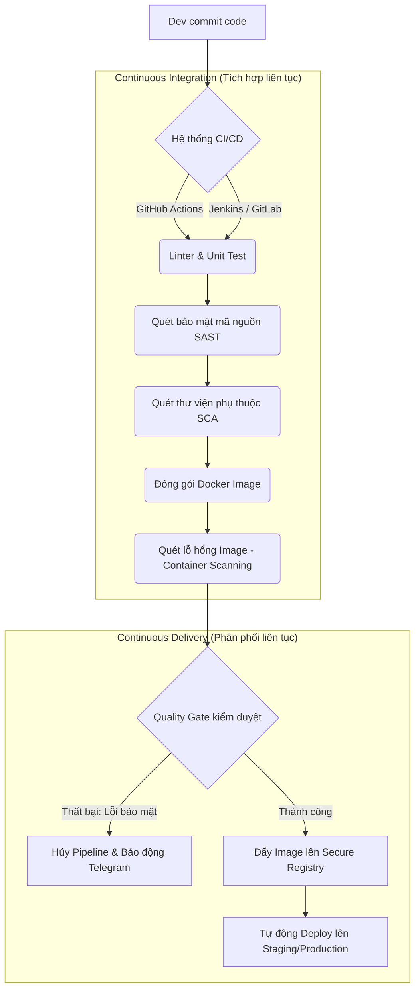

# 🎯 Module 03: Tự Động Hóa CI/CD (CI/CD Automation)

> **"Không có tự động hóa, không thể có DevOps."** 
> CI/CD (Continuous Integration / Continuous Delivery - Tích hợp liên tục / Phân phối liên tục) là trái tim và hệ thống huyết mạch của mọi quy trình phát triển phần mềm hiện đại. Một lỗi cấu hình nhỏ trong pipeline có thể dẫn đến việc lộ secrets ra internet, hoặc mở đường cho các cuộc tấn công chuỗi cung ứng phần mềm (Software Supply Chain Attacks).

---

## 📌 Tại sao DevSecOps cần CI/CD Automation?

1.  **Chuyển dịch về bên trái (Shift-left Security)**: Thay vì kiểm tra bảo mật ở cuối chu kỳ phát triển (sau khi đã deploy), CI/CD cho phép tự động quét lỗ hổng mã nguồn (SAST), quét thư viện dependency (SCA), quét Docker Image ngay khi lập trình viên thực hiện commit code.
2.  **Đồng bộ & Nhất quán**: Đảm bảo quy trình build, test, scan, và deploy diễn ra hoàn toàn tự động, loại bỏ 100% sai sót do con người thao tác thủ công.
3.  **Tự động hóa phản hồi**: Cung cấp phản hồi lập tức về chất lượng mã nguồn và mức độ an toàn bảo mật cho team phát triển trong vòng vài phút sau khi đẩy code.
4.  **Bảo mật quy trình phân phối**: Xây dựng các cổng kiểm soát chất lượng (Quality Gates) ngăn chặn mã nguồn thiếu an toàn hoặc chứa lỗ hổng bảo mật nghiêm trọng được triển khai lên môi trường Production.

---

## 🗺️ Bản đồ Lộ trình học tập (Roadmap)

Sơ đồ dưới đây mô tả các bước từ khi lập trình viên commit code đến khi qua các cổng tự động hóa và bảo mật của pipeline:

---

## 📂 Danh sách các bài học & Thực hành chi tiết

Module này bao gồm 2 Sub-module lớn bám sát các công nghệ CI/CD hàng đầu hiện nay, đi kèm các bài lab thực chiến local tự chạy 100%:

### 1. Sub-module 01: [github-actions](github-actions/github-actions-guide.md) (GitHub Actions & Quét bảo mật tự động)
*   **Lý thuyết chuyên sâu**: Cơ chế workflow, events trigger, runners, jobs, steps, bảo mật bí mật (secrets rotation), và kỹ thuật gia cố an toàn cho Self-hosted Runners (Runner Hardening).
*   🧪 **Thực hành Lab**: [Dựng Self-hosted Runner cục bộ & Tự động quét an toàn với Trivy (SCA)](github-actions/labs/lab-github-actions-runner/lab-instructions.md).

### 2. Sub-module 02: [jenkins-gitlab-ci](jenkins-gitlab-ci/jenkins-gitlab-ci-guide.md) (Hệ thống CI/CD Jenkins & GitLab CI)
*   **Lý thuyết chuyên sâu**: Kiến trúc Controller-Agent phân tán của Jenkins, Declarative Pipeline, kiến trúc GitLab Runner và phân tích chuyên sâu lỗ hổng leo thang đặc quyền của cơ chế chạy Docker-in-Docker (DinD) vs Docker Socket Binding (`/var/run/docker.sock`).
*   🧪 **Thực hành Lab**: [Khởi dựng cụm Jenkins-SonarQube tự động phân tích tĩnh mã nguồn (SAST)](jenkins-gitlab-ci/labs/lab-jenkins-sast/lab-instructions.md).

---

## 📚 Tài nguyên Đọc thêm Chất lượng cao (Recommended Blog Readings)

Mở rộng kiến thức về CI/CD và cách bảo mật pipeline thông qua các bài viết kinh điển sau:

### 1. 🇻🇳 [CI/CD: Từ Khái Niệm Đến Việc Xây Dựng Một Pipeline Thực Tế](https://viblo.asia/p/cicd-tu-khai-niem-den-viec-xay-dung-mot-pipeline-thuc-te-E375zWeElW7)
*   **Nguồn**: Cộng đồng Viblo.asia (Đạt 20k+ views, 250+ upvotes).
*   **Giá trị thực tiễn**: Bài viết hệ thống hóa đầy đủ định nghĩa của Continuous Integration, Continuous Delivery và Continuous Deployment. Tác giả chia sẻ kinh nghiệm thực tế về cách thiết kế một Pipeline chuẩn doanh nghiệp: từ phân chia môi trường (Dev -> Staging -> Production), thiết lập trigger tự động, quản lý cache để tối ưu hóa thời gian build, cho đến các phương án rollback nhanh chóng khi gặp lỗi.
*   **Lý do cần đọc**: Cung cấp bức tranh toàn cảnh để bạn định hình tư duy thiết kế hệ thống trước khi bắt tay viết các file YAML cấu hình.

### 2. 🇬🇧 [Hardening GitHub Actions Self-Hosted Runners: Best Practices (Gia cố Self-Hosted Runners của GitHub Actions)](https://www.cidersecurity.io/blog/security-of-github-actions-self-hosted-runners/)
*   **Tác giả**: Chuyên gia bảo mật chuỗi cung ứng tại Cider Security (nay thuộc Palo Alto Networks).
*   **Bản dịch & Tóm tắt cốt lõi**: Bài nghiên cứu chuyên sâu chỉ ra rằng việc sử dụng Self-hosted Runner mặc định chứa đựng rủi ro **thực thi mã từ xa (RCE)** cực kỳ nguy hiểm. Kẻ tấn công có thể lợi dụng Pull Request từ bên ngoài để chạy code độc hại ngay trên server Runner của bạn. Tác giả đề xuất các biện pháp phòng thủ nghiêm ngặt:
    1.  **Chặn PR từ Fork**: Không bao giờ tự động chạy workflows đối với các Pull Request từ repo phân nhánh ngoại trừ khi có sự phê duyệt thủ công.
    2.  **Sử dụng Ephemeral Runners**: Cấu hình runner chỉ chạy duy nhất 1 job rồi tự hủy (One-time runner), sau đó sinh mới từ image sạch để tránh tình trạng lưu trữ đệm (caching) mã độc.
    3.  **Hạn chế Network Access**: Cô lập Runner trong mạng riêng (VPC), chỉ cho phép kết nối internet outbound tới các địa chỉ whitelist cụ thể (như Github API, Packages Registry), cấm giao tiếp với mạng nội bộ công ty.
    4.  **Chạy user non-privileged**: Tuyệt đối không cho tiến trình runner chạy dưới quyền administrator/root của hệ điều hành host.

