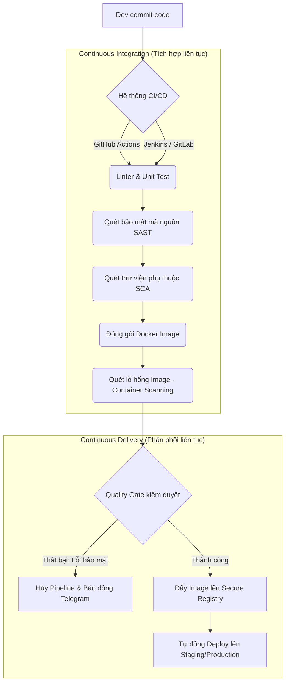

# 🎯 Module 03: Tự Động Hóa CI/CD (CI/CD Automation)

> **"Không có tự động hóa, không thể có DevOps."** 
> CI/CD (Continuous Integration / Continuous Delivery - Tích hợp liên tục / Phân phối liên tục) là trái tim và hệ thống huyết mạch của mọi quy trình phát triển phần mềm hiện đại. Một lỗi cấu hình nhỏ trong pipeline có thể dẫn đến việc lộ secrets ra internet, hoặc mở đường cho các cuộc tấn công chuỗi cung ứng phần mềm (Software Supply Chain Attacks).

---

## 📌 Tại sao DevSecOps cần CI/CD Automation?

1.  **Chuyển dịch về bên trái (Shift-left Security)**: Thay vì kiểm tra bảo mật ở cuối chu kỳ phát triển (sau khi đã deploy), CI/CD cho phép tự động quét lỗ hổng mã nguồn (SAST), quét thư viện dependency (SCA), quét Docker Image ngay khi lập trình viên thực hiện commit code.
2.  **Đồng bộ & Nhất quán**: Đảm bảo quy trình build, test, scan, và deploy diễn ra hoàn toàn tự động, loại bỏ 100% sai sót do con người thao tác thủ công.
3.  **Tự động hóa phản hồi**: Cung cấp phản hồi lập tức về chất lượng mã nguồn và mức độ an toàn bảo mật cho team phát triển trong vòng vài phút sau khi đẩy code.
4.  **Bảo mật quy trình phân phối**: Xây dựng các cổng kiểm soát chất lượng (Quality Gates) ngăn chặn mã nguồn thiếu an toàn hoặc chứa lỗ hổng bảo mật nghiêm trọng được triển khai lên môi trường Production.

---

## 🗺️ Bản đồ Lộ trình học tập (Roadmap)

Sơ đồ dưới đây mô tả các bước từ khi lập trình viên commit code đến khi qua các cổng tự động hóa và bảo mật của pipeline:

---

## 📂 Danh sách các bài học & Thực hành chi tiết

Module này bao gồm 2 Sub-module lớn bám sát các công nghệ CI/CD hàng đầu hiện nay, đi kèm các bài lab thực chiến local tự chạy 100%:

### 1. Sub-module 01: [github-actions](github-actions/github-actions-guide.md) (GitHub Actions & Quét bảo mật tự động)
*   **Lý thuyết chuyên sâu**: Cơ chế workflow, events trigger, runners, jobs, steps, bảo mật bí mật (secrets rotation), và kỹ thuật gia cố an toàn cho Self-hosted Runners (Runner Hardening).
*   🧪 **Thực hành Lab**: [Dựng Self-hosted Runner cục bộ & Tự động quét an toàn với Trivy (SCA)](github-actions/labs/lab-github-actions-runner/lab-instructions.md).

### 2. Sub-module 02: [jenkins-gitlab-ci](jenkins-gitlab-ci/jenkins-gitlab-ci-guide.md) (Hệ thống CI/CD Jenkins & GitLab CI)
*   **Lý thuyết chuyên sâu**: Kiến trúc Controller-Agent phân tán của Jenkins, Declarative Pipeline, kiến trúc GitLab Runner và phân tích chuyên sâu lỗ hổng leo thang đặc quyền của cơ chế chạy Docker-in-Docker (DinD) vs Docker Socket Binding (`/var/run/docker.sock`).
*   🧪 **Thực hành Lab**: [Khởi dựng cụm Jenkins-SonarQube tự động phân tích tĩnh mã nguồn (SAST)](jenkins-gitlab-ci/labs/lab-jenkins-sast/lab-instructions.md).
