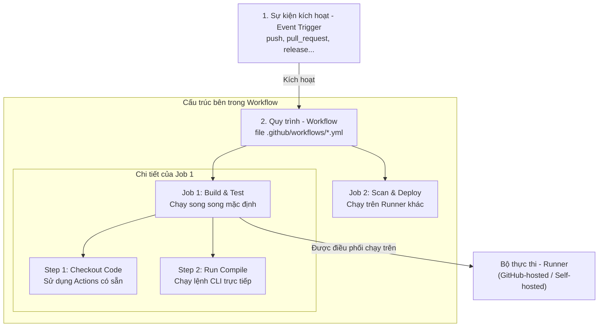

# 🐙 GitHub Actions — Cơ Chế Hoạt Động & Kỹ Thuật Gia Cố Bảo Mật Runner (Self-Hosted Runner Hardening)

> **Mục tiêu (Objectives)**: Hiểu sâu sắc cơ chế hoạt động bên dưới của hệ sinh thái GitHub Actions, làm chủ các kỹ thuật quản lý mã khóa (Secrets), quyền hạn mã thông báo (`GITHUB_TOKEN`), và nắm vững các phương pháp gia cố an toàn tuyệt đối (Hardening) cho Self-hosted Runner để chống lại các cuộc tấn công chuỗi cung ứng phần mềm.

---

## 1. Cơ chế hoạt động của GitHub Actions (Architecture & Core Concepts)

GitHub Actions là một nền tảng **Tự động hóa Quy trình (Workflow Automation)** tích hợp trực tiếp vào kho chứa GitHub. Khi có một sự kiện (Event) xảy ra (ví dụ: Push code, Open Pull Request), GitHub Actions sẽ tự động kích hoạt pipeline tương ứng.

### A. Sơ đồ các Thành phần Kiến trúc của GitHub Actions



---

### B. Bản chất 5 thành phần cốt lõi của Pipeline

1.  **Workflow (Quy trình làm việc):**
    *   *Bản chất:* Là một tiến trình tự động hóa hoàn chỉnh được định nghĩa bằng tệp cấu hình **YAML** nằm trong thư mục `.github/workflows/`.
2.  **Event (Sự kiện):**
    *   *Bản chất:* Là tác nhân kích hoạt workflow. Có thể là sự kiện Git cục bộ (`push`, `pull_request`), sự kiện lập lịch định kỳ (`schedule` chạy bằng Cron syntax), hoặc sự kiện trigger thủ công (`workflow_dispatch`).
3.  **Job (Công việc):**
    *   *Bản chất:* Là tập hợp các bước (Steps) được thực thi trên **cùng một Runner (máy ảo thực thi)**. Mặc định, các Job trong cùng một workflow sẽ chạy song song (parallel). Bạn có thể thiết lập dependencies bằng từ khóa `needs` để ép buộc Job này phải chờ Job kia hoàn thành thành công.
4.  **Step (Bước thực hiện):**
    *   *Bản chất:* Là các đơn vị thực thi nhỏ nhất bên trong Job. Một Step có thể là một câu lệnh CLI chạy trực tiếp (`run: npm install`) hoặc một Action được đóng gói sẵn. Các Step trong một Job chạy tuần tự và chia sẻ chung hệ thống tệp tin của Runner đó.
5.  **Runner (Bộ thực thi pipeline):**
    *   *Bản chất:* Là máy ảo hoặc máy vật lý chạy tiến trình **GitHub Actions Runner application** để trực tiếp kéo mã nguồn về, chạy các lệnh cấu hình và trả log về cho GitHub.

---

## 2. So sánh chuyên sâu Runner: GitHub-hosted vs Self-hosted

Khi thiết kế pipeline cho doanh nghiệp, việc chọn lựa loại Runner ảnh hưởng trực tiếp đến hiệu năng, chi phí và đặc biệt là an ninh hệ thống.

| Tiêu chí so sánh | GitHub-hosted Runners (Do GitHub cung cấp) | Self-hosted Runners (Tự cài đặt & quản lý) |
|:---|:---|:---|
| **Môi trường chạy** | Máy ảo Azure sạch hoàn chỉnh. Mỗi Job được cấp một VM mới toanh và **bị hủy hoàn toàn ngay sau khi chạy xong**. | Máy ảo hoặc container cục bộ của bạn. Môi trường đĩa, cache và tiến trình **được giữ nguyên** giữa các lần chạy Job. |
| **Quyền quản trị** | Không có đặc quyền quản trị máy host vật lý bên dưới. | Có toàn quyền truy cập mạng nội bộ của doanh nghiệp, tài nguyên phần cứng vật lý. |
| **Bảo mật đệm (Cache)** | Rất an toàn, hoàn toàn cô lập dữ liệu giữa các repo khác nhau. | Nguy hiểm nếu không cấu hình dọn dẹp. Lần chạy Job sau có thể đọc dữ liệu/secrets còn sót lại của Job trước trên đĩa. |
| **Hiệu năng & Tối ưu** | Cấu hình mặc định giới hạn, khó tùy biến phần cứng chuyên dụng (như GPU build AI). | Tùy biến thoải mái CPU/RAM/Ổ đĩa, build cực nhanh nhờ tận dụng cache local. |
| **Attack Vector nhắm tới** | Rất thấp. Kẻ tấn công nếu hack được cũng chỉ chiếm được một VM tạm thời bị hủy sau vài phút. | **Cực kỳ cao**. Nếu kẻ tấn công chiếm quyền điều khiển Runner, chúng có thể quét mạng nội bộ doanh nghiệp của bạn. |

---

## 3. Bảo mật trong GitHub Actions (Security Best Practices)

Hệ thống CI/CD là mục tiêu tấn công hàng đầu của tin tặc để cài mã độc vào sản phẩm. Hãy áp dụng 3 lá chắn bảo mật cốt lõi:

### 🛡️ Lá chắn 1: Nguyên tắc Đặc quyền tối thiểu với `GITHUB_TOKEN`

Mỗi khi một Job được kích hoạt, GitHub Actions tự động tạo ra một mã xác thực tạm thời gọi là **`GITHUB_TOKEN`** để Job đó có quyền tương tác (đọc/ghi) với kho chứa GitHub. 

Mặc định, trên nhiều repository cũ, token này được cấp quyền **Ghi (Write)** lên mã nguồn. Điều này cực kỳ nguy hiểm nếu pipeline của bạn bị cài mã độc thông qua PR của kẻ tấn công, chúng có thể dùng token này để commit trực tiếp mã độc vào branch `main`.

**Cách gia cố (Hardening):**
Bắt buộc khai báo giới hạn quyền của `GITHUB_TOKEN` về mức tối thiểu (Read-only) ở đầu mỗi tệp YAML workflow:
```yaml
permissions:
  contents: read    # Chỉ cho phép đọc mã nguồn
  packages: write   # Cho phép đẩy Docker image lên GitHub Container Registry
  security-events: write # Cho phép đẩy báo cáo bảo mật Trivy lên Security tab
```

---

### 🛡️ Lá chắn 2: Xác thực không dùng mã tĩnh (OIDC Token)
Tránh tuyệt đối việc lưu trữ các khóa truy cập dài hạn (static credentials như AWS Access Key, GCP Service Account JSON) vào GitHub Secrets. Nếu tài khoản GitHub bị hack, toàn bộ hạ tầng cloud của bạn sẽ bị sụp đổ.

Hãy sử dụng cơ chế **OpenID Connect (OIDC)**. GitHub Actions sẽ tự động phát sinh một JSON Web Token (JWT) ngắn hạn được ký số bởi GitHub. Hạ tầng Cloud (AWS/GCP/Azure) sẽ kiểm tra chữ ký này và cấp quyền truy cập tạm thời (trong vòng vài phút) cho pipeline mà không cần bất kỳ mật khẩu tĩnh nào!

---

## 4. Gia cố bảo mật cho Self-Hosted Runner (Runner Hardening)

> [!WARNING]
> **Mối đe dọa lớn nhất:** Nếu kho chứa của bạn là **Mã nguồn mở (Public Repository)**, bất kỳ ai cũng có thể tạo một Pull Request gửi mã độc định nghĩa trong tệp `.github/workflows/`. Khi pipeline chạy trên Self-hosted Runner cục bộ của bạn, mã độc này sẽ thực thi trực tiếp dưới quyền của runner và có thể quét toàn bộ mạng nội bộ công ty!

### 🔒 4 Quy tắc Vàng để bảo vệ Self-Hosted Runner:

1.  **Tuyệt đối cấm chạy Runner bằng quyền quản trị tối cao (`root`):**
    *   Tiến trình `run.sh` của runner bắt buộc phải chạy dưới một user thường không đặc quyền.
2.  **Chạy Runner bên trong môi trường Container cô lập hoàn toàn:**
    *   Sử dụng Docker container để bọc ngoài Runner. Mỗi khi Job kết thúc, hãy hủy container đó và dựng lại container sạch mới (Ephemeral Runners).
3.  **CẤM gắn socket Docker của máy host (`/var/run/docker.sock`):**
    *   Nếu bạn gắn socket này vào container của runner để runner có thể chạy lệnh `docker build`, kẻ tấn công chỉ cần gõ lệnh `docker run -v /:/host alpine` bên trong workflow là có thể **truy cập 100% dữ liệu đĩa cứng của máy host vật lý** (Container Breakout). Hãy thay thế bằng các công cụ build không cần socket như **Kaniko** hoặc **Sysbox**.
4.  **Bảo vệ mạng nội bộ (Network Isolation):**
    *   Thiết lập Firewall cô lập hoàn toàn mạng của Runner. Chỉ cho phép traffic đi ra ngoài internet đến máy chủ GitHub, cấm tuyệt đối traffic đi vào mạng nội bộ chứa database hay tài nguyên nhạy cảm của doanh nghiệp.

---

## 📝 Câu hỏi ôn tập chuyên sâu (Deep-dive Quiz)

1.  *Tại sao việc gắn `/var/run/docker.sock` vào container chứa GitHub Self-hosted Runner lại mở ra attack vector leo thang đặc quyền (Privilege Escalation) cực kỳ nguy hiểm?*
2.  *Sự khác biệt về cơ chế dọn dẹp môi trường (Environment Cleanup) giữa GitHub-hosted Runner và Self-hosted Runner ảnh hưởng thế nào đến tính toàn vẹn của mã nguồn build?*
3.  *Làm thế nào để cấu hình ngăn chặn các Pull Request gửi từ các tài khoản lạ (Forked Repositories) tự động kích hoạt chạy pipeline trên Self-hosted Runner của bạn?*
