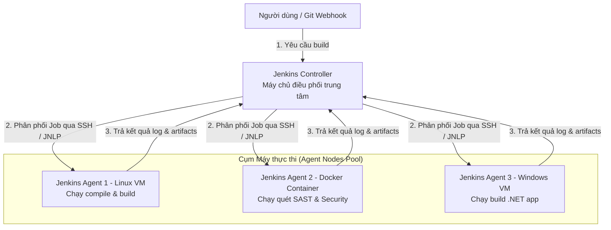
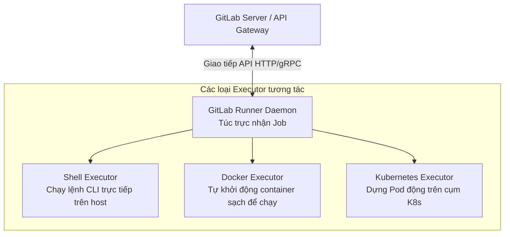

# 🛠️ Jenkins & GitLab CI — Kiến Trúc Phân Tán & An Ninh Bảo Mật Pipeline Containerization

> **Mục tiêu (Objectives)**: Nắm vững mô hình vận hành điều phối Controller-Agent của Jenkins và cơ chế Executor của GitLab CI. Phân tích sâu sắc bản chất an ninh của các giải pháp chạy container trong pipeline (Docker Socket Binding vs DinD) và làm chủ các công nghệ đóng gói container an toàn (như Kaniko).

---

## 1. Kiến trúc phân tán Jenkins Controller-Agent (Master-Agent Architecture)

Trong các hệ thống sản xuất (Production), Jenkins tuyệt đối không được vận hành theo kiểu "đơn độc" (Single Node). Chạy mọi tác vụ biên dịch, kiểm thử trên cùng một máy chủ điều phối sẽ gây nghẽn hệ thống và tạo ra rủi ro bảo mật cực lớn.

### A. Sơ đồ Kiến trúc Điều phối phân tán Jenkins



*   **Jenkins Controller (Bộ điều phối trung tâm):**
    *   *Bản chất:* Chịu trách nhiệm cung cấp giao diện Web UI, quản lý cấu hình hệ thống, lưu trữ mã xác thực (Credentials Database), nhận tín hiệu Webhook từ GitHub/GitLab, lập lịch và phân phối công việc xuống các Agent. **Controller tuyệt đối không được cấu hình số lượng executor lớn hơn 0** để tránh việc trực tiếp thực thi mã nguồn của lập trình viên (ngăn chặn rủi ro mã nguồn độc hại đọc lén Credentials Database của Jenkins).
*   **Jenkins Agent (Máy thực thi):**
    *   *Bản chất:* Là các máy ảo, máy vật lý hoặc container chạy một tiến trình Java Agent siêu nhẹ (`agent.jar`). Nhiệm vụ duy nhất của nó là nhận lệnh từ Controller, trực tiếp biên dịch mã nguồn, thực thi câu lệnh CLI, và truyền trực tuyến (stream) nhật ký hoạt động (logs) về cho Controller hiển thị. Giao tiếp an toàn qua SSH hoặc giao thức JNLP.

---

## 2. Kiến trúc GitLab CI & Cơ chế GitLab Runner

GitLab CI/CD được tích hợp sẵn vào GitLab. Trái tim của hệ thống này là **GitLab Runner** — ứng dụng độc lập viết bằng Go chịu trách nhiệm thực thi các job định nghĩa trong tệp cấu hình `.gitlab-ci.yml`.

### A. Sơ đồ các Tầng thực thi của GitLab Runner



*   **Shell Executor:** Chạy câu lệnh trực tiếp dưới quyền của user `gitlab-runner` trên hệ điều hành máy host. Nhanh nhưng kém an toàn vì các Job dùng chung môi trường hệ thống tệp tin, có thể phá hoại máy host nếu code lỗi.
*   **Docker Executor:** Tự động tạo một container sạch từ một Image khai báo trong `.gitlab-ci.yml`, thực thi các bước của Job bên trong container đó, và hủy container ngay khi hoàn tất. Đảm bảo tính cô lập và sạch sẽ 100% giữa các lần chạy.

---

## 3. Bản chất An ninh Pipeline Container: So sánh Socket Binding vs DinD

Khi sử dụng Docker hoặc GitLab CI để build Docker Image cho ứng dụng, chúng ta phải giải quyết bài toán: *Làm thế nào để chạy các lệnh `docker build` bên trong một container của runner?*

Có 2 phương pháp kinh điển, đi kèm các rủi ro bảo mật nghiêm trọng mà mọi DevSecOps bắt buộc phải hiểu sâu sắc:

```
MÔ PHỎNG AN NINH CONTAINER PIPELINE:

❌ PHƯƠNG PHÁP 1: DOCKER SOCKET BINDING (Mount /var/run/docker.sock)
+-----------------------------------------------------------+
| Container Runner (Chạy dưới quyền root ảo)                |
|   |-- Giao tiếp trực tiếp với daemon máy host             |
|   |-- Lệnh: docker run -v /:/host alpine                 |
|   v                                                       |
| [Docker Daemon của máy host vật lý]                       |
|   ➔ CHIẾM TOÀN BỘ QUYỀN ĐĨA CỨNG MÁY HOST (Breakout!)    |
+-----------------------------------------------------------+

❌ PHƯƠNG PHÁP 2: DOCKER-IN-DOCKER (DinD)
+-----------------------------------------------------------+
| Container Runner chạy chế độ --privileged (Đặc quyền tối cao)|
|   |-- Cho phép tắt toàn bộ lá chắn bảo mật của nhân Kernel|
|   v                                                       |
| [Nhân Kernel máy host]                                    |
|   ➔ Rò rỉ tài nguyên, kẻ tấn công chiếm quyền Kernel!     |
+-----------------------------------------------------------+

✅ GIẢI PHÁP AN TOÀN: KANIKO (Daemonless & Rootless)
+-----------------------------------------------------------+
| Container Runner chạy ở user thường không đặc quyền       |
|   |-- Tự quét thư mục code, nén các layer thành file .tar  |
|   |-- Tự đẩy file .tar lên Docker Hub qua HTTPS API       |
|   ➔ KHÔNG CẦN DOCKER DAEMON, KHÔNG CẦN ĐẶC QUYỀN KERNEL!   |
+-----------------------------------------------------------+
```

---

### A. Phương pháp 1: Docker Socket Binding
*   *Cơ chế:* Gắn kết trực tiếp cổng socket điều khiển Docker của máy host vào container của runner thông qua volume mount: `-v /var/run/docker.sock:/var/run/docker.sock`.
*   *Attack Vector (Nguy cơ bị tấn công):*
    *   Socket file `/var/run/docker.sock` là "bộ não" điều khiển Docker Engine. Bất kỳ ai có quyền ghi vào file socket này đều có quyền tương đương với root trên máy host.
    *   Nếu kẻ tấn công hack được container của runner (hoặc tiêm mã độc qua PR), chúng chỉ cần dùng lệnh Docker Client có sẵn để khởi chạy một container mới có đặc quyền gán ổ cứng vật lý của host: `docker run -it -v /:/host alpine sh`. Khi vào container mới này, kẻ tấn công có thể đọc, sửa, xóa toàn bộ file hệ điều hành của máy host vật lý bên dưới (Container Breakout).

### B. Phương pháp 2: Docker-in-Docker (DinD)
*   *Cơ chế:* Khởi chạy một Docker Daemon hoàn chỉnh chạy **bên trong** một container khác.
*   *Attack Vector (Nguy cơ bị tấn công):*
    *   Để chạy được một Docker Daemon độc lập bên trong container, Docker yêu cầu container đó phải khởi chạy với cờ **`--privileged` (đặc quyền tối cao)**.
    *   Cờ `--privileged` sẽ tắt bỏ toàn bộ cơ chế bảo vệ của Linux Kernel (namespaces, cgroups, AppArmor/SELinux). Container lúc này có quyền can thiệp trực tiếp vào nhân hệ điều hành của máy host vật lý, tạo cơ hội cho kẻ tấn công thực hiện các cuộc tấn công khai thác lỗ hổng Kernel.

---

## 4. Giải pháp thay thế an toàn tuyệt đối: Kaniko

Để triệt tiêu hoàn toàn rủi ro bảo mật của hai phương pháp trên trên môi trường Kubernetes hoặc CI/CD pipeline, Google đã phát triển công cụ **Kaniko**.

*   **Bản chất của Kaniko:**
    *   Kaniko **không phụ thuộc vào bất kỳ Docker Daemon nào** và có thể thực thi hoàn chỉnh ở chế độ không đặc quyền (**Rootless**).
    *   Nó hoạt động hoàn toàn ở không gian người dùng (User Space). Kaniko tự động giải nén base image thành một hệ thống tệp tin ảo trong bộ nhớ đệm, tự động chạy các câu lệnh định nghĩa trong Dockerfile, so sánh sự thay đổi của thư mục để đóng gói thành các layer nén dạng `.tar`, và sử dụng giao thức HTTPS API chuẩn để đẩy trực tiếp các layer đó lên Docker Registry.
    *   *Kết quả:* Build Docker Image an toàn 100% mà không cần gờ bảo mật socket hay đặc quyền privileged VM!

---

## 📝 Câu hỏi ôn tập chuyên sâu (Deep-dive Quiz)

1.  *Tại sao việc cô lập hoàn toàn tài khoản lưu trữ Credentials Database trên Jenkins Controller và cấm Controller chạy các executors lại là nguyên lý bảo mật bắt buộc?*
2.  *Phân tích luồng tấn công chi tiết khi kẻ tấn công lợi dụng tệp `/var/run/docker.sock` được mount vào container để leo thang chiếm quyền root của máy host vật lý.*
3.  *Kaniko thực hiện việc đóng gói và xây dựng các lớp (Layers) của Docker Image thế nào mà không cần sự can thiệp của Docker daemon?*
