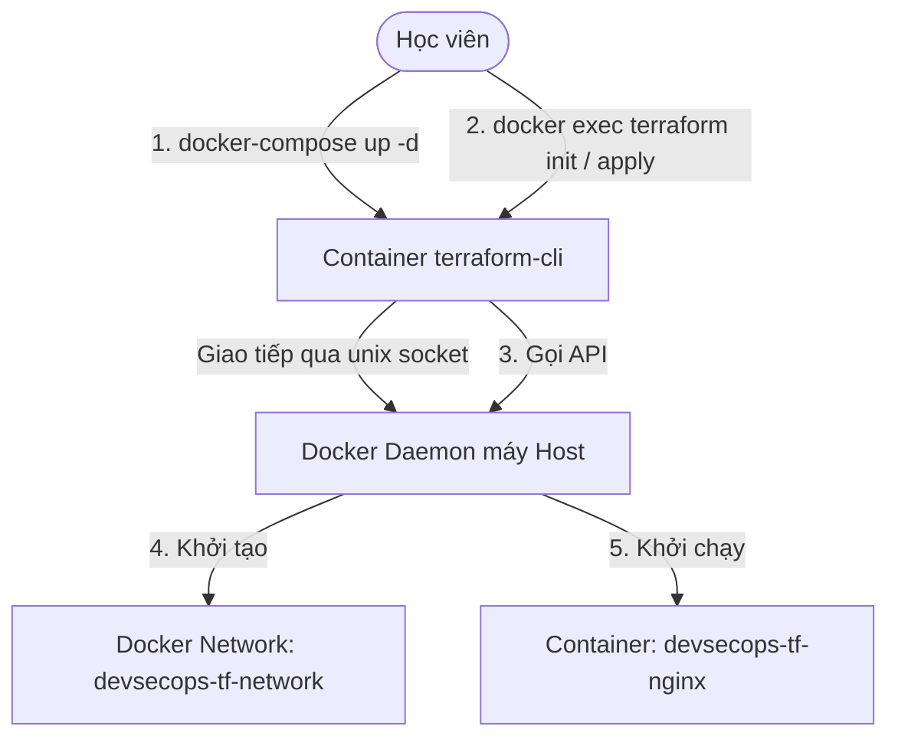

# 🧪 Lab 01: Khởi tạo Hạ tầng Docker Cục bộ bằng Terraform (Terraform Local Lab)

## 📌 Lý do bài thực hành này tồn tại (Why this Lab?)
Để thực hành Terraform, thông thường bạn sẽ cần tạo tài khoản AWS/GCP và cấu hình API keys khá phức tạp, đi kèm rủi ro phát sinh chi phí nếu quên xóa tài nguyên.
Bài lab này giải quyết triệt để vấn đề đó bằng cách **sử dụng chính Docker trên máy của bạn làm Cloud Provider**. Bạn sẽ khởi chạy một Container chuyên dụng chứa Terraform CLI và mount Docker Socket máy host vào container đó. Terraform bên trong container sẽ gọi ngược ra ngoài để quản trị và khởi tạo các tài nguyên Docker cục bộ. **Tiết kiệm 100% chi phí, không cần cài đặt Terraform trên máy host!**

---

## ⚙️ Sơ đồ Luồng Thực hành



---

## 🛠️ Các bước Thực hành Chi tiết

### Bước 1: Khởi dựng Container Terraform CLI
Di chuyển vào thư mục bài lab và chạy lệnh sau để khởi động container chứa môi trường làm việc:
```bash
docker-compose up -d
```
*Lưu ý: Lệnh này khởi tạo container `devsecops-terraform-cli` ở chế độ chạy nền, mount thư mục `./src` chứa file mã nguồn Terraform của bạn.*

### Bước 2: Khởi tạo dự án Terraform (Terraform Init)
Chúng ta sẽ "chui" vào trong container để chạy lệnh Terraform. Trước tiên là khởi tạo dự án để tải về Docker Provider:
```bash
docker exec -it devsecops-terraform-cli terraform init
```
*Bạn sẽ thấy output thông báo tải thành công plugin `kreuzwerker/docker` từ Terraform Registry.*

### Bước 3: Xem kế hoạch thay đổi (Terraform Plan)
Hãy chạy thử xem Terraform sẽ dự định làm gì với hệ thống:
```bash
docker exec -it devsecops-terraform-cli terraform plan
```
*Hãy đọc kỹ màn hình output. Terraform sẽ thông báo kế hoạch: **Plan: 3 to add, 0 to change, 0 to destroy**. Nó sẽ tạo mới 1 Image, 1 Network và 1 Container.*

### Bước 4: Áp dụng cấu hình khởi tạo (Terraform Apply)
Chạy lệnh thực thi để khởi tạo hạ tầng:
```bash
docker exec -it devsecops-terraform-cli terraform apply -auto-approve
```
*Cờ `-auto-approve` giúp tự động đồng ý mà không cần gõ `yes` thủ công.*

### Bước 5: Xác minh kết quả thực hành
1.  **Kiểm tra trên máy host của bạn**: Hãy mở trình duyệt web truy cập địa chỉ: [http://localhost:8080](http://localhost:8080). Bạn sẽ thấy màn hình chào mừng của **Nginx**!
2.  **Kiểm tra danh sách container**:
    ```bash
    docker ps
    ```
    Bạn sẽ thấy một container mới tên là `devsecops-tf-nginx` đang chạy trên cổng `8080`.

### Bước 6: Dọn dẹp hạ tầng (Terraform Destroy)
Sau khi hoàn thành thực hành, hãy dọn dẹp sạch sẽ tài nguyên để tránh chiếm dụng RAM/Port:
1.  **Dọn dẹp tài nguyên do Terraform tạo**:
    ```bash
    docker exec -it devsecops-terraform-cli terraform destroy -auto-approve
    ```
2.  **Tắt container môi trường Terraform CLI**:
    ```bash
    docker-compose down
    ```

---

## 🎯 Tổng kết Bài học
Qua bài lab này, bạn đã:
*   Nắm vững quy trình vòng đời của Terraform CLI (`init` -> `plan` --> `apply` -> `destroy`).
*   Hiểu cách Terraform đọc file `.tf` để giao tiếp với API của Cloud Provider (ở đây là Docker daemon qua `/var/run/docker.sock`).
*   Tự động hóa hoàn toàn việc tạo Network, kéo Image và chạy Container chỉ bằng mã nguồn.
