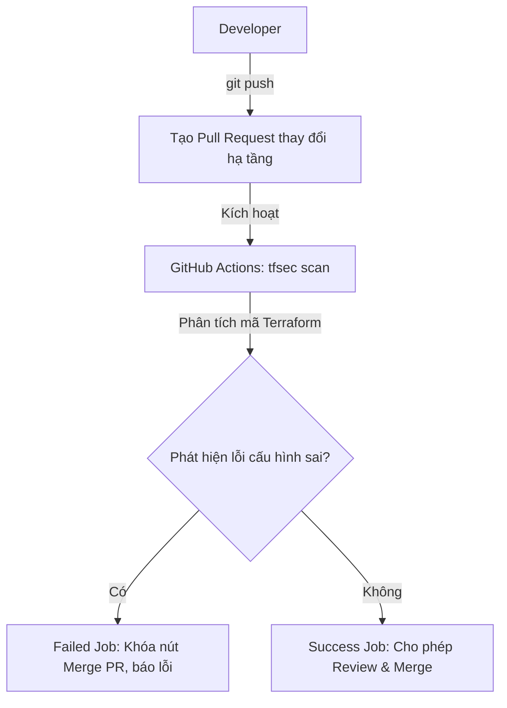

# 🧪 Lab 4.3: Pipeline IaC Security Tự Động Hóa Với GitHub Actions (IaC Pipeline Security Lab)

## 📌 Lý do bài thực hành này tồn tại (Why this Lab?)
Để bảo vệ hạ tầng doanh nghiệp tuyệt đối, chúng ta không thể chỉ dựa vào việc nhà phát triển (developer) tự chạy công cụ quét trên máy cá nhân một cách thủ công. Chúng ta cần thiết lập một **Chốt chặn Bảo mật Tự động** ngay trong luồng CI/CD Pipeline. 
Mỗi khi có một lập trình viên tạo Pull Request (PR) đề xuất thay đổi cấu hình hạ tầng Terraform, hệ thống CI/CD sẽ tự động kích hoạt quét an toàn. Nếu phát hiện bất kỳ lỗi cấu hình sai nào (như mở cổng SSH công khai hay unencrypted storage buckets), pipeline sẽ tự động bị đánh dấu đỏ (Failed) và khóa chặt nút Merge PR, ngăn chặn triệt để hạ tầng không an toàn đi vào hệ thống.

---

## ⚙️ Sơ đồ Quy trình Pipeline IaC Security


---

## 🛠️ Các bước Thực hành Chi tiết

### Bước 1: Chuẩn bị Repository trên GitHub
1. Truy cập [GitHub](https://github.com/) và tạo một repository mới (ví dụ: `devsecops-iac-scan`).
2. Clone repository đó về máy cục bộ của bạn và di chuyển vào thư mục dự án:
```bash
git clone https://github.com/<your-username>/devsecops-iac-scan.git
cd devsecops-iac-scan
```

### Bước 2: Tạo cấu hình Pipeline GitHub Actions
Chúng ta sẽ thiết lập một quy trình tự động hóa quét bảo mật Terraform mỗi khi có commit hoặc Pull Request được tạo.

1. Tạo cấu trúc thư mục workflow của GitHub:
```bash
mkdir -p .github/workflows
```
2. Tạo file cấu hình `.github/workflows/iac-security.yml` và sao chép cấu hình chuyên nghiệp dưới đây:
```yaml
name: IaC Security Scanning

on:
  push:
    branches: [ main, develop ]
  pull_request:
    branches: [ main, develop ]

jobs:
  iac-scan:
    name: Run tfsec Scan
    runs-on: ubuntu-latest
    steps:
      - name: Checkout Code
        uses: actions/checkout@v3

      - name: Run tfsec Security Scanner
        uses: aquasecurity/tfsec-action@v1.0.0
        with:
          soft_fail: false # QUAN TRỌNG: Hủy build (Exit Code 1) và báo lỗi đỏ nếu phát hiện lỗi bảo mật!
```

### Bước 3: Đẩy cấu hình Pipeline lên GitHub
```bash
git add .github/workflows/iac-security.yml
git commit -m "feat: integrate tfsec scanner into CI pipeline"
git push origin main
```
*Hãy truy cập vào tab **Actions** trên giao diện Web của repository GitHub, bạn sẽ thấy pipeline đầu tiên đang khởi chạy và báo trạng thái xanh thành công.*

### Bước 4: Giả lập Tình huống Đẩy code cấu hình sai lên GitHub
Bây giờ, chúng ta sẽ mô phỏng hành vi của một developer sơ ý, tạo một nhánh tính năng mới và viết mã nguồn Terraform dính lỗi bảo mật nghiêm trọng.

1. Tạo nhánh tính năng mới:
```bash
git checkout -b feature/new-database
```

2. Tạo tệp `main.tf` chứa Security Group AWS mở cổng SSH cho toàn bộ thế giới:
```hcl
terraform {
  required_providers {
    aws = {
      source  = "hashicorp/aws"
      version = "~> 4.0"
    }
  }
}

resource "aws_security_group" "bad_sg" {
  name        = "insecure-sg-demo"
  description = "Security group mo cong SSH cong khai cho moi IP"

  ingress {
    from_port   = 22
    to_port     = 22
    protocol    = "tcp"
    cidr_blocks = ["0.0.0.0/0"] # LỖI BẢO MẬT: Mở SSH công khai!
  }
}
```

3. Đẩy nhánh code này lên GitHub và tạo Pull Request:
```bash
git add main.tf
git commit -m "feat: add secure database group configurations"
git push origin feature/new-database
```
*Truy cập GitHub, tạo một **Pull Request (PR)** từ nhánh `feature/new-database` về nhánh `main`.*

### Bước 5: Quan sát chốt chặn hoạt động
Ngay khi PR được tạo, GitHub Actions sẽ tự động kích hoạt quy trình quét **Run tfsec Scan**.
1. Đợi khoảng 10-15 giây, bạn sẽ thấy job quét bị báo đỏ thất bại (**Failed**).
2. Click vào chi tiết log của job, bạn sẽ thấy `tfsec` in ra chính xác lỗi vi phạm:
   - **Mã lỗi**: `CRITICAL - Security group rule allows ingress from public internet to port 22`
   - **Vị trí lỗi**: Tệp `main.tf` dòng 10.
3. Nút **Merge Pull Request** trên GitHub sẽ bị khóa (hoặc báo đỏ), ngăn chặn tuyệt đối mã hạ tầng không an toàn này được tích hợp vào nhánh code chính để khởi tạo lên Cloud thực tế.

---

## 🎯 Tổng kết Bài học
Qua bài thực hành này, bạn đã:
*   Tích hợp thành công công cụ quét bảo mật **tfsec** vào hệ thống **GitHub Actions**.
*   Thiết lập cơ chế chặn đứng pipeline (`soft_fail: false`) để khóa chặt quy trình triển khai nếu phát hiện cấu hình sai an ninh nghiêm trọng.
*   Hiện thực hóa mô hình **Shift-Left Security** tự động hóa ở mức hạ tầng (IaC) chuẩn doanh nghiệp Cloud Native.
