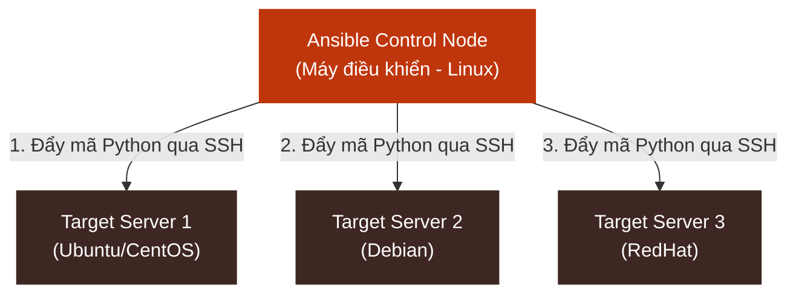
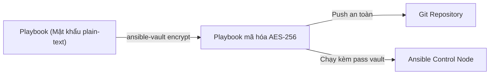

# ⚙️ Sub-module 02: Ansible - Quản lý Cấu hình và Tự động hóa Thiết lập (Configuration Management)

Sub-module này cung cấp kiến thức nền tảng và thực tiễn nâng cao về **Ansible** — công cụ quản lý cấu hình (Configuration Management) và điều phối hệ thống mã nguồn mở hàng đầu hiện nay.

---

## 1. Bản chất Hoạt động của Ansible

Không giống như các công cụ quản lý cấu hình truyền thống như Chef hay Puppet (yêu cầu bạn phải cài đặt một chương trình daemon gọi là Agent trên các server đích), Ansible sử dụng kiến trúc **Không cài Agent (Agentless Architecture)**.

### Sơ đồ kiến trúc không Agent của Ansible:

### 1.1. Cơ chế hoạt động ngầm (Under the hood)
Khi bạn chạy một lệnh Ansible:
1.  **Dịch mã**: Ansible Control Node (máy chạy lệnh) sẽ dịch các khai báo YAML của bạn thành các đoạn mã Python ngắn.
2.  **Truyền tải**: Đoạn mã Python này được đẩy sang Server đích thông qua giao thức **SSH** (hoặc WinRM đối với Windows).
3.  **Thực thi**: Server đích chạy trực tiếp các tệp tin Python này bằng trình thông dịch Python có sẵn trên hệ điều hành, sau đó gửi trả kết quả dạng JSON về cho Control Node.
4.  **Dọn dẹp**: Các đoạn mã Python tạm thời trên server đích tự động bị xóa sạch ngay sau khi chạy xong.

---

## 2. Các khái niệm cốt lõi trong Ansible

Để vận hành tốt Ansible, bạn cần làm quen với các khái niệm sau:

*   **Control Node**: Máy tính cài đặt Ansible, dùng để thực thi các lệnh điều phối. (Bắt buộc phải chạy hệ điều hành Linux/macOS, Windows không hỗ trợ làm Control Node trực tiếp).
*   **Managed Nodes**: Các máy chủ từ xa chịu sự quản lý và cấu hình bởi Control Node.
*   **Inventory**: Tệp tin định nghĩa danh sách các IP/Tên miền của Managed Nodes, được phân loại theo từng nhóm (ví dụ: `[webservers]`, `[databases]`) để dễ quản lý.
*   **Modules**: Các khối mã lệnh viết sẵn đảm nhận các nhiệm vụ cụ thể (như `apt` để cài phần mềm, `copy` để chép file, `service` để quản lý tiến trình).
*   **Ad-hoc Commands**: Câu lệnh chạy nhanh trực tiếp từ dòng lệnh không cần viết script (ví dụ: `ansible webservers -m ping` để kiểm tra kết nối mạng).
*   **Playbooks**: File cấu hình viết bằng định dạng **YAML**, định nghĩa toàn bộ quy trình tự động hóa cấu hình hệ thống bao gồm nhiều bước chạy tuần tự.
*   **Roles**: Cơ chế tổ chức thư mục của Ansible để tái sử dụng mã nguồn Playbook, chia nhỏ biến, cấu hình, file tĩnh và template ra các file riêng biệt.

---

## 3. Bản chất của Tính bất biến trạng thái (Idempotency)

Một trong những ưu điểm lớn nhất của Ansible là tính **Bất biến trạng thái (Idempotency)**. 
*   **Khái niệm**: Nghĩa là dù bạn chạy một Playbook bao nhiêu lần đi chăng nữa trên một Server, kết quả cuối cùng vẫn giữ nguyên không đổi và không gây ra tác dụng phụ.
*   **Cơ chế**: Ansible Module trước khi thực thi luôn kiểm tra trạng thái hiện tại của Server. Ví dụ, nếu bạn viết task yêu cầu cài đặt Nginx, Ansible sẽ check xem Nginx đã cài chưa. Nếu đã cài đúng phiên bản, Ansible sẽ đánh dấu là **SUCCESS (ok)** và bỏ qua, không cài đè lên gây lỗi dịch vụ. Nếu chưa cài, nó mới thực hiện cài và báo **CHANGED**.

---

## 4. Bảo mật với Ansible Vault (Mã hóa bí mật)

Trong DevSecOps, bảo mật mật khẩu database, khóa SSH và các API Keys là tối quan trọng. Bất kỳ thông tin nhạy cảm nào lưu trữ dưới dạng plain-text trong Git đều là thảm họa.

**Ansible Vault** là tính năng được tích hợp sẵn giúp mã hóa các file YAML, file biến chứa thông tin nhạy cảm bằng thuật toán **AES-256**. Bạn chỉ có thể xem, sửa hoặc chạy Playbook đó khi cung cấp đúng mật khẩu khóa giải mã (Vault Password) lúc chạy câu lệnh.
*   Lệnh mã hóa: `ansible-vault encrypt credentials.yml`
*   Lệnh chạy Playbook có vault: `ansible-playbook site.yml --ask-vault-pass`

---

## 5. Gia cố bảo mật Hệ điều hành (OS Hardening) với Ansible

Tự động hóa gia cố bảo mật (Security Hardening) là ứng dụng quan trọng nhất của Ansible trong DevSecOps:
1.  **Hardening SSH Daemon**: Tự động thay đổi cổng SSH mặc định (22 -> 2222), tắt quyền đăng nhập trực tiếp của tài khoản `root`, cấm xác thực bằng mật khẩu dạng plain-text (chỉ cho phép dùng SSH Key).
2.  **Cấu hình Firewall (UFW/Firewalld)**: Thiết lập firewall chặn toàn bộ cổng kết nối, chỉ mở đúng cổng 80/443 của Nginx và chặn các truy cập ngoài vào Database port 5432/3306.
3.  **Tự động cập nhật bảo mật**: Tạo cronjob tự động chạy cập nhật các bản vá an ninh hệ điều hành định kỳ (`unattended-upgrades`).

---

## 📚 Tài nguyên Đọc thêm Chất lượng cao (Recommended Blog Readings)

### 🇬🇧 [OS Hardening with Ansible: Implementing CIS Benchmarks Automatically (Gia Cố Bảo Mật Hệ Điều Hành Bằng Ansible: Tự Động Hóa Triển Khai Tiêu Chuẩn Bảo Mật CIS)](./blog/os-hardening-ansible.md)
*   **Chi tiết**: Bản dịch thuật & tóm tắt chuyên sâu 100% tiếng Việt của bài blog uy tín từ Dev-Sec.io được lưu trữ cục bộ.
*   **Giá trị thực tiễn**: Khám phá quy trình tự động hóa OS Hardening 4 tầng (SSH, Kernel sysctl, file permissions, firewall) sử dụng Ansible để nâng cao an ninh hạ tầng chuẩn CIS Benchmarks.
*   **Liên kết nguồn gốc**: [Dev-Sec.io - OS Hardening with Ansible](https://dev-sec.io/)

---

## 🚀 Bước tiếp theo
Hãy tiến hành bài thực hành Lab thực tế cục bộ để dựng một container Ansible Controller và chạy playbook tự động gia cố bảo mật cho 2 máy chủ target:

👉 **[Bắt đầu bài Lab thực hành: Ansible Hardening](./labs/lab-ansible-hardening/lab-instructions.md)**
