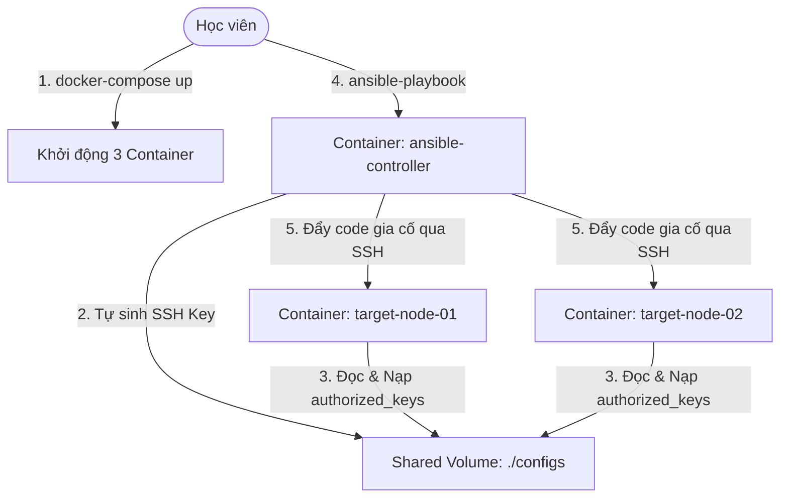

# 🧪 Lab 02: Tự động hóa Gia cố Bảo mật Hệ điều hành bằng Ansible (Ansible OS Hardening Lab)

## 📌 Lý do bài thực hành này tồn tại (Why this Lab?)
Trong vai trò DevSecOps, khi bạn cần gia cố bảo mật (Security Hardening) cho hàng trăm hoặc hàng ngàn server vật lý/máy chủ ảo, việc đăng nhập SSH vào từng máy để chỉnh sửa cấu hình thủ công là bất khả thi.
Bài lab này giúp bạn làm chủ quy trình **quản trị cấu hình tập trung và gia cố an toàn tự động**. Bạn sẽ khởi dựng 1 container đóng vai trò **Ansible Control Node** và 2 container đóng vai trò **Target Servers**. Control Node sẽ tự động sinh cặp khóa SSH động, phân phối và thiết lập kết nối passwordless an toàn tới các target nodes, sau đó chạy một Playbook thực hiện gia cố bảo mật OS đồng loạt!

---

## ⚙️ Sơ đồ Mạng ảo & Luồng Thực hành



---

## 🛠️ Các bước Thực hành Chi tiết

### Bước 1: Khởi chạy Cụm Môi trường Thực hành
Hãy di chuyển vào thư mục bài lab và chạy Docker Compose để khởi chạy cụm 3 máy chủ ảo hóa cục bộ:
```bash
docker-compose up -d
```
*Lưu ý: Mất khoảng vài chục giây trong lần chạy đầu tiên để các container tải xuống Alpine, cài đặt `ansible` trên Control Node và cài `openssh` làm máy chủ SSH trên Target Nodes.*

### Bước 2: Kiểm tra trạng thái sẵn sàng của Ansible Controller
Hãy kiểm tra xem container điều phối đã cài đặt hoàn tất Ansible chưa:
```bash
docker exec -it devsecops-ansible-controller ansible --version
```
*Nếu màn hình in ra phiên bản Ansible (v.d. 2.14.x) nghĩa là hệ thống đã sẵn sàng!*

### Bước 3: Kiểm tra kết nối Ping tới các Target Servers
Trước khi chạy Playbook, ta sử dụng lệnh Ad-hoc đơn giản của Ansible để kiểm tra xem đã thông kết nối SSH passwordless tới 2 target server chưa:
```bash
docker exec -it devsecops-ansible-controller ansible all -m ping
```
*Bạn sẽ nhận được phản hồi màu xanh lá cây với thông báo `"ping": "pong"` từ cả hai server `devsecops-target-node-01` và `devsecops-target-node-02`!*

### Bước 4: Chạy Playbook gia cố bảo mật hệ thống (Hardening)
Bây giờ, hãy khởi chạy Playbook tự động hóa bảo mật:
```bash
docker exec -it devsecops-ansible-controller ansible-playbook playbook.yml
```
*Hãy theo dõi kỹ từng bước thực thi trên màn hình. Ansible sẽ lần lượt thực hiện:*
1.  *Kiểm tra thông tin phân phối hệ điều hành.*
2.  *Cập nhật gói và sửa lỗi vá an ninh hệ điều hành.*
3.  *Cài đặt các gói an toàn thông tin.*
4.  *Gia cố giới hạn tiến trình chống Fork bomb (DoS).*
5.  *Cấu hình các tham số hạt nhân Linux (sysctl net.ipv4) chống tấn công mạng SYN Flood.*
6.  *Chỉnh sửa file cấu hình `/etc/ssh/sshd_config` để cấm mật khẩu thô và tắt X11 forwarding.*
7.  *Restart dịch vụ sshd.*

### Bước 5: Đọc báo cáo kết quả (Play Recap)
Kết thúc câu lệnh, bạn sẽ thấy bảng tổng hợp **PLAY RECAP**:
```
devsecops-target-node-01   : ok=7    changed=5    unreachable=0    failed=0
devsecops-target-node-02   : ok=7    changed=5    unreachable=0    failed=0
```
*Tất cả các task đều chạy thành công (`failed=0`). Các phần thay đổi hệ thống được báo màu vàng (`changed=5`), các phần hệ thống đã có sẵn được báo màu xanh (`ok`).*

### Bước 6: Kiểm tra tính Idempotent (Bất biến trạng thái)
Hãy chạy lại lệnh Playbook một lần nữa:
```bash
docker exec -it devsecops-ansible-controller ansible-playbook playbook.yml
```
*Lần này, hãy quan sát: toàn bộ các task đều báo màu xanh lá (`ok`), trạng thái thay đổi `changed` bằng 0! Điều này minh chứng cho tính chất **Idempotency** tuyệt vời của Ansible — không thay đổi gì nếu hệ thống đã đạt trạng thái an toàn mong muốn.*

### Bước 7: Dọn dẹp môi trường
Sau khi kết thúc thực hành, tắt cụm container để dọn dẹp RAM máy tính:
```bash
docker-compose down
```

---

## 🎯 Tổng kết Bài học
Qua bài thực hành này, bạn đã:
*   Nắm vững cơ chế hoạt động không cài agent (Agentless) của Ansible thông qua SSH keys.
*   Hiểu cách sử dụng Inventory để gom nhóm và quản trị hàng loạt server.
*   Viết thành công một Playbook gia cố an toàn hệ thống (limits, sysctl, SSHD hardening).
*   Trải nghiệm thực tế tính chất bất biến trạng thái (Idempotency) của Ansible.
