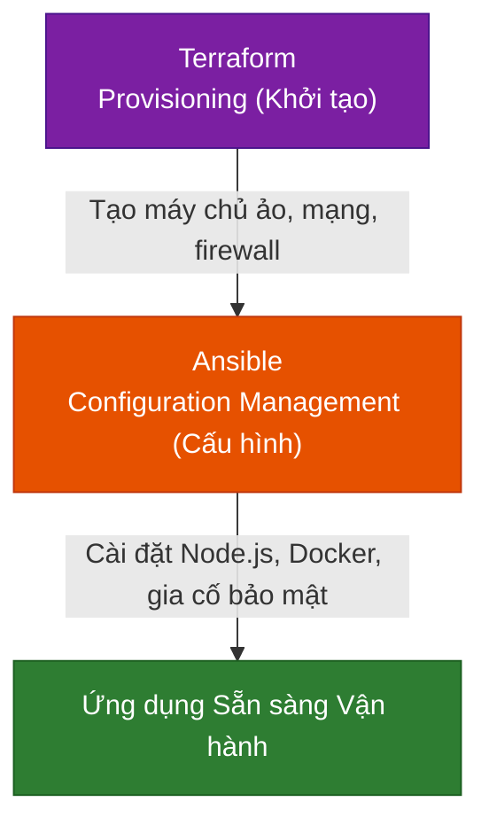

# 🛠️ MODULE 4 — HẠ TẦNG DẠNG CODE (INFRASTRUCTURE AS CODE - IaC)

Chào mừng bạn đến với Module về **Hạ tầng dạng Code (Infrastructure as Code - IaC)**. Trong kỷ nguyên đám mây và DevSecOps, việc khởi tạo, cấu hình và quản trị tài nguyên phần cứng (Servers, Networks, Firewalls, Load Balancers) thủ công đã hoàn toàn được thay thế bằng mã nguồn. IaC giúp tự động hóa 100%, đảm bảo tính nhất quán (Consistency) và loại bỏ hoàn toàn các lỗi do con người.

---

## 🔍 Phân loại IaC: Provisioning vs Configuration Management

Trong thực tế, hệ sinh thái IaC được phân tách thành hai nhóm công cụ chính có chức năng bổ trợ cho nhau:



### 1. Provisioning (Khởi tạo tài nguyên) — Đại diện: Terraform
*   **Trọng tâm**: Khởi tạo hạ tầng thô (Infrastructure Provisioning).
*   **Cách thức**: Sử dụng mô hình **Khai báo (Declarative)** để định nghĩa cấu trúc tài nguyên mong muốn (như VPC, Subnets, EC2 instances, Security Groups, IAM Policies).
*   **Mục tiêu**: Thiết lập bộ khung phần cứng ảo hóa trên AWS, GCP, Azure, VMware hoặc Localstack.

### 2. Configuration Management (Quản lý cấu hình) — Đại diện: Ansible
*   **Trọng tâm**: Cài đặt phần mềm, cấu hình hệ điều hành và gia cố bảo mật (Hardening) trên hạ tầng đã có sẵn.
*   **Cách thức**: Sử dụng mô hình **Đẩy (Push-based)** và kiến trúc không cài agent (**Agentless**), giao tiếp qua SSH/WinRM để quản trị hệ thống.
*   **Mục tiêu**: Biến một server Linux trắng thành một Web Server bảo mật chạy Docker, cài đặt Node.js, cập nhật bản vá bảo mật và tắt các cổng kết nối nguy hiểm.

---

## 📁 Cấu trúc Module 4

Module này được phân chia thành hai Sub-module lớn thực hành trực tiếp:

```
04-infrastructure-as-code/
├── infrastructure-as-code-overview.md   # File này (Giới thiệu tổng quan)
│
├── terraform/                           # Sub-module 01: Terraform
│   ├── terraform-guide.md               # Hướng dẫn chi tiết Terraform lý thuyết
│   └── labs/
│       └── lab-terraform-local/         # Lab thực hành khởi tạo hạ tầng cục bộ
│
└── ansible/                             # Sub-module 02: Ansible
    ├── ansible-guide.md                 # Hướng dẫn chi tiết Ansible lý thuyết
    └── labs/
        └── lab-ansible-hardening/       # Lab thực hành gia cố bảo mật máy chủ từ xa
```

---

## 🔒 Triết lý Bảo mật trong IaC (Security-as-Code)

Tích hợp an toàn thông tin vào IaC giúp ngăn chặn các lỗi cấu hình nghiêm trọng trước khi hạ tầng được khởi dựng:

1.  **Quản lý Bí mật (Secret Management)**: Tuyệt đối không hardcode API keys, mật khẩu hay SSH keys trong mã nguồn tf/yml. Sử dụng biến môi trường hoặc tích hợp Vault/Ansible Vault.
2.  **Quét lỗi cấu hình tĩnh (Static Analysis)**: Sử dụng các công cụ như `tfsec`, `kics`, `ansible-lint` để tự động phát hiện các lỗ hổng như cổng SSH 22 mở public, thiếu mã hóa ổ đĩa, chạy container dưới quyền root.
3.  **Bảo vệ State File**: Terraform State chứa toàn bộ thông tin hạ tầng bao gồm cả secret dạng plain-text. Bắt buộc phải lưu trữ file này ở backend an toàn (S3, GCS) có mã hóa và bật tính năng State Locking (DynamoDB) để ngăn trùng lặp ghi đè.

---

## 🚀 Lộ trình Học tập

*   👉 **[Bước 1: Bắt đầu tìm hiểu về Terraform](./terraform/terraform-guide.md)** để nắm vững cách khai báo hạ tầng.
*   👉 **[Bước 2: Học về Ansible](./ansible/ansible-guide.md)** để nắm vững cách quản lý cấu hình và gia cố bảo mật máy chủ tự động.

---

## 📚 Tài nguyên Đọc thêm Chất lượng cao (Recommended Blog Readings)

Khám phá các bài blog thực tế và kinh nghiệm nâng cao từ cộng đồng DevOps để làm chủ Hạ tầng dạng Code (IaC):

### 1. 🇻🇳 [Terraform Series - Bài 13 - Ansible with Terraform](https://viblo.asia/p/terraform-series-bai-13-ansible-with-terraform-63vKj19a52Y)
*   **Nguồn**: Cộng đồng Viblo.asia (Đạt 10k+ views và 150+ upvotes).
*   **Giá trị thực tiễn**: Hướng dẫn chi tiết cách kết hợp sức mạnh của hai công cụ IaC hàng đầu: Terraform (đóng vai trò khởi tạo hạ tầng - *provisioning*) và Ansible (đóng vai trò quản lý cấu hình - *configuration management*). Bài viết đi sâu vào cách dùng `local-exec` và `remote-exec` để truyền IP động từ Terraform output sang Ansible inventory, giúp tự động hóa 100% quy trình từ tạo server đến cấu hình và deploy app.
*   **Lý do cần đọc**: Giúp bạn giải quyết bài toán thực tế khi muốn liên kết hai công cụ này với nhau một cách mượt mà và tự động nhất mà không cần nhập IP thủ công.

### 2. 🇬🇧 [Terraform State: Best Practices and Common Pitfalls (Quản lý Trạng thái trong Terraform: Thực tiễn Tốt nhất và Các Cạm Bẫy Thường Gặp)](https://medium.com/hashicorp-engineering/terraform-state-best-practices-and-common-pitfalls-974a91bb49ee)
*   **Nguồn**: Medium / HashiCorp Blog (Bài viết đạt lượt tương tác và upvotes rất cao từ cộng đồng quốc tế).
*   **Bản dịch & Tóm tắt cốt lõi**: Phân tích cơ chế hoạt động của tập tin trạng thái (*State file* - `terraform.tfstate`). Tại sao lưu trữ state file ở máy cục bộ (*local*) là cực kỳ nguy hiểm (nguy cơ mất mát dữ liệu, xung đột ghi đè khi team chạy song song, rò rỉ thông tin nhạy cảm ở dạng văn bản thuần túy (*plain-text*)). Hướng dẫn 5 nguyên tắc vàng (*Best Practices*):
    1.  **Sử dụng Kho lưu trữ từ xa (Remote Backends)**: Chuyển state lên AWS S3, Google Cloud Storage hoặc Terraform Cloud để quản lý tập trung.
    2.  **Bật Khóa trạng thái (State Locking)**: Cấu hình DynamoDB kết hợp với S3 để ngăn chặn nhiều tiến trình hoặc kỹ sư cùng chạy `terraform apply` một lúc dẫn đến hỏng hoặc chồng chéo dữ liệu state.
    3.  **Mã hóa tuyệt đối (Encryption)**: Bật mã hóa cả khi truyền tải (*in-transit*) và khi lưu trữ (*at-rest*) cho bucket chứa state file.
    4.  **Cô lập môi trường và Thu hẹp phạm vi ảnh hưởng (Blast Radius)**: Phân tách state file theo môi trường (dev, staging, prod) và theo thành phần (network, database, app) để nếu có lỗi xảy ra cũng không làm sập toàn bộ hệ thống.
    5.  **Cấm sửa đổi thủ công**: Tuyệt đối không can thiệp trực tiếp vào file JSON state, thay vào đó dùng CLI như `terraform state mv` (di chuyển tài nguyên) hoặc `terraform state rm` (xóa tài nguyên khỏi state quản lý).

