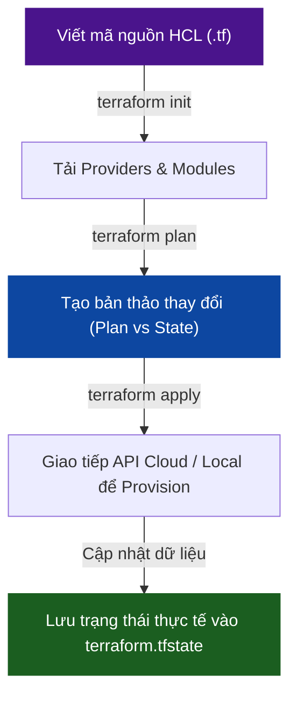
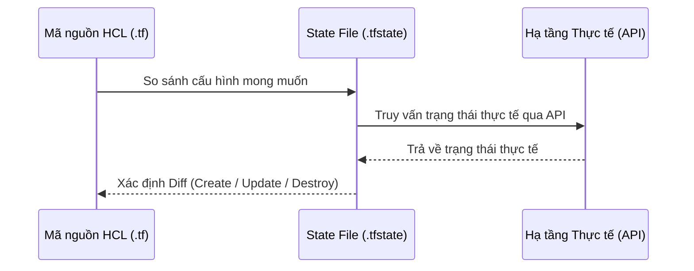

# 🌍 Sub-module 01: Terraform - Khởi tạo Hạ tầng dạng Code (Infrastructure Provisioning)

Sub-module này cung cấp kiến thức nền tảng và nâng cao về **Terraform** — công cụ khởi tạo hạ tầng dạng mã nguồn (Infrastructure Provisioning) phổ biến nhất hiện nay do HashiCorp phát triển.

---

## 1. Bản chất Hoạt động của Terraform

Terraform hoạt động dựa trên cơ chế **Declarative (Khai báo)** và sử dụng ngôn ngữ cấu hình riêng gọi là **HCL (HashiCorp Configuration Language)**. Khác với mô hình Imperative (Mệnh lệnh) nơi bạn phải chỉ ra từng bước để tạo tài nguyên (ví dụ: chạy shell script AWS CLI), với Terraform bạn chỉ cần mô tả **Trạng thái mong muốn (Desired State)** của hệ thống, Terraform sẽ tự tính toán các bước thay đổi để đạt được trạng thái đó.

### Sơ đồ luồng hoạt động chính của Terraform:

### 1.1. Kiến trúc đồ thị tài nguyên (Resource Graph Theory)
Bên trong nhân của Terraform là một công cụ phân tích đồ thị hướng không chu trình (**Directed Acyclic Graph - DAG**). Khi bạn chạy `terraform plan` hoặc `apply`, Terraform sẽ duyệt qua toàn bộ mã nguồn HCL của bạn để xây dựng một bản đồ liên kết phụ thuộc giữa các tài nguyên.
*   **Tự động song song hóa**: Nhờ có đồ thị DAG, Terraform biết được các tài nguyên nào độc lập với nhau để tạo song song, giúp tối ưu hóa thời gian provision.
*   **Thứ tự tạo tài nguyên**: Nếu tài nguyên A cần ID của tài nguyên B (như Subnet cần VPC ID), Terraform sẽ tự động tạo B trước rồi mới tạo A.

---

## 2. Quản lý trạng thái hạ tầng (State Management)

Trái tim của Terraform chính là tệp tin **`terraform.tfstate`**. Đây là tệp tin định dạng JSON ghi lại bản đồ ánh xạ chính xác giữa mã nguồn HCL của bạn và tài nguyên thực tế chạy trên đám mây.

### 2.1. Tại sao State File lại cực kỳ quan trọng?
1.  **Hiệu năng**: Thay vì phải gọi API lên AWS/GCP để kiểm tra hàng ngàn tài nguyên mỗi lần chạy lệnh, Terraform đọc trực tiếp thông tin từ State File.
2.  **Quản lý Metadata**: Theo dõi các mối quan hệ phức tạp và metadata của tài nguyên mà API của Cloud provider không trả về.
3.  **Phát hiện sai lệch cấu hình (Drift Detection)**: Khi ai đó vào giao diện web của AWS chỉnh sửa thủ công tài nguyên, `terraform plan` sẽ so sánh thực tế với State File để phát hiện và tự động sửa lại theo đúng code của bạn.

### 2.2. Bảo mật State File & Cơ chế Khóa trạng thái (State Locking)
> [!CAUTION]
> **Rủi ro rò rỉ thông tin nhạy cảm**: State file chứa toàn bộ thông tin tài nguyên dưới dạng plain-text, bao gồm cả mật khẩu DB, API keys và khóa SSH nếu bạn truyền vào. Tuyệt đối **CẤM commit file `.tfstate` lên Git**.

*   **Remote Backend**: Trong môi trường dự án thực tế chạy nhóm, bạn phải lưu trữ State file trên các hệ thống lưu trữ tập trung an toàn như AWS S3, Google Cloud Storage (GCS) hoặc HashiCorp Terraform Cloud. Các hệ thống này hỗ trợ mã hóa dữ liệu khi ghi xuống đĩa (Encryption at Rest) và mã hóa đường truyền SSL/TLS.
*   **State Locking**: Khi có 2 kỹ sư cùng chạy lệnh `terraform apply` một lúc, có thể làm hỏng State file. Việc cấu hình State Locking (ví dụ sử dụng **Amazon DynamoDB** làm khóa lock hoặc khóa lock của Consul) giúp khóa quyền ghi, chỉ cho phép 1 tiến trình chạy tại một thời điểm.

---

## 3. Các thành phần cú pháp cốt lõi của HCL

Một dự án Terraform cơ bản sẽ gồm các khối cú pháp sau:

*   **`terraform`**: Cấu hình các thiết lập của Terraform như phiên bản yêu cầu và remote backend.
*   **`provider`**: Định nghĩa nhà cung cấp dịch vụ hạ tầng mà Terraform sẽ giao tiếp (như `aws`, `google`, `kubernetes`, `docker`, `local`). Mỗi provider sẽ tải về một binary plugin riêng để dịch mã HCL thành lệnh gọi API.
*   **`resource`**: Khối quan trọng nhất, định nghĩa tài nguyên cụ thể bạn muốn tạo (ví dụ: `resource "docker_container" "web" {}`).
*   **`variable`**: Biến đầu vào (Input Variables) giúp cấu hình linh hoạt mà không cần sửa code gốc.
*   **`output`**: Trả về các thông số sau khi provision thành công (như địa chỉ IP public của server vừa tạo) để sử dụng cho bước tiếp theo.
*   **`data`**: Khối dữ liệu (Data Sources) dùng để truy vấn thông tin từ tài nguyên có sẵn nằm ngoài tầm quản lý của project Terraform này.
*   **`module`**: Gom nhóm các tài nguyên liên quan lại với nhau để tái sử dụng nhiều lần.

---

## 4. Quy trình Vòng đời CLI (Terraform Workflow)

Quy trình chuẩn hóa khi làm việc với Terraform gồm 4 bước chính:

1.  **`terraform init`**: Khởi tạo thư mục làm việc, tải các binary plugin của Provider khai báo trong code và cấu hình backend lưu trữ state.
2.  **`terraform plan`**: Thực hiện chạy thử nghiệm. Terraform so sánh code `.tf` với file state hiện tại và thực tế trên Cloud để tạo ra một bản mô tả chi tiết: những tài nguyên nào sẽ được **thêm mới (+)**, **chỉnh sửa (~)**, hay **xóa bỏ (-)**.
3.  **`terraform apply`**: Thực thi các thay đổi được vạch ra trong bước `plan`. Sau khi người dùng gõ xác nhận `yes`, Terraform gọi API để tạo hạ tầng và ghi đè trạng thái mới vào `.tfstate`.
4.  **`terraform destroy`**: Dọn sạch toàn bộ hạ tầng do dự án này tạo ra, đưa tài nguyên về 0.

---

## 5. Gia cố bảo mật cho IaC (IaC Hardening)

Để bảo mật mã nguồn IaC ngay từ giai đoạn phát triển (Shift Left Security), cộng đồng DevSecOps khuyến nghị tích hợp các công cụ quét mã tĩnh (Static Application Security Testing - SAST dành cho IaC):

*   **tfsec**: Công cụ quét an toàn cực mạnh dành riêng cho Terraform. Nó giúp phát hiện nhanh các lỗi như: Security Group mở cổng 0.0.0.0/0 bừa bãi, không bật mã hóa S3 bucket, sử dụng phiên bản TLS cũ.
*   **Checkov / KICS**: Các framework quét bảo mật IaC đa nền tảng (hỗ trợ cả Terraform, CloudFormation, Kubernetes YAML, Dockerfile).

---

## 📚 Tài liệu đọc thêm khuyến nghị

*   [Terraform Registry - Providers Docs](https://registry.terraform.io/) — Tra cứu cú pháp các tài nguyên của AWS, Docker, Kubernetes... chính thức.
*   [Terraform Best Practices](https://www.terraform-best-practices.com/) — Hướng dẫn tổ chức thư mục, cấu hình biến và tối ưu hóa module Terraform.
*   [tfsec Documentation](https://aquasecurity.github.io/tfsec/) — Danh mục các quy tắc an toàn bảo mật khi viết Terraform.

---

## 🚀 Bước tiếp theo
Hãy tiến hành bài thực hành Lab thực tế cục bộ để khởi tạo hạ tầng Docker tự động bằng Terraform trên máy của bạn:

👉 **[Bắt đầu bài Lab thực hành: Terraform Local](./labs/lab-terraform-local/lab-instructions.md)**
