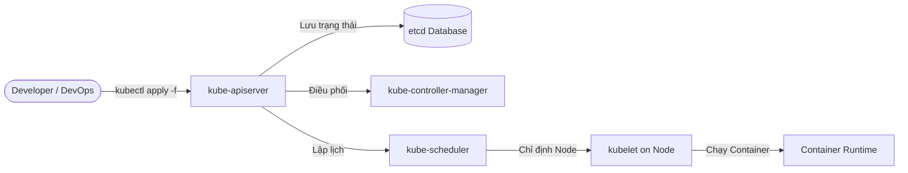
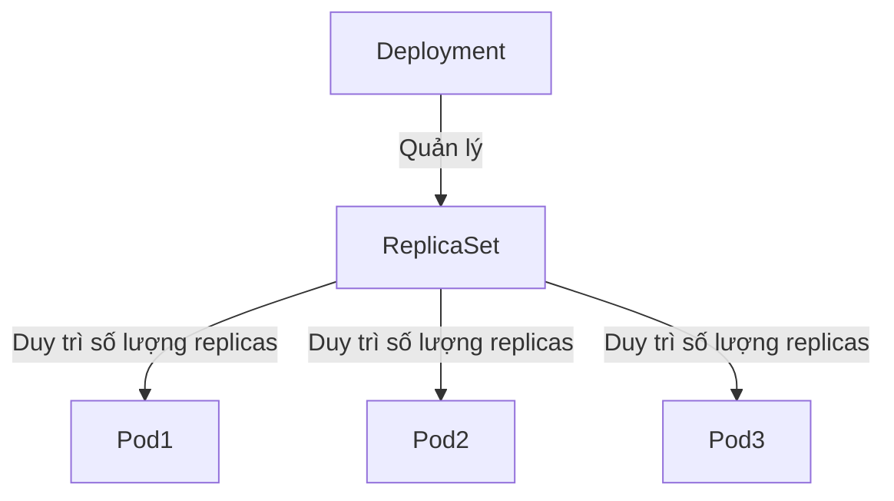

# ☸️ Sub-module 01: Kubernetes Cơ bản (CKAD Guide)

Sub-module này tập trung cung cấp kiến thức nền tảng vững chắc về phát triển và triển khai ứng dụng trên Kubernetes, bám sát khung chương trình chuẩn của chứng chỉ quốc tế **CKAD (Certified Kubernetes Application Developer)**.

---

## 1. Tổng quan Kiến trúc Ứng dụng trên Kubernetes

Kubernetes (K8s) hoạt động theo mô hình **Declarative Configuration** (Cấu hình khai báo). Nghĩa là bạn định nghĩa trạng thái mong muốn của ứng dụng (Desired State) qua các file cấu hình YAML, và Kubernetes Control Plane (Bộ điều khiển trung tâm) sẽ liên tục theo dõi và đưa trạng thái thực tế (Actual State) khớp với trạng thái mong muốn đó.



---

## 2. Các Thành phần Cốt lõi (Core Resources)

### 2.1. Pods — Đơn vị tính toán nhỏ nhất
*   **Khái niệm**: Pod là thực thể nhỏ nhất có thể khởi tạo và quản lý trong Kubernetes. Một Pod đại diện cho một tiến trình đang chạy trong cụm.
*   **Đặc điểm**:
    *   Một Pod có thể chứa **một hoặc nhiều container** chung một số tài nguyên (Network namespace, Storage volumes).
    *   Các container trong cùng một Pod chia sẻ cùng địa chỉ IP (`localhost`) và dải cổng (Port range). Chúng có thể giao tiếp với nhau cực kỳ nhanh chóng qua IPC (Inter-Process Communication).
    *   Pod có tính chất **ephemeral** (tạm thời) — nó có thể bị xóa, di chuyển hoặc recreate bất cứ lúc nào và sẽ nhận một địa chỉ IP mới. **Tuyệt đối không lưu dữ liệu trực tiếp trong Pod** mà không cấu hình Storage persistent.

### 2.2. Deployments — Quản lý vòng đời ứng dụng không trạng thái (Stateless)
*   **Khái niệm**: Deployment cung cấp cơ chế cập nhật khai báo cho Pods và **ReplicaSets**. Bạn mô tả trạng thái mong muốn trong Deployment, và Deployment Controller sẽ thay đổi trạng thái thực tế sang trạng thái mong muốn với tốc độ được kiểm soát.
*   **Các tính năng quan trọng**:
    *   **Scaling**: Tăng hoặc giảm số lượng replica (bản sao của Pod) dễ dàng qua tham số `spec.replicas` hoặc tự động thông qua **Horizontal Pod Autoscaler (HPA)**.
    *   **Rolling Update (Cập nhật cuốn chiếu)**: Cập nhật phiên bản ứng dụng mới (thay đổi image container) từng bước một để đảm bảo hệ thống không bị gián đoạn dịch vụ (**Zero Downtime**). Hai tham số quyết định tốc độ rolling update là `maxSurge` (số lượng Pod tối đa được phép vượt quá cấu hình mong muốn) và `maxUnavailable` (số lượng Pod tối đa có thể tạm thời không sẵn sàng trong quá trình cập nhật).
    *   **Rollback**: Cho phép quay ngược phiên bản ứng dụng về trạng thái ổn định trước đó ngay lập tức nếu phiên bản mới gặp lỗi nghiêm trọng thông qua lệnh `kubectl rollout undo`.



### 2.3. Services — Đầu mối kết nối ổn định (Service Discovery)
Do Pods có tính chất tạm thời và IP của chúng liên tục thay đổi, ta cần một cơ chế để giữ kết nối ổn định đến cụm Pods. K8s **Service** định nghĩa một tập hợp logic các Pods và một chính sách để truy cập chúng (thông qua nhãn `selector`).

Có 3 loại Service cơ bản thường gặp:
1.  **ClusterIP (Mặc định)**: Expose service trên một IP nội bộ của cụm cluster. Service loại này chỉ có thể truy cập được từ bên trong cụm (Internal-only).
2.  **NodePort**: Expose service trên mỗi IP của Node tại một cổng tĩnh (trong dải mặc định `30000-32767`). Bạn có thể kết nối tới service từ bên ngoài cụm bằng cách truy cập `<NodeIP>:<NodePort>`.
3.  **LoadBalancer**: Expose service ra ngoài internet sử dụng bộ cân bằng tải của nhà cung cấp đám mây (Cloud Provider Load Balancer như AWS ELB, GCP Cloud Load Balancing).

---

## 3. Quản lý Cấu hình & Thông tin Nhạy cảm (ConfigMaps & Secrets)

Để tách biệt mã nguồn khỏi cấu hình theo nguyên tắc **Twelve-Factor App**, Kubernetes cung cấp ConfigMap và Secret:

*   **ConfigMap**:
    *   Dùng để lưu trữ dữ liệu cấu hình không nhạy cảm dưới dạng các cặp key-value (ví dụ: file cấu hình ứng dụng, cổng kết nối database, các cờ debug).
    *   Có thể được truyền vào container dưới dạng biến môi trường (Environment Variables) hoặc mount dưới dạng file trong thư mục (Volume Mounts).
*   **Secret**:
    *   Dùng để lưu trữ dữ liệu nhạy cảm như API Keys, Passwords, Certificates, SSH Keys.
    *   Mặc định, K8s Secret được mã hóa dạng **Base64** trong manifest YAML. Tuy nhiên, Base64 **không phải là mã hóa an toàn** (chỉ là encoding). Ở môi trường production, etcd database lưu Secret cần được cấu hình mã hóa khi ghi xuống đĩa (Encryption at Rest) hoặc tích hợp với các giải pháp quản lý khóa bên ngoài như **HashiCorp Vault**.

---

## 4. Cơ chế Tự phục hồi (Health Checks / Probes)

Kubernetes đảm bảo ứng dụng luôn chạy ổn định nhờ vào cơ chế tự động kiểm tra sức khỏe của container thông qua **Probes** điều phối bởi `kubelet`:

1.  **Startup Probe**: Kiểm tra xem ứng dụng bên trong container đã khởi động thành công chưa. Mọi Probe khác (Liveness, Readiness) sẽ bị tạm ngưng cho đến khi Startup Probe vượt qua. Điều này cực kỳ hữu ích cho các ứng dụng legacy mất nhiều thời gian để khởi tạo ban đầu.
2.  **Liveness Probe**: Kiểm tra xem container còn sống và hoạt động bình thường không. Nếu ứng dụng bị treo, deadlock hoặc gặp lỗi nghiêm trọng không thể tự phục hồi, Liveness Probe thất bại sẽ kích hoạt hành động **khởi động lại container (Restart Container)**.
3.  **Readiness Probe**: Kiểm tra xem container đã sẵn sàng để nhận traffic từ người dùng chưa. Nếu Readiness Probe thất bại, K8s sẽ **ngắt container đó khỏi danh sách Endpoint của Service**, ngăn chặn traffic đổ vào container lỗi gây ra lỗi 5xx cho người dùng.

```yaml
# Ví dụ cấu hình Probes thực tế
spec:
  containers:
  - name: my-webapp
    image: node:18-alpine
    livenessProbe:
      httpGet:
        path: /healthz
        port: 8080
      initialDelaySeconds: 15
      periodSeconds: 10
    readinessProbe:
      httpGet:
        path: /ready
        port: 8080
      initialDelaySeconds: 5
      periodSeconds: 5
```

---

## 5. Đóng gói Ứng dụng chuyên nghiệp với Helm Charts

### 5.1. Helm là gì?
Helm được ví như **Package Manager** (trình quản lý gói) của Kubernetes (tương tự `apt` trên Ubuntu hay `npm` trên NodeJS). Helm giúp đóng gói toàn bộ manifests YAML phức tạp của K8s thành một đơn vị duy nhất gọi là **Helm Chart**.

### 5.2. Cấu trúc chuẩn của một Helm Chart
Một Helm Chart thường có cấu trúc thư mục như sau:
```
mychart/
├── Chart.yaml          # File chứa thông tin metadata của Chart (Tên, phiên bản, mô tả)
├── values.yaml         # File chứa các cấu hình mặc định (Có thể ghi đè bởi người dùng)
├── charts/             # Thư mục chứa các sub-charts phụ thuộc (nếu có)
└── templates/          # Thư mục chứa các file manifest YAML mẫu dùng cú pháp Go template
    ├── deployment.yaml
    ├── service.yaml
    ├── configmap.yaml
    └── _helpers.tpl    # Định nghĩa các template helper tái sử dụng
```

---

## 📚 Tài liệu đọc thêm khuyến nghị (Recommended Readings)

Để hiểu sâu sắc hơn về từng chủ đề và chuẩn bị tốt nhất cho thực tế vận hành cũng như chứng chỉ CKAD, bạn hãy tham khảo các bài blog và tài liệu chính thống chất lượng cao sau:

### 1. Tài liệu chính thống (Official Docs)
*   [Kubernetes Pods Documentation](https://kubernetes.io/docs/concepts/workloads/pods/) — Hiểu tận gốc về cách Pod vận hành và vòng đời của nó.
*   [Kubernetes Deployments Guide](https://kubernetes.io/docs/concepts/workloads/controllers/deployment/) — Chi tiết về cơ chế Rolling Update và các chiến lược rollback.
*   [Configure Liveness, Readiness and Startup Probes](https://kubernetes.io/docs/tasks/configure-pod-container/configure-liveness-readiness-startup-probes/) — Hướng dẫn cấu hình chi tiết health checks từ Kubernetes.

### 2. Các bài viết chuyên sâu & Blog uy tín (Tiếng Việt & Tiếng Anh)
*   🇻🇳 [Thiết Kế Cấu Trúc Helm Chart Đạt Chuẩn Production Cho Ứng Dụng Microservices](./blog/production-helm-charts-design.md) — Bài viết dịch thuật và biên soạn chuyên sâu 100% tiếng Việt từ CNCF Kubernetes Special Interest Group & Bitnami Engineering về cách thiết kế Helm Chart chuyên nghiệp, phân tách môi trường, named templates, probes và gia cố bảo mật Pod.
*   [Kubernetes Series - Viblo (Tiếng Việt)](https://viblo.asia/tags/kubernetes) — Loạt bài viết giải thích Kubernetes từ cơ bản đến nâng cao cực kỳ dễ hiểu của cộng đồng lập trình viên Việt Nam.
*   [Liveness vs Readiness vs Startup Probes - Kinsta Blog](https://kinsta.com/blog/kubernetes-probes/) — Phân tích chi tiết hành vi và kịch bản thực tế khi áp dụng từng loại Probe.
*   [Helm Official Quickstart Guide](https://helm.sh/docs/intro/quickstart/) — Hướng dẫn cài đặt, tìm kiếm và sử dụng Helm chỉ trong 5 phút.
*   [A Complete Guide to Kubernetes Secrets - HashiCorp Blog](https://www.hashicorp.com/resources/kubernetes-secrets-management) — Phân tích các lỗ hổng tiềm ẩn của K8s Secret mặc định và cách gia cố bảo mật bằng Vault.

---

## 🚀 Bước tiếp theo của bạn
Sau khi đã nắm vững phần lý thuyết trên, hãy tiến hành thực hành bài Lab thực chiến đầu tiên: **Triển khai ứng dụng web NodeJS bằng Helm Chart cục bộ**.

👉 **[Bắt đầu bài thực hành Lab 01: Deploy WebApp với Helm Chart](./labs/lab-helm-deploy-webapp/lab-instructions.md)**
