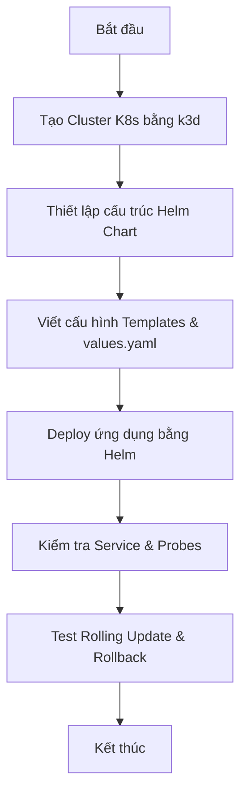

# 🧪 LAB 01 — Triển khai Ứng dụng Web NodeJS lên Kubernetes bằng Helm Chart

## 🎯 Mục tiêu bài Lab
*   Khởi tạo một cụm Kubernetes (K8s) cục bộ siêu nhẹ bằng **k3d** (chạy trên Docker).
*   Tự tay xây dựng một **Helm Chart** từ đầu để đóng gói ứng dụng web.
*   Cấu hình quản lý môi trường thông qua **ConfigMap** và biến môi trường.
*   Thiết lập cơ chế tự phục hồi (**Self-healing**) với **Liveness & Readiness Probes**.
*   Sử dụng Helm để cài đặt, cập nhật (Rolling Update) và quản lý vòng đời ứng dụng.

---

## 🛠 Chuẩn bị Môi trường (Prerequisites)

Bài lab này yêu cầu máy tính của bạn đã cài đặt các công cụ sau:
1.  **Docker Desktop** (hoặc Docker Engine trên Linux).
2.  **k3d** (CLI giúp khởi chạy cụm Kubernetes siêu tốc dựa trên Docker images).
    *   *Cài đặt nhanh trên Windows (PowerShell)*: `winget install k3d` hoặc `choco install k3d`
    *   *Cài đặt nhanh trên macOS/Linux*: `curl -s https://raw.githubusercontent.com/k3d-io/k3d/main/install.sh | TAG=v5.6.0 bash`
3.  **kubectl** (CLI tương tác với cụm K8s).
    *   *Cài đặt nhanh*: `winget install Kubernetes.cli`
4.  **Helm** (CLI quản lý Helm Charts).
    *   *Cài đặt nhanh*: `winget install Helm.Helm`

---

## 🏗 Kịch bản Thực hành (Step-by-Step Guide)



### Bước 1: Khởi tạo cụm Kubernetes cục bộ với k3d
Chúng ta sẽ tạo một cụm K8s có tên là `devsecops-cluster` bao gồm 1 node master (control-plane) và mapping cổng `8080` của máy host vào cổng `30080` của cụm K8s để dễ dàng truy cập ứng dụng web từ trình duyệt của máy thật.

Hãy mở terminal/cmd và chạy câu lệnh sau:
```bash
k3d cluster create devsecops-cluster -p "8080:30080@agent:0" --agents 1
```

*Giải thích cờ lệnh:*
*   `-p "8080:30080@agent:0"`: Map cổng `8080` của máy thật (localhost) vào cổng `30080` trên node agent số 0 của K8s.
*   `--agents 1`: Tạo thêm 1 node worker (agent) để chạy ứng dụng của ta.

Sau khi chạy xong, hãy xác minh cụm K8s hoạt động bình thường:
```bash
kubectl cluster-info
kubectl get nodes
```

---

### Bước 2: Thiết kế cấu trúc thư mục Helm Chart
Mẫu ứng dụng đích là một Docker Image web đơn giản được đóng gói sẵn có tên: `nghiadinh03/devops-webapp:v1.0.0`. Ứng dụng này lắng nghe ở cổng `3000` và sẽ hiển thị giao diện kèm các biến môi trường cấu hình.

Chúng ta sẽ tạo thư mục Helm Chart có tên `webapp-chart/` ngay trong thư mục bài lab này:

```
05-kubernetes/01-k8s-basics/labs/lab-helm-deploy-webapp/
├── lab-instructions.md (File này)
└── webapp-chart/
    ├── Chart.yaml          # Metadata của chart
    ├── values.yaml         # Các biến cấu hình chung
    └── templates/          # Các file cấu hình Kubernetes
        ├── configmap.yaml  # Lưu trữ cấu hình ứng dụng
        ├── deployment.yaml # Khai báo số replica, image, probes, configmap
        └── service.yaml    # Expose cổng dịch vụ NodePort
```

---

### Bước 3: Xem và viết nội dung các file cấu hình Helm Chart

#### 3.1. File `webapp-chart/Chart.yaml`
Định nghĩa metadata cơ bản của chart.
*(Xem chi tiết file tại: [Chart.yaml](./webapp-chart/Chart.yaml))*

#### 3.2. File `webapp-chart/values.yaml`
Chứa các giá trị cấu hình linh hoạt. Chúng ta có thể dễ dàng thay đổi số replica, image tag, hay cổng ứng dụng tại đây mà không cần sửa file YAML của Kubernetes trực tiếp.
*(Xem chi tiết file tại: [values.yaml](./webapp-chart/values.yaml))*

#### 3.3. File `webapp-chart/templates/configmap.yaml`
Lưu trữ thông tin biến môi trường của ứng dụng. Ở đây ta khai báo ứng dụng chạy ở môi trường nào (`APP_ENV`) và câu chào người dùng (`WELCOME_MSG`).
*(Xem chi tiết file tại: [configmap.yaml](./webapp-chart/templates/configmap.yaml))*

#### 3.4. File `webapp-chart/templates/deployment.yaml`
Khai báo triển khai Pods. Lưu ý cách cấu hình **LivenessProbe** và **ReadinessProbe** chỉ định đường dẫn sức khỏe `/health` và cổng `3000` (được lấy động từ dynamic values của Helm).
*(Xem chi tiết file tại: [deployment.yaml](./webapp-chart/templates/deployment.yaml))*

#### 3.5. File `webapp-chart/templates/service.yaml`
Định vị Service loại **NodePort** để ánh xạ cổng `30080` nhằm giúp máy host kết nối trực tiếp được vào dịch vụ thông qua mapping của k3d.
*(Xem chi tiết file tại: [service.yaml](./webapp-chart/templates/service.yaml))*

---

### Bước 4: Triển khai Ứng dụng bằng Helm
Di chuyển vào thư mục bài lab:
```bash
cd 05-kubernetes/01-k8s-basics/labs/lab-helm-deploy-webapp
```

Đầu tiên, hãy dùng lệnh `helm template` để kiểm tra cú pháp và render thử xem các file YAML có lỗi định dạng hay thụt lề (indentation) nào không:
```bash
helm template my-webapp ./webapp-chart
```

Nếu không có lỗi, tiến hành deploy ứng dụng lên K8s:
```bash
helm install my-webapp ./webapp-chart
```

Kiểm tra trạng thái deploy của ứng dụng:
```bash
kubectl get deployments
kubectl get pods
kubectl get services
```

*Lưu ý:* Ban đầu Pods sẽ hiển thị trạng thái `ContainerCreating`, sau đó chuyển sang `Running` nhưng chưa sẵn sàng (`0/1` READY). Phải mất khoảng 5-10 giây để **Readiness Probe** chạy lần đầu và xác minh ứng dụng khỏe mạnh, lúc đó Pod mới có trạng thái `1/1` READY.

---

### Bước 5: Kiểm tra ứng dụng từ máy thật
Do ta đã map cổng `8080` máy host sang `30080` của K8s node bằng k3d, hãy mở trình duyệt web trên máy host của bạn và truy cập địa chỉ sau:

👉 **http://localhost:8080**

Bạn sẽ thấy giao diện web hiển thị chào mừng kèm dòng chữ lấy từ cấu hình ConfigMap:
`WELCOME_MSG: Chào mừng các bạn đến với khóa học DevSecOps thực chiến!`

---

### Bước 6: Thử nghiệm cơ chế Rolling Update (Cập nhật không gián đoạn)

Bây giờ, chúng ta muốn nâng cấp ứng dụng lên phiên bản mới `v2.0.0` (phiên bản này thay đổi màu sắc giao diện và sửa đổi nhẹ logic ứng dụng).

Chúng ta chỉ cần ghi đè tham số `image.tag` trực tiếp từ command line mà không cần thay đổi file `values.yaml` trên đĩa:
```bash
helm upgrade my-webapp ./webapp-chart --set image.tag=v2.0.0
```

Trong khi lệnh đang chạy, hãy liên tục chạy lệnh sau ở một tab terminal khác để theo dõi quá trình K8s tạo các Pod mới và xóa dần các Pod cũ một cách nhịp nhàng (Rolling Update):
```bash
kubectl get pods -w
```

Sau khi quá trình nâng cấp thành công, hãy F5 (làm mới) trình duyệt của bạn tại địa chỉ **http://localhost:8080** để xem giao diện phiên bản mới `v2.0.0`.

---

### Bước 7: Thử nghiệm cơ chế Rollback (Quay lui phiên bản lỗi)

Giả sử phiên bản nâng cấp vừa rồi phát sinh lỗi nghiêm trọng ngoài ý muốn, và bạn cần khôi phục lại hệ thống về trạng thái hoạt động tốt của phiên bản cũ ngay lập tức.

Đầu tiên, xem lịch sử các lần deploy (revisions) của Helm:
```bash
helm history my-webapp
```
Bạn sẽ thấy Revision 1 (chạy bản v1.0.0) và Revision 2 (chạy bản v2.0.0).

Tiến hành rollback về Revision 1:
```bash
helm rollback my-webapp 1
```

Kiểm tra lại danh sách Pods:
```bash
kubectl get pods
```
K8s sẽ tự động hủy các Pod chạy v2.0.0 và khôi phục lại các Pod chạy v1.0.0. Hệ thống của bạn đã được khôi phục thành công chỉ trong vài giây!

---

## 🧹 Dọn dẹp Tài nguyên (Clean up)

Sau khi hoàn thành bài thực hành, hãy xóa cụm k3d để giải phóng tài nguyên CPU/RAM cho máy tính của bạn:
```bash
k3d cluster delete devsecops-cluster
```

---

## 💡 Bài tập nâng cao tự thử thách (Challenge)
*   **Thử thách 1**: Sửa file `webapp-chart/values.yaml` để tăng số lượng replicas từ `1` lên `3` và chạy lệnh `helm upgrade` để chứng kiến cách Kubernetes tự động cân bằng tải traffic người dùng qua 3 Pods đó.
*   **Thử thách 2**: Thay đổi đường dẫn sức khỏe `readinessProbe.httpGet.path` trong `deployment.yaml` thành một đường dẫn không tồn tại (ví dụ: `/path-loi`) rồi deploy bản nâng cấp. Hãy quan sát xem Kubernetes có cho phép cập nhật Pod lỗi này không? (Gợi ý: Rolling Update sẽ bị dừng lại vì Pod mới không bao giờ vượt qua được Readiness Probe, giúp bảo vệ người dùng khỏi phiên bản lỗi).
