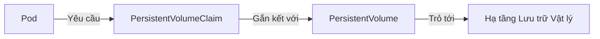

# ☸️ Sub-module 02: Quản trị Kubernetes chuyên sâu (CKA Guide)

Sub-module này cung cấp kiến thức nền tảng vững chắc về quản trị, vận hành và xử lý sự cố hạ tầng cụm Kubernetes, bám sát khung chương trình chuẩn của chứng chỉ quốc tế **CKA (Certified Kubernetes Administrator)**.

---

## 1. Kiến trúc Cụm Kubernetes (Cluster Architecture)

Một cụm Kubernetes hoạt động theo mô hình Master-Worker (Control Plane và Node). Việc hiểu rõ nhiệm vụ của từng tiến trình (process) chạy trong cụm là chìa khóa để vận hành và troubleshooting hiệu quả.

```mermaid
graph TD
    subgraph Control Plane (Master Node)
        API[kube-apiserver] <--> etcd[(etcd Database)]
        API <--> CM[kube-controller-manager]
        API <--> SCH[kube-scheduler]
    end
    subgraph Worker Node
        API <--> Klet[kubelet]
        Klet --> CRI[Container Runtime Engine]
        API <--> Kproxy[kube-proxy]
    end
    style Control Plane fill:#f9f,stroke:#333,stroke-width:2px
    style Worker Node fill:#bbf,stroke:#333,stroke-width:2px
```

### 1.1. Các thành phần thuộc Control Plane (Master Node)
Control Plane chịu trách nhiệm đưa ra các quyết định toàn cục cho cụm (ví dụ: lập lịch chạy Pods), phát hiện và phản hồi các sự kiện trong cụm.

1.  **kube-apiserver**: 
    *   Trái tim của Control Plane. Nó expose Kubernetes API và là đầu mối giao tiếp duy nhất của cụm. 
    *   Mọi tương tác từ bên ngoài (như CLI `kubectl`) hoặc giao tiếp nội bộ giữa các thành phần đều phải đi qua APIServer. Nó chịu trách nhiệm xác thực (Authentication) và phân quyền (Authorization) mọi yêu cầu.
2.  **etcd**:
    *   Cơ sở dữ liệu khóa-giá trị (key-value store) có tính nhất quán cao và sẵn sàng cao.
    *   etcd lưu trữ toàn bộ trạng thái dữ liệu cấu hình của cụm (Cluster State). **etcd là trái tim của hệ thống**, nếu mất etcd mà không có bản backup, cụm K8s coi như bị thảm họa phá hủy hoàn toàn.
3.  **kube-scheduler**:
    *   Chịu trách nhiệm lập lịch. Nó theo dõi các Pod mới được tạo nhưng chưa được gán node, xem xét các yêu cầu về tài nguyên (CPU/RAM), các ràng buộc chính sách (affinity/tolerations) để tìm kiếm và chỉ định Worker Node phù hợp nhất để Pod chạy.
4.  **kube-controller-manager**:
    *   Chạy các tiến trình điều khiển (Controllers). Mỗi controller chạy một vòng lặp vô hạn liên tục so sánh trạng thái hiện tại của cụm với trạng thái mong muốn và thực hiện các điều chỉnh cần thiết.
    *   Ví dụ: *Node Controller* (giám sát trạng thái Node), *Replication Controller* (duy trì đúng số lượng Pods), *Endpoint Controller* (kết nối Service với Pods).

### 1.2. Các thành phần chạy trên Worker Node
Các node worker chịu trách nhiệm chạy các container ứng dụng thực tế.

1.  **kubelet**:
    *   Một agent cực kỳ quan trọng chạy trên mỗi node của cụm. Nó đảm bảo các container được mô tả trong các file cấu hình (PodSpecs) đang chạy và khỏe mạnh.
    *   Kubelet giao tiếp trực tiếp với Control Plane qua APIServer và ra lệnh cho Container Runtime để khởi tạo/xóa container.
2.  **kube-proxy**:
    *   Một dịch vụ mạng chạy trên từng node. Nó duy trì các quy tắc mạng (network rules) trên các node, cho phép truyền thông mạng tới các Pod từ bên trong hoặc bên ngoài cụm (thường thông qua iptables hoặc IPVS).
3.  **Container Runtime**:
    *   Phần mềm chịu trách nhiệm chạy container thực tế. Kubernetes hỗ trợ các container runtime tuân thủ chuẩn **CRI (Container Runtime Interface)** như `containerd`, `CRI-O`.

---

## 2. Cơ chế Lưu trữ Persistent Storage

Kubernetes cung cấp mô hình trừu tượng hóa tài nguyên lưu trữ để lập trình viên không cần biết chi tiết hạ tầng ổ đĩa vật lý phía sau (SAN, NAS, AWS EBS, NFS...):



### 2.1. PersistentVolume (PV)
*   Là một tài nguyên lưu trữ trong cụm được quản trị viên thiết lập sẵn hoặc được tự động cấp phát bởi StorageClass.
*   Nó tồn tại độc lập với vòng đời của Pod sử dụng nó. Khi Pod bị xóa, PV vẫn giữ nguyên để đảm bảo an toàn dữ liệu.

### 2.2. PersistentVolumeClaim (PVC)
*   Là yêu cầu cấp phát lưu trữ từ phía người dùng (Developer). Nó tương tự như việc Pod yêu cầu tài nguyên CPU/RAM, PVC yêu cầu dung lượng (Storage size) và chế độ truy cập (Access Modes) cụ thể từ PV.
*   Các chế độ truy cập phổ biến:
    *   **ReadWriteOnce (RWO)**: Chỉ một Node được phép mount volume ở chế độ đọc-viết.
    *   **ReadOnlyMany (ROM)**: Nhiều Node được phép mount volume ở chế độ chỉ đọc.
    *   **ReadWriteMany (RWX)**: Nhiều Node được phép mount volume ở chế độ đọc-viết đồng thời (thích hợp cho các giải pháp NFS hoặc GlusterFS).

### 2.3. StorageClass & Cấp phát Động (Dynamic Provisioning)
*   Thay vì quản trị viên phải tạo thủ công hàng trăm PV (Static Provisioning), họ định nghĩa các **StorageClass**.
*   Khi học viên tạo một PVC trỏ tới StorageClass đó, hệ thống sẽ tự động liên hệ với hạ tầng cloud để khởi tạo ổ đĩa vật lý tương ứng và tự động tạo PV liên kết với PVC đó ngay lập tức (Dynamic Provisioning).

---

## 3. Định tuyến Ingress Controller

Trong khi Service NodePort hay LoadBalancer hoạt động ở Layer 4 (TCP/UDP), **Ingress** là một tài nguyên K8s hoạt động ở **Layer 7 (Application Layer)**, cung cấp cơ chế định tuyến HTTP/HTTPS thông minh, quản lý SSL/TLS Termination, và cân bằng tải dựa trên domain/path.

```
Traffic ngoài ---> [ Ingress Controller / Nginx ]
                        |
                        +---> domain.com/api  ---> Service Backend ---> Pods
                        |
                        +---> domain.com/web  ---> Service Frontend ---> Pods
```

*   **Ingress Resource**: File cấu hình YAML định nghĩa các quy tắc định tuyến traffic (ví dụ: truy cập `/api` thì chuyển hướng đến service nào).
*   **Ingress Controller**: Bộ động cơ chạy thực tế (thường là Nginx Ingress Controller, Traefik, HAProxy, Kong) liên tục đọc cấu hình Ingress Resource để cập nhật bảng định tuyến ngược (Reverse Proxy). Bạn bắt buộc phải cài đặt Ingress Controller trong cụm thì các cấu hình Ingress Resource mới có hiệu lực.

---

## 4. Quy trình Troubleshooting Cụm cơ bản

Khi cụm gặp lỗi, CKA Engineer cần tuân thủ quy trình kiểm tra tuần tự từ dưới lên trên:

### 4.1. Kiểm tra trạng thái Node vật lý
Nếu Pods không thể lập lịch hoặc báo lỗi `NodeNotReady`:
```bash
# Xem danh sách Node và trạng thái
kubectl get nodes

# Xem chi tiết sự kiện lỗi của Node cụ thể
kubectl describe node <node-name>
```

### 4.2. Kiểm tra dịch vụ Kubelet trên Node
Kubelet là dịch vụ hệ thống (systemd), nếu nó chết, node đó sẽ lập tức mất kết nối:
```bash
# Đăng nhập vào node bị lỗi qua SSH và chạy kiểm tra dịch vụ
systemctl status kubelet

# Xem log runtime của kubelet để tìm nguyên nhân crash
journalctl -u kubelet -n 100 -f
```

### 4.3. Kiểm tra Logs của Pod bị lỗi
Nếu Node ổn định nhưng Pod báo lỗi `CrashLoopBackOff` hoặc `Error`:
```bash
# Xem log hiện tại của Container trong Pod
kubectl logs <pod-name>

# Xem log của container chạy trước đó trước khi bị crash (cực kỳ quan trọng)
kubectl logs <pod-name> --previous

# Xem mô tả chi tiết sự kiện (Events) của Pod để biết lỗi Pull image hay thiếu ổ đĩa
kubectl describe pod <pod-name>
```

---

## 📚 Tài liệu đọc thêm khuyến nghị (Recommended Readings)

Hãy tham khảo các tài liệu và bài blog chất lượng cao dưới đây để mở rộng kiến thức quản trị thực tế:

### 1. Tài liệu chính thống (Official Docs)
*   [Kubernetes Components Architecture](https://kubernetes.io/docs/concepts/overview/components/) — Tổng quan đầy đủ về các thành phần cốt lõi của Control Plane và Worker Nodes.
*   [Persistent Volumes Concepts](https://kubernetes.io/docs/concepts/storage/persistent-volumes/) — Chi tiết về vòng đời của PV, PVC và StorageClass.
*   [Ingress Controllers Guide](https://kubernetes.io/docs/concepts/services-networking/ingress/) — Cách thiết lập Ingress Resource và cấu hình SSL/TLS.

### 2. Các bài viết chuyên sâu & Blog uy tín (Tiếng Việt & Tiếng Anh)
*   [Kiến trúc Kubernetes & Cơ chế hoạt động của etcd - Viblo](https://viblo.asia/p/kubernetes-series-phan-2-kien-truc-kubernetes-va-cac-component-LzD578px5jD) — Bài viết tiếng Việt phân tích rất sâu về etcd và cách nó tương tác với APIServer.
*   [A Practical Guide to Kubernetes Ingress - NGINX Blog](https://www.nginx.com/blog/guide-to-kubernetes-ingress-controller/) — Hướng dẫn thực hành cài đặt NGINX Ingress Controller chuyên nghiệp.
*   [Kubernetes Storage CKA Deep Dive](https://medium.com/awesome-kubernetes/kubernetes-storage-pv-pvc-and-storageclass-a-practical-guide-b3d5b0c7c34b) — Bài viết trực quan phân tích cách liên kết PV và PVC thực tế trên Cloud.

---

## 🚀 Bước tiếp theo của bạn
Hãy tiến hành bài thực hành Lab 02: **Tự tay cấu hình sao lưu (Backup) và khôi phục (Restore) cơ sở dữ liệu etcd của cụm K8s** để làm chủ kỹ năng bảo vệ dữ liệu sống còn của hệ thống.

👉 **[Bắt đầu bài thực hành Lab 02: Backup và Restore ETCD](./labs/lab-k8s-etcd-backup/lab-instructions.md)**
