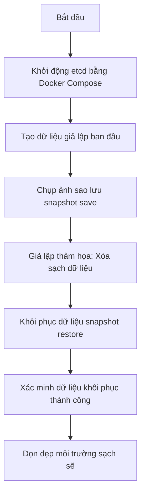

# 🧪 LAB 02 — Thực hành Sao lưu (Backup) và Khôi phục (Restore) cơ sở dữ liệu etcd

## 🎯 Mục tiêu bài Lab
*   Khởi chạy một dịch vụ cơ sở dữ liệu **etcd** (trái tim lưu trữ của Kubernetes) cục bộ bằng Docker Compose.
*   Tự tay tương tác và tạo dữ liệu trong etcd bằng công cụ dòng lệnh **etcdctl**.
*   Thực hiện chụp ảnh snapshot sao lưu dự phòng (**Backup etcd**) chuẩn CKA.
*   Giả lập sự cố mất dữ liệu (thảm họa hệ thống).
*   Thực hiện khôi phục dữ liệu từ snapshot cũ (**Restore etcd**) và xác minh dữ liệu phục hồi thành công.

---

## 🛠 Chuẩn bị Môi trường (Prerequisites)

Bài thực hành yêu cầu máy tính của bạn đã cài đặt:
1.  **Docker** và **Docker Compose**.
2.  **etcdctl** (Công cụ dòng lệnh CLI để tương tác với etcd).
    *   *Mẹo nhỏ*: Để không bắt học viên phải cài đặt cấu hình CLI phức tạp lên máy host thật, chúng ta sẽ **sử dụng trực tiếp công cụ `etcdctl` có sẵn bên trong container Docker của etcd** thông qua câu lệnh `docker exec`. Rất sạch sẽ và tiện lợi!

---

## 🏗 Kịch bản Thực hành (Step-by-Step Guide)



### Bước 1: Khởi động dịch vụ etcd cục bộ
Di chuyển vào thư mục bài lab này:
```bash
cd 05-kubernetes/02-k8s-administration/labs/lab-k8s-etcd-backup
```

Khởi chạy container etcd ở chế độ chạy ngầm (detached mode):
```bash
docker-compose up -d
```

Xác minh container đã hoạt động ổn định:
```bash
docker ps
```
Bạn sẽ thấy container `devsecops-etcd` đang chạy ở cổng `2379` và `2380`.

---

### Bước 2: Tạo dữ liệu giả lập trong etcd
Chúng ta sẽ lưu trữ một vài thông tin cấu hình giả lập của Kubernetes vào etcd (như tên các deployment, phiên bản cấu hình) để làm đối tượng kiểm nghiệm khôi phục.

Chúng ta sử dụng lệnh `docker exec` để gọi trực tiếp `etcdctl` bên trong container:

1.  **Tạo một cấu hình giả lập của deployment**:
    ```bash
    docker exec -it devsecops-etcd etcdctl put /registry/deployments/frontend "version: v1.0.0, replicas: 3"
    ```
2.  **Tạo một cấu hình database config**:
    ```bash
    docker exec -it devsecops-etcd etcdctl put /registry/configs/database "host: db.local, port: 5432"
    ```

Hãy truy vấn lại để kiểm tra xem dữ liệu đã được lưu trữ thành công chưa:
```bash
docker exec -it devsecops-etcd etcdctl get /registry/deployments/frontend
docker exec -it devsecops-etcd etcdctl get /registry/configs/database
```
Bạn sẽ thấy thông tin khóa-giá trị được in ra màn hình.

---

### Bước 3: Tiến hành chụp ảnh sao lưu (Backup / Snapshot Save)
Trong thực tế (chứng chỉ CKA hoặc vận hành hệ thống), chúng ta cần lưu trữ snapshot này ra một file cụ thể bên ngoài.

Chạy lệnh sau để ra lệnh cho `etcdctl` lưu trữ snapshot của toàn bộ database vào tệp tin `/etcd-data/snapshot.db` (thư mục `/etcd-data` đã được volume mount ra thư mục ổ đĩa vật lý của bạn trên máy thật):
```bash
docker exec -it devsecops-etcd etcdctl snapshot save /etcd-data/snapshot.db
```

Xác minh thông tin chi tiết của bản sao lưu vừa tạo:
```bash
docker exec -it devsecops-etcd etcdctl --write-out=table snapshot status /etcd-data/snapshot.db
```
Bạn sẽ thấy bảng trạng thái mô tả kích thước tệp tin snapshot, số lượng Revisions và mã Hash của cơ sở dữ liệu. Bản sao lưu của bạn đã được ghi nhận an toàn!

---

### Bước 4: Giả lập thảm họa (Xóa sạch cơ sở dữ liệu)
Hãy tưởng tượng hệ thống bị lỗi đĩa hoặc quản trị viên gõ nhầm lệnh xóa sạch toàn bộ dữ liệu cấu hình:

Chạy các lệnh sau để xóa trắng các key vừa tạo:
```bash
docker exec -it devsecops-etcd etcdctl del /registry/deployments/frontend
docker exec -it devsecops-etcd etcdctl del /registry/configs/database
```

Thử truy vấn lại xem còn dữ liệu không:
```bash
docker exec -it devsecops-etcd etcdctl get /registry/deployments/frontend
docker exec -it devsecops-etcd etcdctl get /registry/configs/database
```
Màn hình trống trơn! Hệ thống của bạn đã mất sạch dữ liệu cấu hình sống còn.

---

### Bước 5: Tiến hành khôi phục dữ liệu từ Snapshot (Restore)
Để khôi phục, chúng ta cần dừng dịch vụ etcd hiện tại, xóa thư mục data bị lỗi, và chạy lệnh khôi phục từ file `snapshot.db` dự phòng để tái tạo cấu trúc thư mục data mới khỏe mạnh.

1.  **Dừng dịch vụ etcd hiện tại**:
    ```bash
    docker-compose stop
    ```
2.  **Khôi phục dữ liệu từ snapshot**:
    Chúng ta sẽ khởi động một container tạm thời chỉ để chạy lệnh `etcdctl snapshot restore` nhằm biến đổi tệp `snapshot.db` thành thư mục dữ liệu mới `/etcd-data-new`.
    
    Hãy chạy câu lệnh Docker sau (chạy một lần rồi tự xóa container):
    ```bash
    docker run --rm -v devsecops-etcd-data:/etcd-data quay.io/coreos/etcd:v3.5.9 etcdctl snapshot restore /etcd-data/snapshot.db --data-dir=/etcd-data-new
    ```
3.  **Thay thế thư mục dữ liệu bị lỗi**:
    Chúng ta sẽ di chuyển thư mục dữ liệu mới `/etcd-data-new` đè lên thư mục `/etcd-data/member` cũ.
    
    Hãy chạy lệnh Docker sau:
    ```bash
    docker run --rm -v devsecops-etcd-data:/etcd-data alpine sh -c "rm -rf /etcd-data/member && mv /etcd-data-new/member /etcd-data/member && rm -rf /etcd-data-new"
    ```
4.  **Khởi động lại dịch vụ etcd**:
    ```bash
    docker-compose start
    ```

---

### Bước 6: Xác minh dữ liệu đã khôi phục thành công
Bây giờ, hãy truy vấn lại etcd xem các thông tin cấu hình nhạy cảm mà bạn đã tạo ở Bước 2 có quay trở lại kỳ diệu hay không:

```bash
docker exec -it devsecops-etcd etcdctl get /registry/deployments/frontend
docker exec -it devsecops-etcd etcdctl get /registry/configs/database
```

**Kết quả mong đợi**:
Các khóa và dữ liệu `"version: v1.0.0, replicas: 3"` và `"host: db.local, port: 5432"` đã được khôi phục chính xác 100%! Bạn đã hoàn thành quy trình ứng phó thảm họa etcd xuất sắc.

---

## 🧹 Dọn dẹp Tài nguyên (Clean up)

Sau khi đã hoàn thành bài thực hành, hãy tắt container và **xóa sạch volume dữ liệu** để trả lại đĩa trống sạch sẽ cho máy tính của bạn:

```bash
docker-compose down -v
```

*Lưu ý*: Cờ `-v` cực kỳ quan trọng, nó ra lệnh cho Docker Compose xóa sạch volume lưu trữ `devsecops-etcd-data` đã mount, không để lại bất kỳ rác dữ liệu nào trên máy host.
