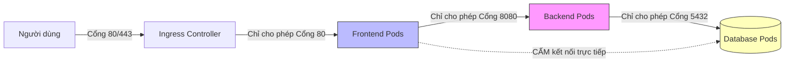

# 🛡️ Gia Cố Bảo Mật Kubernetes Cluster: 10 Quy Tắc Network Policies Thực Chiến

*   **Tác giả gốc:** Tigera (Calico Creators) & Kubernetes Security Working Group
*   **Dịch thuật & Biên soạn:** Đội ngũ DevSecOps Tutorials (Vietnamese version)
*   **Liên kết bài viết gốc:** [Tigera - Calico Network Policy Best Practices](https://www.tigera.io/blog/kubernetes-network-policy-best-practices/)

---

## 📌 Giới thiệu

Mặc định, cụm **Kubernetes** được thiết kế theo nguyên lý mở: **tất cả các Pods trong cluster đều có thể giao tiếp trực tiếp với nhau** mà không gặp bất kỳ rào cản nào, bất kể chúng có nằm khác Namespace hay thuộc các dịch vụ hoàn toàn độc lập.

⚠️ **Kịch bản rủi ro nghiêm trọng:** Một ứng dụng web Frontend dính lỗ hổng bảo mật và bị hacker chiếm quyền điều khiển. Vì mạng mở, hacker có thể chạy các công cụ quét mạng nội bộ (`nmap`, `netcat`) trực tiếp từ Pod Frontend để tấn công brute-force cơ sở dữ liệu (Database Pod) ở Namespace khác, hoặc truy cập trái phép vào các dịch vụ quản trị nhạy cảm.

Để ngăn chặn lỗ hổng thiết kế này, Kubernetes cung cấp tài nguyên **Network Policy** hoạt động như một hệ thống tường lửa phân tán (Stateful Firewall) kiểm soát chặt chẽ luồng dữ liệu vào (`Ingress`) và ra (`Egress`) của từng Pod.

Bài viết này tổng hợp **10 quy tắc thiết lập Network Policies thực chiến** giúp bạn gia cố an ninh mạng Kubernetes lên chuẩn bảo mật tối cao **Zero-Trust**.

---

## ⚙️ 10 Quy Tắc Thiết Lập Network Policies Thực Chiến



---

### Quy tắc 1: Cấm tất cả các kết nối theo mặc định (Default Deny All)
Đừng cố gắng viết luật chặn từng dịch vụ. Hãy bắt đầu chiến lược bảo mật bằng cách **chặn đứng hoàn toàn** mọi kết nối vào/ra của tất cả các Pod trong Namespace. Bất kỳ kết nối nào muốn hoạt động đều phải được khai báo cho phép một cách tường minh sau đó (Whitelisting).

*Tệp cấu hình Default Deny All (`default-deny-all.yaml`):*
```yaml
apiVersion: networking.k8s.io/v1
kind: NetworkPolicy
metadata:
  name: default-deny-all
  namespace: production
spec:
  podSelector: {} # Áp dụng cho TẤT CẢ các Pods trong namespace
  policyTypes:
  - Ingress
  - Egress
```

---

### Quy tắc 2: Cho phép phân giải tên miền DNS bắt buộc
Khi áp dụng luật *Default Deny All*, toàn bộ các Pod sẽ bị mất khả năng kết nối tới dịch vụ DNS nội bộ (`kube-dns`), dẫn đến việc ứng dụng không thể gọi API hay kết nối DB qua tên miền.

*Cho phép Egress tới cổng DNS (UDP/53):*
```yaml
apiVersion: networking.k8s.io/v1
kind: NetworkPolicy
metadata:
  name: allow-dns-egress
  namespace: production
spec:
  podSelector: {} # Áp dụng cho toàn bộ Pods
  policyTypes:
  - Egress
  egress:
  # Chỉ cho phép gửi traffic ra cổng 53 của kube-dns
  - to:
    - namespaceSelector:
        matchLabels:
          kubernetes.io/metadata.name: kube-system
    ports:
    - protocol: UDP
      port: 53
```

---

### Quy tắc 3: Chỉ cho phép Frontend kết nối tới Backend
Chỉ cho phép các Pod mang nhãn `tier: backend` nhận kết nối vào từ các Pod mang nhãn `tier: frontend`.

```yaml
apiVersion: networking.k8s.io/v1
kind: NetworkPolicy
metadata:
  name: allow-frontend-to-backend
  namespace: production
spec:
  podSelector:
    matchLabels:
      tier: backend # Áp dụng luật cho Backend Pods
  policyTypes:
  - Ingress
  ingress:
  - from:
    - podSelector:
        matchLabels:
          tier: frontend # Chỉ cho phép kết nối đến từ Frontend Pods
    ports:
    - protocol: TCP
      port: 8080
```

---

### Quy tắc 4: Chỉ cho phép Backend kết nối tới Database (Cấm Frontend gọi trực tiếp DB)
Tuyệt đối cấm các Pod Frontend hoặc bất kỳ Pod nào khác kết nối trực tiếp vào cổng Database (v.d. cổng PostgreSQL `5432`). Chỉ cho phép duy nhất Backend được làm điều này.

```yaml
apiVersion: networking.k8s.io/v1
kind: NetworkPolicy
metadata:
  name: allow-backend-to-database
  namespace: production
spec:
  podSelector:
    matchLabels:
      tier: database # Áp dụng luật cho Database Pods
  policyTypes:
  - Ingress
  ingress:
  - from:
    - podSelector:
        matchLabels:
          tier: backend # Chỉ cho phép duy nhất Backend kết nối vào
    ports:
    - protocol: TCP
      port: 5432
```

---

### Quy tắc 5: Cô lập hoàn toàn lưu lượng giữa các Namespaces
Nếu bạn chạy môi trường thử nghiệm (`staging`) và sản xuất (`production`) trên chung một cluster, hãy cô lập hoàn toàn lưu lượng mạng giữa hai Namespace này để tránh việc cấu hình nhầm lẫn hoặc hacker lây nhiễm chéo.

```yaml
apiVersion: networking.k8s.io/v1
kind: NetworkPolicy
metadata:
  name: deny-other-namespaces
  namespace: production
spec:
  podSelector: {}
  policyTypes:
  - Ingress
  ingress:
  # Chỉ cho phép các Pod nằm chung Namespace production giao tiếp với nhau
  - from:
    - namespaceSelector:
        matchLabels:
          kubernetes.io/metadata.name: production
```

---

### Quy tắc 6: Chặn đứng truy cập vào Cloud Metadata API nhạy cảm
Nếu chạy Kubernetes trên AWS, GCP hoặc Azure, các Pod có thể gửi request tới IP metadata tĩnh `169.254.169.254` để đánh cắp IAM Roles của Node. Đây là con đường leo thang quyền lực đám mây cực kỳ phổ biến.

*Chính sách chặn kết nối tới IP Metadata:*
```yaml
apiVersion: networking.k8s.io/v1
kind: NetworkPolicy
metadata:
  name: block-cloud-metadata
  namespace: production
spec:
  podSelector: {}
  policyTypes:
  - Egress
  egress:
  # Cho phép đi internet nhưng ngoại trừ IP metadata 169.254.169.254
  - to:
    - ipBlock:
        cidr: 0.0.0.0/0
        except:
        - 169.254.169.254/32
```

---

### Quy tắc 7: Chỉ cho phép hệ thống giám sát Prometheus thu thập số liệu (Scraping)
Để Prometheus có thể kéo (scrape) metrics từ ứng dụng của bạn, bạn cần mở cổng metrics (v.d. `8080/metrics`) nhưng chỉ mở duy nhất cho Pod Prometheus.

```yaml
apiVersion: networking.k8s.io/v1
kind: NetworkPolicy
metadata:
  name: allow-prometheus-scraping
  namespace: production
spec:
  podSelector:
    matchLabels:
      app: my-app
  policyTypes:
  - Ingress
  ingress:
  - from:
    - namespaceSelector:
        matchLabels:
          kubernetes.io/metadata.name: monitoring
      podSelector:
        matchLabels:
          app: prometheus
    ports:
    - protocol: TCP
      port: 8080
```

---

### Quy tắc 8: Hạn chế kết nối ra mạng Internet công cộng (Restricted Egress)
Ngoại trừ các dịch vụ cần gọi API bên thứ ba (v.d. cổng thanh toán Stripe, SendGrid), phần lớn các Pod nghiệp vụ bên trong mạng không có lý do gì để kết nối trực tiếp ra internet công cộng. Việc chặn Egress giúp ngăn hacker cài reverse shell kết nối về máy chủ điều khiển (C2 Server).

---

### Quy tắc 9: Bảo vệ cổng API Server của Kubernetes (`kube-apiserver`)
Các Pod chạy nghiệp vụ thông thường không cần giao tiếp trực tiếp với Kubernetes API. Hãy khóa chặt kết nối từ các Pod nghiệp vụ tới IP của dịch vụ API Server (thường là IP đầu tiên của dải CIDR dịch vụ, v.d. `10.96.0.1`) để tránh việc khai thác các lỗi leo thang đặc quyền cluster.

---

### Quy tắc 10: Chỉ cho phép Ingress Controller định tuyến traffic vào Frontend
Ingress Controller (v.d. Nginx Ingress) là cổng vào duy nhất từ internet. Hãy thiết lập để Ingress Controller chỉ có quyền gọi tới Pod Frontend, chặn đứng Ingress đi thẳng vào Backend hay Database.

---

## 📝 Yêu Cầu Kỹ Thuật Quan Trọng: Cần Có Container Network Interface (CNI)

> [!WARNING]
> Bản thân tài nguyên `NetworkPolicy` chỉ là một tệp khai báo cấu hình trừu tượng. Để các chính sách này thực sự có hiệu lực thực thi dưới tầng nhân Linux, cụm Kubernetes của bạn **bắt buộc phải cài đặt một CNI Plugin hỗ trợ Network Policies** như **Calico**, **Cilium**, hoặc **Weave Net**. 
> Các CNI mặc định siêu giản lược như Flannel sẽ **bỏ qua hoàn toàn** các tệp tin Network Policy này và không có bất kỳ tác dụng phòng thủ nào!

---

## 📝 Tổng kết

Làm chủ Network Policies là bước đi quan trọng nhất để đạt được chứng chỉ bảo mật Kubernetes nâng cao **CKS (Certified Kubernetes Security Specialist)** và hiện thực hóa mô hình bảo mật Zero-Trust. Bằng cách áp dụng triệt để chính sách chặn mặc định, cô lập dải mạng và phân quyền cổng tối thiểu, bạn đã tự tạo dựng một hệ thống phòng thủ vững chắc bảo vệ an toàn tuyệt đối cho mọi dữ liệu của doanh nghiệp!
