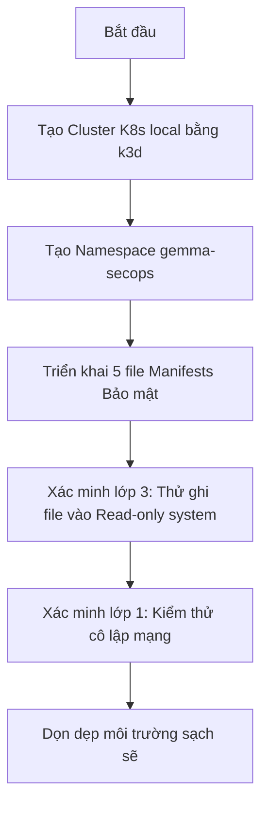

# 🧪 LAB 03 — Gia cố Bảo mật (Hardening) 4 Lớp cho ứng dụng AI Chatbot Gemma

## 🎯 Mục tiêu bài Lab
*   Khởi tạo một cụm Kubernetes cục bộ bằng **k3d** và tạo một namespace biệt lập cho dự án.
*   Thiết lập **Bảo mật 4 Lớp** chuẩn bảo mật quốc tế **CKS**:
    1.  **Lớp 1 (Network Policy)**: Thiết lập cô lập mạng Zero-trust, cấm toàn bộ kết nối tự do ngoại trừ các cổng dịch vụ được cấu hình.
    2.  **Lớp 2 (RBAC)**: Tạo ServiceAccount riêng biệt và cấp đúng quyền hạn tối thiểu.
    3.  **Lớp 3 (Pod Security Context)**: Khóa cứng container ở chế độ chạy User thường (Non-root), cấm leo thang đặc quyền và chuyển ổ đĩa sang chỉ đọc (Read-only root filesystem).
    4.  **Lớp 4 (Secret Management)**: Tiêm mã bảo mật API Key dạng tệp tin mount để tránh bị lộ.
*   Trực tiếp chui vào bên trong Container giả lập tấn công để kiểm chứng cơ chế ngăn chặn đột nhập của K8s.

---

## 🏗 Kịch bản Thực hành (Step-by-Step Guide)



### Bước 1: Khởi động cụm Kubernetes cục bộ
Chúng ta sẽ tạo một cụm K8s local sạch sẽ cho bài lab này:
```bash
k3d cluster create secure-cluster --agents 1
```

Sau khi cụm hoạt động bình thường, tạo một Namespace biệt lập dành riêng cho chatbot Gemma để dễ quản lý:
```bash
kubectl create namespace gemma-secops
```

---

### Bước 2: Xem và phân tích các manifest gia cố an ninh
Di chuyển vào thư mục bài lab này:
```bash
cd 05-kubernetes/03-k8s-security/labs/lab-hardening-ai-microservice
```

Hãy mở xem nội dung các file cấu hình nằm trong thư mục `manifests/`:
1.  **[gemma-secret.yaml](./manifests/gemma-secret.yaml)**: Chứa API Key được mã hóa Base64 an toàn.
2.  **[gemma-rbac.yaml](./manifests/gemma-rbac.yaml)**: Khởi tạo ServiceAccount riêng biệt mang tên `gemma-sa` phân quyền tối thiểu.
3.  **[gemma-networkpolicy.yaml](./manifests/gemma-networkpolicy.yaml)**: Cô lập mạng chặn đứng hacker dò quét cổng mạng.
4.  **[gemma-service.yaml](./manifests/gemma-service.yaml)**: Định nghĩa cổng dịch vụ.
5.  **[gemma-deployment.yaml](./manifests/gemma-deployment.yaml)**: Trung tâm cấu hình gia cố Container (`readOnlyRootFilesystem: true`, cấm chạy root, mount RAM ảo `/tmp` và tiêm secret an toàn làm tệp tin).

---

### Bước 3: Triển khai cụm ứng dụng gia cố bảo mật
Áp dụng toàn bộ các cấu hình bảo mật trên lên cụm K8s:
```bash
kubectl apply -f manifests/
```

Kiểm tra xem tất cả các tài nguyên đã được tạo thành công chưa:
```bash
kubectl get all -n gemma-secops
```
Đợi khoảng 10 giây cho Pod `gemma-chat` chuyển sang trạng thái `Running` khỏe mạnh.

---

### Bước 4: Xác minh Lớp 3 - Kiểm chứng cơ chế chặn ghi đĩa (Read-only Filesystem)
Giả sử hacker thông qua lỗ hổng web tìm cách tải một script backdoor hay mã độc xuống thư mục `/app` của chatbot để chiếm quyền điều khiển lâu dài.

Chúng ta sẽ đóng vai hacker bằng cách chui trực tiếp vào bên trong container đang chạy và cố gắng tạo một file rác:

1.  **Lấy tên Pod đang chạy**:
    ```bash
    kubectl get pods -n gemma-secops
    ```
2.  **Chui vào Shell bên trong Pod** (Thay `<pod-name>` bằng tên Pod thực tế của bạn):
    ```bash
    kubectl exec -it <pod-name> -n gemma-secops -- sh
    ```
3.  **Hành động của hacker: Thử ghi file độc hại vào thư mục ứng dụng `/app`**:
    ```bash
    echo "backdoor code" > /app/backdoor.sh
    ```
    
    **Kết quả mong đợi**:
    Hệ thống sẽ ngay lập tức chặn đứng và in ra lỗi:
    `sh: can't create /app/backdoor.sh: Read-only file system`
    
    *Giải thích*: Do ta đã cấu hình `readOnlyRootFilesystem: true` trong `gemma-deployment.yaml`, toàn bộ hệ thống file của container bị khóa cứng. Hacker tuyệt đối không thể ghi file độc hại vào cụm.

4.  **Thử ghi file vào phân vùng RAM tạm `/tmp`**:
    ```bash
    echo "temp log" > /tmp/test.txt
    ls -l /tmp/test.txt
    ```
    Lệnh này lại hoạt động bình thường!
    *Giải thích*: Phân vùng `/tmp` đã được chúng ta mount bằng bộ nhớ RAM ảo (`emptyDir: {}`) để đảm bảo các tiến trình đệm của NodeJS hoạt động trơn tru mà không làm ảnh hưởng tới tính an toàn của các thư mục mã nguồn chính.

5.  **Hành động của hacker: Thử kiểm tra xem mình có quyền Root không**:
    ```bash
    whoami
    ```
    Màn hình hiển thị: `whoami: unknown uid 10001`
    Bạn đang chạy với User thường vô danh, không có quyền Root để phá hoại hệ thống.
    
    Gõ `exit` để thoát khỏi Pod.

---

### Bước 5: Xác minh Lớp 4 - Kiểm chứng bí mật API Key được truyền an toàn
Mặc định Secrets được truyền dưới dạng tệp tin mount an toàn. Hãy kiểm tra xem API key có nằm đúng thư mục virtual ảo hay không:

Chui vào shell của Pod lại:
```bash
kubectl exec -it <pod-name> -n gemma-secops -- sh
```

Truy cập thư mục bí mật và xem file:
```bash
cat /etc/secrets/GEMMA_API_KEY
```
Bạn sẽ thấy chuỗi API Key plain-text hiển thị: `gemma-chat-secret-token-key-2026`. Ứng dụng của bạn có thể đọc trực tiếp từ đây cực kỳ an toàn, không sợ bị lộ trong các log biến môi trường của Node.

Gõ `exit` để thoát.

---

### Bước 6: Xác minh Lớp 1 - Kiểm chứng cô lập mạng (Network Policy)
Theo chính sách `gemma-networkpolicy.yaml`, chỉ các Pod mang nhãn `role: client` mới được phép kết nối tới cổng `3000` của `gemma-chat`. Các Pod khác sẽ bị chặn đứng kết nối.

Chúng ta sẽ kiểm chứng bằng cách tạo 2 Pod thử nghiệm: một Pod mang nhãn được phép (`role: client`) và một Pod bình thường mang nhãn lạ (`role: attacker`).

1.  **Chạy Pod Attacker không được cấp phép**:
    ```bash
    kubectl run network-attacker -n gemma-secops --image=alpine --labels="role=attacker" --restart=Never -it -- rm -f -- sh
    ```
    Bên trong Pod Attacker, thử gõ lệnh curl tới dịch vụ Gemma:
    ```bash
    wget -T 5 -O- http://gemma-service:3000
    ```
    **Kết quả**: Lệnh bị treo và báo lỗi `wget: download timed out` sau 5 giây. Attacker đã bị chặn đứng kết nối hoàn toàn bởi Network Policy! Gõ `exit` để thoát.

2.  **Chạy Pod Client được cấp phép chính chủ**:
    ```bash
    kubectl run network-client -n gemma-secops --image=alpine --labels="role=client" --restart=Never -it -- rm -f -- sh
    ```
    Bên trong Pod Client, thử truy cập:
    ```bash
    wget -T 5 -O- http://gemma-service:3000
    ```
    **Kết quả**: Bạn sẽ nhận được phản hồi phản vật lý từ máy chủ web (hoặc lỗi kết nối thông thường từ ứng dụng thay vì bị timeout), chứng minh traffic được thông suốt bình thường! Gõ `exit` để thoát.

---

## 🧹 Dọn dẹp Tài nguyên (Clean up)

Sau khi hoàn thành bài thực hành gia cố bảo mật xuất sắc này, hãy xóa cụm k3d để dọn dẹp sạch sẽ tài nguyên cho máy tính:

```bash
k3d cluster delete secure-cluster
```

Toàn bộ cụm K8s và các container chạy chatbot sẽ được quét sạch sẽ khỏi ổ đĩa của bạn trong 5 giây!
