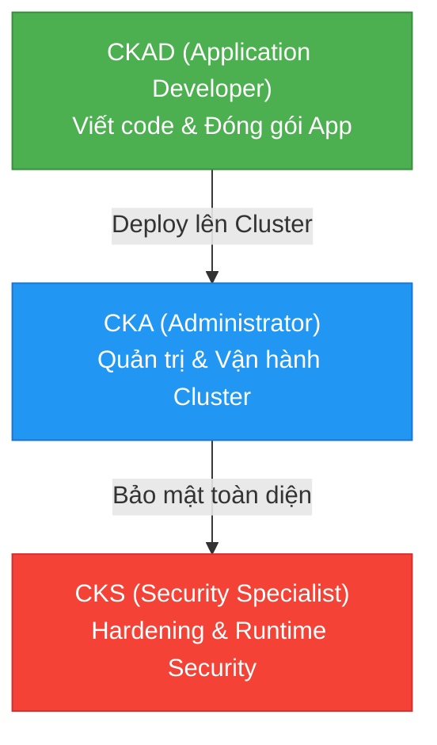

# ☸️ MODULE 5 — HỆ SINH THÁI KUBERNETES & BẢO MẬT (K8S ECOSYSTEM)

Chào mừng bạn đến với Module chuyên sâu về Kubernetes. Module này được thiết kế theo lộ trình chuẩn quốc tế, giúp bạn đi từ một nhà phát triển ứng dụng trên Kubernetes, tiến lên nhà quản trị hệ thống, và cuối cùng trở thành chuyên gia gia cố bảo mật chuyên sâu.

---

## 🔍 Phân tích Lộ trình: Sự khác biệt & Liên kết giữa các Chứng chỉ

Để tránh nhầm lẫn trong quá trình học và làm việc thực tế, chúng ta cần làm rõ bản chất của từng cấp độ và cách chúng bổ sung cho nhau:



### 1. CKAD (Certified Kubernetes Application Developer) — Vận hành Cơ bản
*   **Trọng tâm**: Tập trung vào việc **Phát triển và Triển khai** ứng dụng.
*   **Công việc thực tế**: Tạo các tài nguyên cơ bản như Pods, Deployments, Services, ConfigMaps, Secrets, Liveness/Readiness Probes, và đóng gói ứng dụng bằng Helm Charts.
*   **Câu hỏi thường gặp**: *"Làm sao để ứng dụng của tôi chạy ổn định, tự động phục hồi và có thể giao tiếp với database?"*

### 2. CKA (Certified Kubernetes Administrator) — Quản trị Trung cấp
*   **Trọng tâm**: Tập trung vào việc **Quản lý hạ tầng và Vận hành** cụm (Cluster).
*   **Công việc thực tế**: Khởi tạo cluster từ đầu (kubeadm), quản lý lưu trữ persistent (PV/PVC), cấu hình mạng cluster (CNI), backup/restore database ETCD, nâng cấp phiên bản Kubernetes, troubleshoot lỗi node.
*   **Câu hỏi thường gặp**: *"Làm sao để đảm bảo hạ tầng cluster luôn mở rộng tốt, không bị gián đoạn khi nâng cấp, và cấp phát đủ tài nguyên lưu trữ?"*

### 3. CKS (Certified Kubernetes Security Specialist) — Bảo mật Nâng cao
*   **Trọng tâm**: Tập trung vào việc **Gia cố an toàn thông tin (Hardening)** xuyên suốt vòng đời Build, Ship, Run.
*   **Công việc thực tế**: Thiết lập Network Policies (cô lập network), phân quyền tối thiểu với RBAC, cấu hình Pod Security Standards (PSS), tích hợp công cụ quét image vào pipeline, giám sát và cảnh báo runtime security (Falco, Sysdig).
*   **Câu hỏi thường gặp**: *"Nếu hacker kiểm soát được 1 Pod của tôi, làm sao để ngăn chặn họ tấn công lan sang các Pod khác hoặc chiếm quyền điều khiển toàn bộ cluster?"*

---

## 📁 Cấu trúc Module 5

Module này được phân chia thành 3 sub-module tương ứng với 3 cấp độ trên:

```
05-kubernetes/
├── kubernetes-overview.md              # File này (Giới thiệu tổng quan)
│
├── 01-k8s-basics/                      # Sub-module 01: CKAD (Developer)
│   ├── k8s-basics-guide.md             # Hướng dẫn chi tiết CKAD
│   └── labs/                           # Thư mục thực hành (lab-helm-deploy-webapp)
│
├── 02-k8s-administration/               # Sub-module 02: CKA (Administrator)
│   └── k8s-administration-guide.md     # Hướng dẫn chi tiết CKA
│
└── 03-k8s-security/                    # Sub-module 03: CKS (Security Specialist)
    ├── k8s-security-guide.md           # Hướng dẫn chi tiết CKS
    └── labs/
        └── lab-hardening-ai-microservice/ # Lab thực chiến gia cố bảo mật cho App AI (lab-instructions.md)
```

---

## 💡 Thiết kế Lab Thực Chiến Nâng cao: Hardening AI Microservice

Để áp dụng các kiến thức bảo mật Kubernetes cao cấp nhất (CKS), chúng ta sẽ thực hành trực tiếp trên ứng dụng đích là **App AI Chatbot** (sử dụng Docker image công khai `nghiadinh03/gemma-chatbot:v1.0.0` trên Docker Hub).

> [!IMPORTANT]
> **Cam kết an toàn**: Bài lab này hoàn toàn khép kín và an toàn. Toàn bộ tài liệu lab và manifests cấu hình sẽ được lưu trữ hoàn chỉnh tại thư mục cục bộ của dự án:
> `05-kubernetes/03-k8s-security/labs/lab-hardening-ai-microservice/`

### Kịch bản Lab thực tế:
Bạn đóng vai trò là một DevSecOps Engineer được giao nhiệm vụ triển khai và gia cố an toàn cho Microservice AI Chatbot. Ứng dụng này giao tiếp trực tiếp với mô hình ngôn ngữ lớn (LLM) và chứa các thông tin API keys nhạy cảm. Bạn cần thiết lập bảo mật 4 lớp:

1.  **Lớp 1: Network Hardening (Network Policies)**
    *   Mặc định Kubernetes cho phép tất cả các Pod giao tiếp tự do. Bạn sẽ viết NetworkPolicy thiết lập chính sách **Default Deny** (cấm toàn bộ kết nối).
    *   Chỉ mở cổng (Allow Ingress) từ duy nhất Ingress Controller/API Gateway đi vào Pod `gemma-chat`.
    *   Giới hạn cổng (Allow Egress) từ Pod `gemma-chat` chỉ được phép kết nối ra DNS Server (`kube-dns`) và API Server của Ollama/Gemma, cấm hoàn toàn kết nối internet tự do để ngăn chặn rò rỉ dữ liệu (Data Exfiltration).

2.  **Lớp 2: Phân quyền Tối thiểu (RBAC)**
    *   Tạo một `ServiceAccount` riêng cho ứng dụng `gemma-chat` thay vì dùng account `default` của namespace.
    *   Thiết lập `Role` và `RoleBinding` để giới hạn tài khoản này không được phép truy cập hay đọc thông tin các tài nguyên khác của cluster.

3.  **Lớp 3: Bảo mật Pod Runtime (Pod Security Standards)**
    *   Cấu hình Security Context cho Pod để bắt buộc:
        *   `runAsNonRoot: true` — Ứng dụng tuyệt đối không được chạy dưới quyền root inside container.
        *   `allowPrivilegeEscalation: false` — Ngăn chặn container leo thang đặc quyền để kiểm soát node vật lý.
        *   `readOnlyRootFilesystem: true` — Khóa toàn bộ filesystem của container ở chế độ Read-Only để hacker không thể cài đặt mã độc hay backdoor.

4.  **Lớp 4: Quản lý Bí mật (Secret Hardening)**
    *   Sử dụng Kubernetes `Secret` được mã hóa để truyền API token an toàn thay vì lưu trực tiếp trong biến môi trường (Environment Variable) dạng plain-text.

---

## 🚀 Điểm xuất phát của bạn là gì?

*   **Nếu bạn chưa bao giờ dùng Kubernetes**: Hãy bắt đầu từ [01-k8s-basics](./01-k8s-basics/k8s-basics-guide.md) để học cách viết các file YAML deploy ứng dụng đơn giản trước.
*   **Nếu bạn đã biết deploy app nhưng chưa biết setup hệ thống**: Hãy bắt đầu từ [02-k8s-administration](./02-k8s-administration/k8s-administration-guide.md) để hiểu sâu về cách vận hành một cụm cluster thực tế.
*   **Nếu bạn đã thành thạo vận hành và muốn gia cố an toàn theo chuẩn bảo mật**: Hãy tiến thẳng tới [03-k8s-security](./03-k8s-security/k8s-security-guide.md) để làm quen với các công nghệ an ninh phòng thủ cao cấp nhất.

---

## 📚 Tài nguyên Đọc thêm Chất lượng cao (Recommended Blog Readings)

Nâng cao hiểu biết chuyên sâu và tiếp cận kinh nghiệm thực tế về mạng và bảo mật trong hệ sinh thái Kubernetes:

### 1. 🇻🇳 [Tìm hiểu về Kubernetes Service và Kube-proxy: Dưới góc nhìn của gói tin](https://viblo.asia/p/tim-hieu-ve-kubernetes-service-va-kube-proxy-duoi-goc-nhin-cua-goi-tin-ByEZk6nxlQ0)
*   **Nguồn**: Cộng đồng Viblo.asia (Đạt 15k+ views, 200+ upvotes).
*   **Giá trị thực tiễn**: Bài viết đi sâu giải mã mô hình mạng phẳng đặc trưng của Kubernetes. Giải thích sự khác biệt cốt lõi giữa đối tượng trừu tượng *Service* (như ClusterIP, NodePort, LoadBalancer) và thành phần thực thi `kube-proxy` chạy dưới dạng DaemonSet trên mỗi node. Phân tích chi tiết cách `kube-proxy` cập nhật Endpoints từ API Server và lập trình lại `iptables` hoặc `IPVS` để định hướng gói tin đi thẳng tới Pod đích mà không cần đi qua một lớp proxy trung gian gây nghẽn cổ chai.
*   **Lý do cần đọc**: Nắm vững luồng đi của gói tin giúp bạn tự tin xử lý các sự cố mất kết nối mạng nội bộ (*network troubleshooting*) phức tạp trong cluster.

### 2. 🇬🇧 [Kubernetes Security Hardening based on CKS (Gia cố Bảo mật Kubernetes dựa trên Chuẩn Chứng chỉ CKS)](https://medium.com/cncf-vietnam/kubernetes-security-hardening-based-on-cks-52b8af9131)
*   **Nguồn**: Medium / CNCF Blog (Được cộng đồng DevSecOps toàn cầu đánh giá là cẩm nang bỏ túi không thể thiếu).
*   **Bản dịch & Tóm tắt cốt lõi**: Hướng dẫn checklist thực tiễn để bảo mật cụm Kubernetes theo tiêu chuẩn Certified Kubernetes Security Specialist (CKS) bao gồm 5 khía cạnh cốt lõi:
    1.  **Gia cố API Server**: Vô hiệu hóa truy cập ẩn danh (*Anonymous Auth*), hạn chế IP truy cập bằng tường lửa, cấu hình kiểm tra admission controller chặt chẽ.
    2.  **Kiểm soát Truy cập dựa trên Vai trò (RBAC)**: Tuân thủ nguyên tắc đặc quyền tối thiểu (*Least Privilege*), rà soát định kỳ các ClusterRole, RoleBinding để tránh bị lạm dụng quyền hạn.
    3.  **Thiết lập Chính sách mạng (Network Policies)**: Áp dụng quy tắc mặc định cấm tất cả (*Default Deny-All*) cho cả chiều vào (*Ingress*) và chiều ra (*Egress*), chỉ mở các luồng giao tiếp được whitelist cụ thể giữa các dịch vụ microservices.
    4.  **Thiết lập An toàn cho Pod (SecurityContext)**: Khai báo rõ cấu hình Pod/Container không chạy quyền root (`runAsNonRoot: true`), cấm leo thang đặc quyền (`allowPrivilegeEscalation: false`) và khóa hệ thống file ghi đè (`readOnlyRootFilesystem: true`).
    5.  **Giám sát thời gian chạy (Runtime Security)**: Cài đặt và cấu hình Falco/Sysdig để phát hiện và cảnh báo tức thời khi có hành vi bất thường xảy ra trên hệ điều hành host hoặc container.

