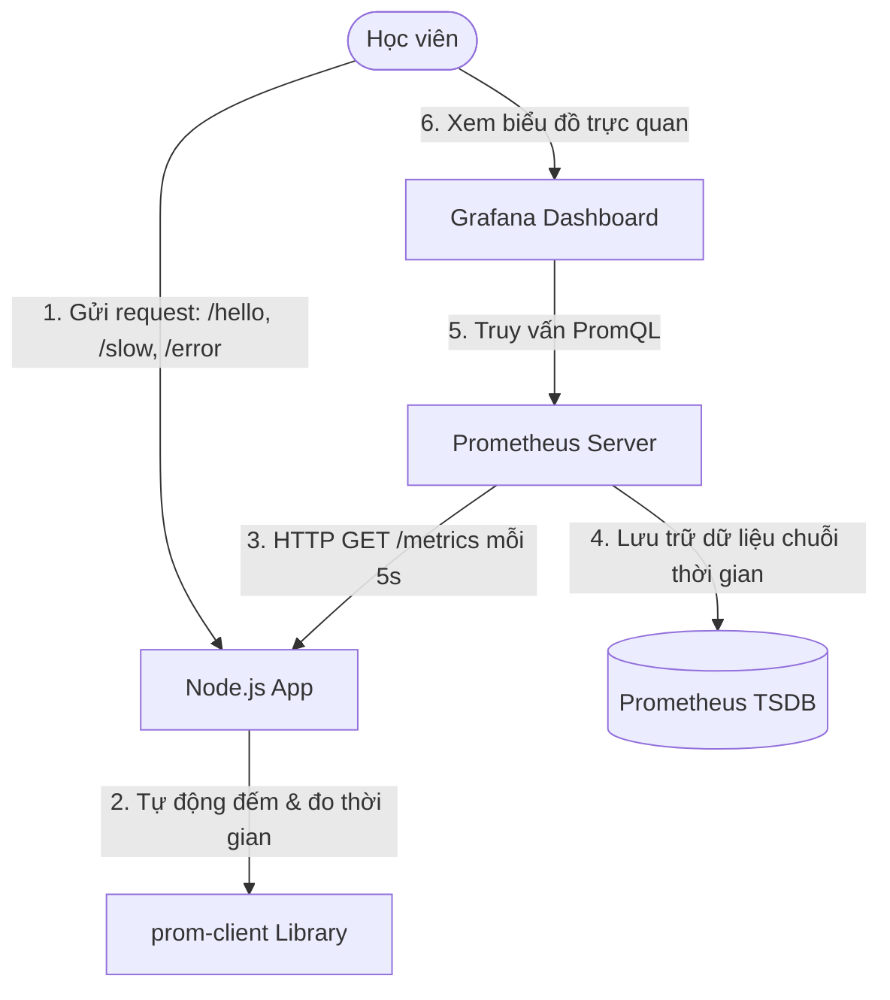

# 🧪 Lab 03: Giám sát Số liệu Hiệu năng Ứng dụng với Prometheus & Grafana (Prometheus & Grafana Lab)

## 📌 Lý do bài thực hành này tồn tại (Why this Lab?)
Để xây dựng hệ thống tự phục hồi (Self-healing) hoặc cảnh báo (Alerting) tự động trong DevSecOps, trước tiên bạn phải có khả năng **đo lường và thu thập số liệu (Metrics Collection)** từ mã nguồn ứng dụng của mình.
Bài lab này hướng dẫn bạn cách tích hợp thư viện tiêu chuẩn vào mã nguồn **Node.js** để tự sinh mã metrics, cấu hình **Prometheus** tự động kéo dữ liệu (Scraping), và kết nối **Grafana** vẽ biểu đồ trực quan hóa độ trễ, lưu lượng và lỗi hệ thống (Golden Signals).

---

## ⚙️ Sơ đồ Quy trình Vận hành Lab



---

## 🛠️ Các bước Thực hành Chi tiết

### Bước 1: Khởi động Hệ thống Giám sát
Hãy di chuyển vào thư mục bài lab và khởi chạy 3 container dịch vụ:
```bash
docker-compose up -d
```
*Lưu ý: Đợi khoảng 10-20 giây để container `devsecops-node-app` tự động tải các thư viện `express` và `prom-client` từ internet.*

### Bước 2: Tạo Lưu lượng giả lập (Traffic Generation)
1.  **Truy cập endpoint bình thường**: Truy cập liên tục 5-10 lần vào [http://localhost:3000/hello](http://localhost:3000/hello). Bạn sẽ thấy phản hồi JSON bình thường.
2.  **Truy cập endpoint trễ (Latency)**: Truy cập 5 lần vào [http://localhost:3000/slow](http://localhost:3000/slow). Trang web sẽ phản hồi chậm ngẫu nhiên từ 1-3 giây.
3.  **Truy cập endpoint lỗi (Error)**: Truy cập 3 lần vào [http://localhost:3000/error](http://localhost:3000/error). Bạn sẽ nhận được lỗi 500.

### Bước 3: Xem số liệu thô (Raw Metrics)
Mở trang web xem dữ liệu thô do thư viện tự động thống kê tại địa chỉ: [http://localhost:3000/metrics](http://localhost:3000/metrics).
Bạn sẽ thấy rất nhiều metrics hệ thống (CPU, RAM) và đặc biệt là 2 metrics tự định nghĩa:
*   `http_requests_total{method="GET",route="/hello",status="200"}`
*   `http_request_duration_seconds_bucket`

### Bước 4: Kiểm tra trạng thái trên Prometheus
1.  Mở giao diện Prometheus Server: [http://localhost:9090](http://localhost:9090).
2.  Truy cập menu **Status** -> **Targets**. Bạn phải thấy mục `nodejs-app` báo trạng thái màu xanh lá cây **UP**!
3.  Quay lại trang chủ, gõ vào khung tìm kiếm câu lệnh PromQL: `http_requests_total` rồi nhấn **Execute**. Chọn tab **Graph** để xem đồ thị sơ khởi.

### Bước 5: Cấu hình Grafana Dashboard trực quan hóa
1.  Mở giao diện Grafana: [http://localhost:3001](http://localhost:3001).
2.  Đăng nhập bằng tài khoản mặc định: User `admin` / Mật khẩu `admin`. (Hệ thống sẽ bắt bạn đổi mật khẩu mới, bạn có thể nhấn **Skip**).
3.  **Kết nối Data Source**:
    *   Nhấp vào nút **Add your first data source** hoặc vào Home -> Connections -> Data Sources.
    *   Chọn **Prometheus**.
    *   Ở khung **URL**, gõ chính xác địa chỉ mạng nội bộ của Prometheus container: `http://prometheus:9090`.
    *   Kéo xuống dưới cùng và nhấn **Save & Test**. Bạn sẽ nhận thông báo màu xanh *"Data source is working"*.
4.  **Tạo Dashboard giám sát**:
    *   Nhấp vào biểu tượng dấu cộng `+` ở góc phải trên cùng -> chọn **Dashboard** -> **Add a new panel**.
    *   Trong ô **Query**, chọn Data Source là Prometheus.
    *   Gõ câu lệnh PromQL tính số request/giây:
        ```promql
        sum(rate(http_requests_total[1m])) by (route, status)
        ```
    *   Nhấn nút **Run query**. Bạn sẽ thấy đồ thị tuyệt đẹp hiển thị lưu lượng truy cập phân tách theo route và mã trạng thái HTTP!
    *   Ở ô bên phải, đặt tên Panel là *"Traffic Rate per Route"* và nhấn **Apply** ở góc phải trên.
5.  **Tạo thêm panel đo độ trễ trung bình (Average Latency)**:
    *   Chọn **Add panel** -> **Add a new panel**.
    *   Gõ câu lệnh PromQL tính độ trễ phản hồi trung bình trong 1 phút qua:
        ```promql
        sum(rate(http_request_duration_seconds_sum[1m])) / sum(rate(http_request_duration_seconds_count[1m]))
        ```
    *   Nhấn nút **Run query** và đặt tên Panel là *"Average Response Latency (Seconds)"*. Nhấn **Apply**.
    *   Nhấn nút Lưu (Save) góc trên để lưu lại Dashboard giám sát hoàn chỉnh của bạn!

### Bước 6: Dọn dẹp môi trường
Tắt toàn bộ hệ thống lab sau khi hoàn thành:
```bash
docker-compose down
```

---

## 🎯 Tổng kết Bài học
Qua bài thực hành này, bạn đã:
*   Biết cách sử dụng thư viện `prom-client` để thu thập metrics trong mã nguồn ứng dụng Node.js.
*   Hiểu cơ chế kéo dữ liệu (Pull-based) của Prometheus thông qua `/metrics`.
*   Cấu hình thành công Grafana kết nối Prometheus làm Data Source.
*   Viết các câu lệnh PromQL để vẽ đồ thị theo dõi 3 tín hiệu vàng: Traffic, Latency và Errors.
