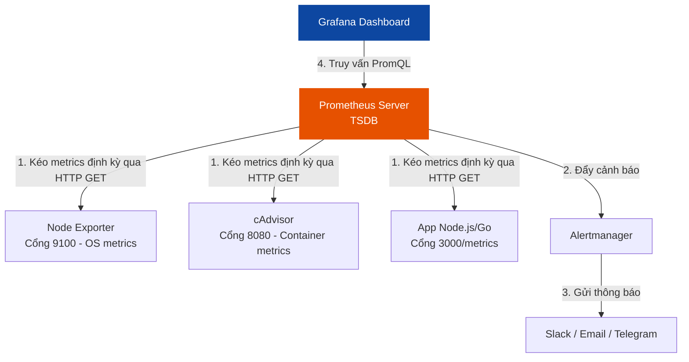

# 📈 Sub-module 01: Prometheus & Grafana - Giám sát Số liệu và Trực quan hóa (Metrics & Dashboards)

Sub-module này cung cấp kiến thức nền tảng và nâng cao về **Prometheus & Grafana** — bộ đôi tiêu chuẩn công nghiệp (De-facto Standard) được chứng nhận bởi tổ chức điện toán đám mây CNCF để thu thập metrics và trực quan hóa hiệu năng hệ thống.

---

## 1. Cơ chế hoạt động của Prometheus

Khác biệt lớn nhất của Prometheus so với đa số các công cụ giám sát khác (như Nagios, Zabbix) là nó sử dụng cơ chế **Kéo dữ liệu (Pull-based)** thay vì Đẩy dữ liệu (Push-based).

### Sơ đồ kiến trúc thu thập metrics của Prometheus:



### 1.1. Cơ chế Pull-based hoạt động thế nào?
1.  **Exporters**: Prometheus không tự kết nối trực tiếp vào hệ điều hành hay mã nguồn ứng dụng để lấy dữ liệu. Thay vào đó, nó dựa vào các **Exporters** (các proxy nhỏ chạy cạnh ứng dụng). Exporters thu thập thông tin và expose ra một đường dẫn HTTP dạng plain-text mặc định là `/metrics`.
2.  **Scrape**: Định kỳ (ví dụ mỗi 15 giây), Prometheus Server sẽ thực hiện các truy vấn HTTP GET lên endpoint `/metrics` của Exporters để kéo dữ liệu về.
3.  **TSDB (Time Series Database)**: Dữ liệu kéo về được lưu trữ trực tiếp vào Cơ sở dữ liệu chuỗi thời gian (TSDB). Dữ liệu này được nén cực mạnh và lập chỉ mục theo mốc thời gian (Timestamp) và các nhãn (Labels).

---

## 2. 4 Tín hiệu Vàng của Giám sát hệ thống (4 Golden Signals)

Khi thiết kế hệ thống giám sát và cảnh báo cho một ứng dụng, Google khuyến nghị bạn phải theo dõi sát sao **4 Tín hiệu Vàng**:

| Tín hiệu | Tiếng Anh | Định nghĩa | Ví dụ thực tế |
|---|---|---|---|
| **1. Độ trễ** | **Latency** | Thời gian cần thiết để xử lý một Request thành công hoặc thất bại. | Thời gian phản hồi API trung bình là 150ms. |
| **2. Lưu lượng** | **Traffic** | Mức độ tải của hệ thống, đo lường bằng số lượng yêu cầu dịch vụ cụ thể. | Số lượng HTTP request/giây hoặc số lượng query DB/giây. |
| **3. Tỷ lệ lỗi** | **Errors** | Tỷ lệ các yêu cầu bị thất bại (lỗi 5xx hoặc timeout). | Số lượng request lỗi 500 chiếm 1.5% tổng traffic. |
| **4. Độ bão hòa** | **Saturation** | Mức độ "đầy" của tài nguyên hệ thống, đo lường các bộ phận bị giới hạn nhất. | Dung lượng RAM còn trống 5%, Disk I/O đang quá tải. |

---

## 3. Ngôn ngữ truy vấn PromQL (Prometheus Query Language)

Prometheus cung cấp một ngôn ngữ truy vấn riêng cực kỳ mạnh mẽ tên là **PromQL**. Nó cho phép bạn lọc, tính toán và tổng hợp dữ liệu chuỗi thời gian theo thời gian thực.

### 3.1. Các kiểu dữ liệu chính trong PromQL
*   **Instant Vector**: Tập hợp các chuỗi thời gian trả về một giá trị duy nhất tại đúng thời điểm hiện tại (v.d: `node_cpu_seconds_total`).
*   **Range Vector**: Tập hợp các chuỗi thời gian trả về một dải giá trị trong một khoảng thời gian lịch sử (v.d: `node_cpu_seconds_total[5m]` lấy dữ liệu trong 5 phút qua).

### 3.2. Các câu lệnh PromQL phổ biến trong thực tế
*   **Tính tỷ lệ tăng trưởng trong 5 phút qua (`rate`)**:
    ```promql
    rate(http_requests_total[5m])
    ```
    *Dùng cho các metrics dạng Counter (số liệu chỉ tăng lên như số request).*
*   **Tổng hợp toàn bộ hệ thống (`sum`)**:
    ```promql
    sum(rate(http_requests_total[5m])) by (status)
    ```
    *Nhóm tổng số lượng request theo mã trạng thái HTTP (200, 404, 500).*

---

## 4. Trực quan hóa dữ liệu với Grafana

Nếu Prometheus xuất sắc trong việc **thu thập và lưu trữ**, thì **Grafana** là ông vua không đối thủ trong việc **trực quan hóa dữ liệu (Visualization)**.

*   **Data Sources**: Grafana hỗ trợ kết nối tới hàng chục loại database khác nhau (Prometheus, Loki, Elasticsearch, PostgreSQL, MySQL).
*   **Dashboards & Panels**: Cho phép kéo thả và thiết lập các đồ thị trực quan cực kỳ sinh động (Graph, Gauge, Bar Chart, Heatmap).
*   **Alerting**: Cho phép thiết lập các ngưỡng cảnh báo trực tiếp trên giao diện đồ thị (ví dụ: vẽ một đường line đỏ ở mức CPU 80%, nếu đồ thị vượt ngưỡng này quá 3 phút, Grafana sẽ tự động bắn tin nhắn cảnh báo về Slack/Telegram).

## 5. 🧪 Tích hợp Chaos Engineering: Kiểm Thử Hệ Thống Cảnh Báo (Chaos Alert Testing)

Trong thực tế vận hành hệ thống, việc có một hệ thống giám sát và cảnh báo là chưa đủ. Một câu hỏi lớn mà các kỹ sư SRE luôn phải đặt ra là: **"Liệu hệ thống cảnh báo có thực sự hoạt động khi sự cố xảy ra hay không?"**

Để trả lời câu hỏi này, chúng ta áp dụng triết lý của **Chaos Engineering (Kỹ nghệ hỗn loạn)**: chủ động tạo ra sự cố giả lập trong môi trường được kiểm soát để xác minh tính đúng đắn của hệ thống giám sát.

### A. Quy trình 3 bước Kiểm thử Hỗn loạn cho Cảnh báo (Alert Testing)
1. **Thiết lập Giả định (Hypothesis)**: Thiết lập giả định rằng nếu mức sử dụng CPU của container ứng dụng vượt quá 90% liên tục trong 1 phút, Prometheus sẽ phát hiện, chuyển trạng thái Alert sang `FIRING` và Alertmanager sẽ gửi cảnh báo đến Slack/Telegram trong vòng tối đa 90 giây.
2. **Kích hoạt Chaos Tool (Tạo tải giả lập)**: Sử dụng các công cụ tạo tải hoặc kiểm thử lỗi. Ở mức độ đơn giản trong Docker, chúng ta có thể dùng công cụ `stress-ng` trực tiếp bên trong container để ép CPU hoạt động 100%.
3. **Xác minh & Cải tiến**: Quan sát Grafana Dashboard để xem sự gia tăng tài nguyên, kiểm tra trạng thái alert trên giao diện Prometheus, và xác nhận xem tin nhắn Slack/Telegram có nổ ra đúng thời gian cam kết hay không.

### B. Lab Thực hành nhanh: Giả lập Quá tải CPU bằng Docker CLI
Bạn có thể giả lập ngay tình huống một container ứng dụng Node.js bị rò rỉ tài nguyên (CPU Spikes) bằng cách chạy một container tạm thời bằng lệnh sau:
```bash
# Chạy container tạo tải CPU 100% trên 2 cores vật lý trong vòng 60 giây
docker run --rm -it alpine sh -c "apk add --no-cache stress-ng && stress-ng --cpu 2 --timeout 60s"
```
Khi chạy lệnh này, hãy theo dõi Grafana Dashboard và kiểm tra xem cảnh báo `HighCPUUsage` bạn thiết lập trong Prometheus Rule có được kích hoạt thành công hay không. Đây là cách diễn tập thực chiến tuyệt vời giúp bạn tự tin rằng hệ thống tự động hóa SecOps/SRE sẽ bảo vệ bạn lúc nửa đêm khi sự cố thực xảy ra!

---

## 6. Tài nguyên Đọc thêm Chất lượng cao (Recommended Blog Readings)

### 🇻🇳 [Thiết Kế Dashboard Grafana Hoàn Hảo (Designing the Perfect Grafana Dashboard)](./blog/designing-perfect-grafana-dashboard.md)
*   **Chi tiết**: Bản dịch thuật & biên soạn chuyên sâu 100% tiếng Việt của bài blog từ chính đội ngũ Grafana Blog được lưu trữ cục bộ.
*   **Giá trị thực tiễn**: Khám phá nguyên lý phân cấp kim tự tháp thông tin, các quy tắc UX/UI giảm nhiễu hình ảnh và các phương pháp tối ưu hóa hiệu năng truy vấn Dashboard.
*   **Liên kết nguồn gốc**: [Grafana Blog - Designing the Perfect Grafana Dashboard](https://grafana.com/blog/2020/06/23/designing-the-perfect-grafana-dashboard/)

### 🇻🇳 [Chống Cảnh Báo Tràn Lan Với Prometheus Alertmanager (Preventing Alert Fatigue)](./blog/preventing-alert-fatigue-prometheus.md)
*   **Chi tiết**: Hướng dẫn dịch thuật và hiệu đính chi tiết từ các chuyên gia SRE hàng đầu của Robust Perception được biên soạn chuẩn kỹ thuật.
*   **Giá trị thực tiễn**: Tìm hiểu gốc rễ của hội chứng tràn lan cảnh báo (Alert Fatigue), phương pháp cấu hình gom nhóm (Grouping), ức chế (Inhibition), trì hoãn (Silence) của Alertmanager để chỉ gửi cảnh báo thực sự có giá trị hành động cho kỹ sư On-call.
*   **Liên kết nguồn gốc**: [Robust Perception - Prometheus Alerting Best Practices](https://www.robustperception.io/blog/)

---

## 🚀 Bước tiếp theo
Hãy bắt đầu bài thực hành dựng một cụm giám sát hoàn chỉnh bằng Docker Compose: một ứng dụng Node.js tự động export metrics, một Prometheus server kéo dữ liệu, và một Grafana dashboard biểu diễn trực quan:

👉 **[Bắt đầu bài Lab thực hành: Prometheus & Grafana](./labs/lab-prometheus-grafana/lab-instructions.md)**
