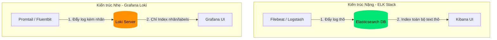

# 🪵 Sub-module 02: Quản lý Log tập trung (Centralized Log Aggregation)

Sub-module này cung cấp kiến thức nền tảng và so sánh chuyên sâu về hai hệ thống quản lý log tập trung phổ biến nhất hiện nay: **ELK Stack** truyền thống và **Grafana Loki** hiện đại, cùng cách ứng dụng LogQL để truy vết lỗi hệ thống.

---

## 1. Tại sao cần Quản lý Log tập trung?

Trong kiến trúc Monolith cổ điển, khi gặp sự cố, bạn chỉ cần SSH vào một server duy nhất và chạy lệnh `tail -f /var/log/nginx/error.log` để tìm lỗi.
Tuy nhiên, trong kiến trúc Microservices chạy trên cụm Kubernetes:
*   Ứng dụng của bạn được chia nhỏ thành hàng trăm container nằm rải rác trên hàng chục Node vật lý khác nhau.
*   Container có tính chất **tạm thời (ephemeral)** — khi bị lỗi nghiêm trọng, container sẽ tự khởi động lại hoặc bị xóa đi, kéo theo toàn bộ log bên trong container biến mất hoàn toàn.
Do đó, ta bắt buộc phải có một hệ thống **Log Aggregation (Thu thập log tập trung)** để tự động gom log từ mọi container về một cơ sở dữ liệu chung an toàn, ổn định.

---

## 2. So sánh Kiến trúc: ELK Stack vs Grafana Loki

Có hai trường phái quản lý log lớn thống trị thị trường:



### 2.1. ELK Stack (Elasticsearch, Logstash, Kibana)
*   **Cơ chế hoạt động**: Sử dụng **Elasticsearch** làm bộ máy tìm kiếm. Elasticsearch sẽ bóc tách toàn bộ ký tự trong log thô để lập chỉ mục toàn văn (**Full-Text Indexing**).
*   **Ưu điểm**: Khả năng tìm kiếm văn bản cực kỳ mạnh mẽ và nhanh chóng, phù hợp cho việc phân tích dữ liệu kinh doanh phức tạp.
*   **Nhược điểm**: **Cực kỳ tốn tài nguyên (RAM/Disk/CPU)**. Elasticsearch chạy trên nền Java JVM, tốn tối thiểu 2-4GB RAM ở mức cơ bản để chạy ổn định. Dung lượng lưu trữ file index cực kỳ phình to (có thể chiếm tới 150-200% dung lượng log gốc).

### 2.2. Grafana Loki (Hệ thống Log định hướng Metadata)
*   **Cơ chế hoạt động**: Được ví như *"Prometheus dành cho Logs"*. Thay vì lập chỉ mục toàn văn log thô, Loki **chỉ lập chỉ mục các nhãn/siêu dữ liệu (Metadata/Labels)** giống hệt cấu trúc nhãn của Prometheus (ví dụ: `{app="nginx", env="production"}`). Log thô được nén chặt thành các block lớn (chunks) và lưu trữ trực tiếp vào Object Storage giá rẻ (như AWS S3, MinIO).
*   **Ưu điểm**: **Siêu nhẹ và tiết kiệm chi phí**. Tiêu tốn cực kỳ ít tài nguyên (chỉ vài trăm MB RAM). Tốc độ lưu trữ cực nhanh. Dung lượng file index chỉ chiếm 1-5% dung lượng log gốc.
*   **Nhược điểm**: Tìm kiếm thô chậm hơn Elasticsearch nếu truy vấn trên một dải thời gian quá lớn không có nhãn giới hạn.

---

## 3. Kiến trúc Bộ ba Grafana Loki (LGT Stack)

Quy trình thu thập log của Loki hoạt động khép kín qua 3 thành phần:

1.  **Promtail (Log Shipper)**: Là một agent siêu nhẹ chạy trên mỗi server/Node vật lý. Nó tự động đọc log từ các file log tĩnh (`/var/log/*`) hoặc nghe ngóng qua Docker Unix Socket để bắt log của các container, gắn thêm các nhãn (Labels) tương ứng rồi đẩy (Push) lên Loki Server qua giao thức HTTP POST.
2.  **Loki (Log Storage Engine)**: Máy chủ trung tâm tiếp nhận log, nén chặt và lưu trữ log, đồng thời quản lý file index chứa nhãn.
3.  **Grafana (Log Viewer)**: Cung cấp giao diện đồ thị để kỹ sư viết các câu lệnh truy vấn log và xem kết quả trực quan.

---

## 4. Làm chủ Ngôn ngữ Truy vấn LogQL

Loki sử dụng một ngôn ngữ truy vấn mạnh mẽ gọi là **LogQL** (Loki Query Language). Cú pháp của LogQL được chia thành hai phần chính:

```
{app="node-app"} |= "error" != "timeout"
 └─────────────┘  └──────────────────┘
 Stream Selector      Log Pipeline
```

1.  **Stream Selector (Bộ lọc Dòng Log)**: Bắt buộc nằm trong dấu ngoặc nhọn `{}` để lọc nhanh log dựa vào nhãn (Labels) đã được index. Điều này giúp Loki cô lập vùng tìm kiếm cực nhanh.
    *   Ví dụ: `{container_name="devsecops-node-app"}`
2.  **Log Pipeline (Đường ống Lọc Nội dung)**: Thực hiện tìm kiếm chuỗi thô bên trong nội dung log bằng các toán tử lọc:
    *   `|= "error"`: Lấy các dòng log **chứa** chữ "error".
    *   `!= "timeout"`: Loại bỏ các dòng log **chứa** chữ "timeout".
    *   `|~ "regex"`: Khớp biểu thức chính quy.

---

## 5. Gia cố Bảo mật cho Hệ thống Logs (Log Hardening)

Hệ thống log là đích ngắm yêu thích của các hacker nhằm xóa dấu vết sau khi thâm nhập hoặc đánh cắp thông tin nhạy cảm. Bạn cần thực thi các biện pháp bảo mật:
1.  **Mã hóa truyền tải (TLS)**: Bắt buộc cấu hình Promtail đẩy log lên Loki qua đường truyền mã hóa HTTPS nhằm tránh bị nghe trộm.
2.  **Chống rò rỉ dữ liệu nhạy cảm (Data Masking)**: Sử dụng các bộ lọc của Promtail để tự động thay thế mã hóa (Mask) các thông tin nhạy cảm như số thẻ tín dụng, mật khẩu plain-text, API key trước khi đẩy lên lưu trữ trong Loki.
3.  **Bảo vệ tính toàn vẹn (Immutable Logs)**: Thiết lập phân quyền ghi cho Loki (Append-only), không cho phép bất kỳ ai (kể cả admin hệ thống) được quyền xóa hay sửa đổi các bản ghi log cũ trong vòng 90 ngày (tuân thủ các chuẩn PCI-DSS).

---

## 📚 Tài liệu đọc thêm khuyến nghị

*   **[Grafana Loki Official Documentation](https://grafana.com/docs/loki/latest/)** — Hướng dẫn toàn diện kiến trúc và triển khai Loki.
*   **[Loki LogQL Guide](https://grafana.com/docs/loki/latest/query/)** — Tra cứu đầy đủ các hàm tổng hợp và bộ lọc nâng cao của LogQL.

---

## 🚀 Bước tiếp theo
Hãy tiến hành bài thực hành xây dựng hệ thống thu thập log tự động cục bộ: cấu hình Promtail tự động lắng nghe và hút log từ các container Docker đang chạy để đẩy về Loki Server biểu diễn trực quan:

👉 **[Bắt đầu bài Lab thực hành: Loki & Promtail](./labs/lab-elk-loki/lab-instructions.md)**
