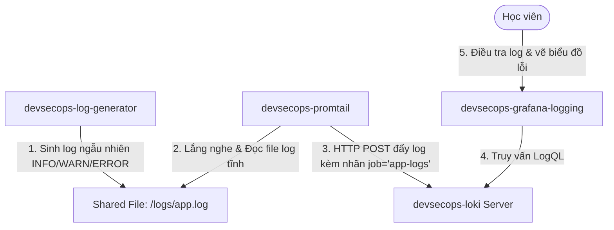

# 🧪 Lab 04: Thu thập và Truy vấn Log tập trung với Grafana Loki & Promtail (Loki & Promtail Lab)

## 📌 Lý do bài thực hành này tồn tại (Why this Lab?)
Khi vận hành một hệ thống phân tán, việc đi mò tìm lỗi bằng cách thủ công SSH vào từng máy chủ để đọc log thô là cơn ác mộng. Hơn nữa, container bị chết sẽ mang theo toàn bộ log biến mất.
Bài lab này hướng dẫn bạn xây dựng một **Kiến trúc Thu thập Log Tập trung (Centralized Logging)** cực kỳ nhẹ nhàng và chuẩn chỉnh: sử dụng **Promtail** tự động hút log từ các container chia sẻ qua Shared Volume, đẩy về **Loki Server** lưu trữ tập trung, và sử dụng **Grafana** viết các câu lệnh truy vấn **LogQL** chuyên nghiệp để tìm kiếm lỗi trong thời gian thực.

---

## ⚙️ Sơ đồ Luồng Hoạt động trong Lab



---

## 🛠️ Các bước Thực hành Chi tiết

### Bước 1: Khởi động Cụm Thu thập Log
Di chuyển vào thư mục bài lab và chạy lệnh sau để khởi động 4 container liên kết mạng ảo cô lập:
```bash
docker-compose up -d
```
*Lưu ý: Hệ thống sẽ khởi chạy một Node ứng dụng sinh log tự động mỗi 1.5 giây vào file `./logs/app.log`, một Promtail agent, một Loki database và một Grafana UI.*

### Bước 2: Xác minh tệp log được sinh ra
Hãy kiểm tra xem container sinh log có hoạt động chính xác không bằng cách đọc file log tĩnh trên máy host:
```bash
tail -f logs/app.log
```
*(Hoặc dùng notepad mở file `logs/app.log` lên). Bạn sẽ thấy các dòng log chuẩn cấu trúc dạng `[TIMESTAMP] [LEVEL] Message` liên tục được nối thêm.*

### Bước 3: Đăng nhập Grafana và cấu hình Loki Data Source
1.  Mở trình duyệt truy cập Grafana chuyên dụng cho Logging: [http://localhost:3002](http://localhost:3002).
2.  Đăng nhập với User `admin` / Mật khẩu `admin` (Nhấn **Skip** đổi mật khẩu).
3.  **Kết nối Loki làm Data Source**:
    *   Vào Connections -> Data Sources -> nhấp **Add data source**.
    *   Chọn **Loki**.
    *   Ở khung **URL**, nhập chính xác địa chỉ container Loki: `http://loki:3100`.
    *   Kéo xuống dưới cùng nhấn **Save & Test**. Bạn phải nhận được thông báo màu xanh chúc mừng kết nối thành công!

### Bước 4: Viết câu lệnh LogQL truy vết lỗi (Log Investigation)
1.  Nhấp vào biểu tượng la bàn **Explore** ở thanh công cụ bên trái (hoặc bấm Home -> Explore).
2.  Chọn Data Source là **Loki**.
3.  **Lọc toàn bộ log**: Trong khung nhập liệu LogQL, gõ câu lệnh sau để lọc toàn bộ luồng log có nhãn `job="app-logs"`:
    ```logql
    {job="app-logs"}
    ```
    Nhấn **Run query** ở góc trên. Bạn sẽ thấy danh sách toàn bộ log chảy về thời gian thực!
4.  **Tìm kiếm các dòng cảnh báo và lỗi (WARN & ERROR)**:
    Sử dụng đường ống Log Pipeline để lọc các dòng log chứa từ khóa `"WARN"` hoặc `"ERROR"`:
    ```logql
    {job="app-logs"} |= "ERROR"
    ```
    Nhấn **Run query**. Bạn sẽ chỉ nhìn thấy các dòng log Database Connection Failed màu đỏ rực hiển thị!
5.  **Lọc kết hợp nhiều từ khóa (AND/NOT)**:
    Tìm các dòng chứa chữ `"ERROR"` nhưng không liên quan đến `"PostgreSQL"`:
    ```logql
    {job="app-logs"} |= "ERROR" != "PostgreSQL"
    ```
    *(Kết quả sẽ trả về rỗng vì mọi log ERROR trong lab này đều do database failure. Điều này chứng minh bộ lọc hoạt động cực kỳ chính xác!)*

### Bước 5: Biến đổi Log thành số liệu (Log-to-Metrics)
Một tính năng cực đỉnh của LogQL là cho phép đếm tần suất xuất hiện lỗi trong log để vẽ thành đồ thị trực quan giống như Prometheus metrics.
Gõ câu lệnh sau để đếm tổng số lỗi `ERROR` xuất hiện trong mỗi khoảng 1 phút:
```logql
count_over_time({job="app-logs"} |= "ERROR"[1m])
```
*Nhấn **Run query**, Grafana sẽ tự động vẽ một đồ thị biểu diễn tần suất lỗi tăng giảm theo thời gian thực phía trên danh sách log!*

### Bước 6: Dọn dẹp môi trường
Sau khi kết thúc thực hành, hãy tắt cụm container:
```bash
docker-compose down
```

---

## 🎯 Tổng kết Bài học
Qua bài thực hành này, bạn đã:
*   Xây dựng thành công một pipeline thu thập log tập trung hoàn chỉnh (Log Generator -> Shared File -> Promtail -> Loki -> Grafana).
*   Hiểu bản chất cơ chế index theo nhãn (Metadata-only Indexing) siêu nhẹ của Loki.
*   Làm chủ ngôn ngữ truy vấn **LogQL** để lọc log theo nhãn, tìm kiếm text thô, và đếm tần suất lỗi vẽ biểu đồ trực quan.
