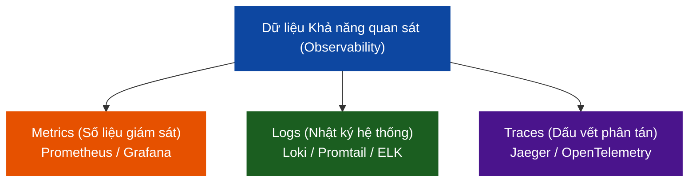

# 📊 MODULE 6 — GIÁM SÁT & KHẢ NĂNG QUAN SÁT (OBSERVABILITY)

Chào mừng bạn đến với Module về **Khả năng quan sát (Observability)**. Trong môi trường DevSecOps hiện đại, nơi hệ thống chuyển dịch mạnh mẽ sang Microservices và Kubernetes, việc biết được hệ thống có đang chạy ổn định và an toàn hay không là một thách thức cực kỳ lớn. Observability giúp bạn thu thập, phân tích và trực quan hóa toàn bộ dữ liệu hoạt động của hệ thống để phát hiện sự cố trước khi người dùng kịp nhận ra.

---

## 🔍 Dữ liệu Khả năng quan sát: Metrics vs Logs vs Traces

Khả năng quan sát toàn diện được xây dựng trên **Ba trụ cột cốt lõi (Three Pillars of Observability)**:



### 1. Metrics (Số liệu giám sát) — Trả lời câu hỏi: "Hệ thống có lỗi không?"
*   **Đặc điểm**: Số liệu thống kê định lượng theo thời gian (v.d. RAM sử dụng %, số lượng request/giây, tỷ lệ lỗi 5xx). Dữ liệu nhẹ, lưu trữ lâu, dùng để vẽ đồ thị và kích hoạt cảnh báo (Alerting).
*   **Công cụ**: Prometheus, Grafana.

### 2. Logs (Nhật ký hệ thống) — Trả lời câu hỏi: "Tại sao hệ thống lỗi?"
*   **Đặc điểm**: Nhật ký chi tiết của các sự kiện diễn ra trong ứng dụng và hệ thống (v.d. Stack trace của exception, SQL query bị fail). Dữ liệu nặng, chi tiết, dùng để điều tra nguyên nhân gốc rễ (Root Cause Analysis).
*   **Công cụ**: Grafana Loki & Promtail, ELK Stack (Elasticsearch, Logstash, Kibana).

### 3. Traces (Dấu vết phân tán) — Trả lời câu hỏi: "Lỗi xảy ra ở bước nào trong luồng đi?"
*   **Đặc điểm**: Dấu vết của một Request đi qua nhiều microservice khác nhau (v.d. Client -> API Gateway -> Auth Service -> Cart Service -> Database). Dùng để phân tích độ trễ (Latency) và nghẽn cổ chai.
*   **Công cụ**: Jaeger, Zipkin, OpenTelemetry.

---

## 📁 Cấu trúc Module 6

Module này tập trung hướng dẫn bạn làm chủ 2 trụ cột đầu tiên (Metrics & Logs) bằng công nghệ hiện đại, siêu nhẹ, chuẩn CNCF:

```
06-observability/
├── observability-overview.md            # File này (Giới thiệu tổng quan)
│
├── prometheus-grafana/                  # Sub-module 01: Prometheus & Grafana
│   ├── prometheus-grafana-guide.md      # Lý thuyết thu thập metrics & lập dashboard
│   └── labs/
│       └── lab-prometheus-grafana/      # Lab thực hành dựng hệ thống giám sát app Node.js
│
└── elk-loki-logging/                    # Sub-module 02: Logging tập trung với Loki
    ├── elk-loki-guide.md                # Lý thuyết so sánh ELK vs Loki & Cơ chế Log Labeling
    └── labs/
        └── lab-elk-loki/                # Lab thực hành thu thập log container thời gian thực
```

---

## 🚀 Lộ trình Học tập

*   👉 **[Bước 1: Bắt đầu với Prometheus & Grafana](./prometheus-grafana/prometheus-grafana-guide.md)** để học cách giám sát metrics và cấu hình Dashboard trực quan hóa đẹp mắt.
*   👉 **[Bước 2: Học về Quản lý Log tập trung với Loki & Promtail](./elk-loki-logging/elk-loki-guide.md)** để nắm vững kỹ thuật thu thập, phân loại nhãn và truy vấn log hệ thống.

---

## 📚 Tài nguyên Đọc thêm Chất lượng cao (Recommended Blog Readings)

Mở rộng kiến thức về giám sát và phân tích log hệ thống với các bài blog chất lượng hàng đầu:

### 1. 🇻🇳 [Xây dựng hệ thống Logging tập trung nhẹ nhàng với Grafana Loki và Promtail](https://viblo.asia/p/xay-dung-he-thong-logging-tap-trung-nhe-nhang-voi-grafana-loki-va-promtail-ByEZk6nxlQ0)
*   **Nguồn**: Cộng đồng Viblo.asia (Đạt 18k+ views, 220+ upvotes).
*   **Giá trị thực tiễn**: Tác giả so sánh chi tiết và khách quan giữa hai kiến trúc thu thập log (*Log Aggregation*) phổ biến nhất hiện nay: **ELK Stack** (Elasticsearch, Logstash, Kibana) và **PLG Stack** (Prometheus, Loki, Grafana). Bài viết làm rõ lý do tại sao ELK lại tiêu tốn quá nhiều tài nguyên RAM/CPU cho việc đánh chỉ mục toàn văn (*full-text indexing*), trong khi Loki chỉ đánh chỉ mục cho nhãn dữ liệu (*metadata labels*) và nén log thô lưu vào Object Storage (S3/MinIO), giúp doanh nghiệp tiết kiệm đến 90% chi phí hạ tầng.
*   **Lý do cần đọc**: Giúp bạn định hình tư duy tối ưu chi phí vận hành hạ tầng giám sát, tránh lãng phí tài nguyên của công ty khi dựng lab hoặc chạy production.

### 2. 🇬🇧 [The 4 Golden Signals of Monitoring (4 Tín Hiệu Vàng Trong Giám Sát Hệ Thống)](https://sre.google/sre-book/monitoring-distributed-systems/#xref_monitoring_golden-signals)
*   **Nguồn**: Google SRE Book - Site Reliability Engineering (Cuốn sách gối đầu giường kinh điển của mọi kỹ sư DevOps/SRE trên toàn cầu).
*   **Bản dịch & Tóm tắt cốt lõi**: Bài phân tích đi sâu giải nghĩa 4 chỉ số vàng bắt buộc phải thu thập và giám sát để đánh giá chính xác, toàn diện nhất sức khỏe của một hệ thống phân tán:
    1.  **Độ trễ (Latency)**: Thời gian hệ thống cần để xử lý một yêu cầu (*request*). Tác giả lưu ý phải tách biệt rõ ràng latency của các request thành công (200 OK) và request lỗi (5xx) để tránh số liệu trung bình ảo.
    2.  **Lưu lượng (Traffic)**: Mức độ tải thực tế đang đè lên hệ thống, ví dụ số yêu cầu trên giây (*RPS - Requests Per Second*) đối với HTTP API, hoặc số phiên giao dịch đồng thời đối với Database.
    3.  **Lỗi (Errors)**: Tỷ lệ các yêu cầu bị thất bại (lỗi HTTP 5xx, kết nối bị ngắt quãng, lỗi logic nghiệp vụ).
    4.  **Độ bão hòa (Saturation)**: Mức độ "đầy" của tài nguyên hệ thống (bao nhiêu phần trăm RAM, CPU, IOPS đang được dùng, kích thước hàng chờ của queue). Đây là chỉ số dự báo sớm nhất giúp phát hiện các sự cố hệ thống đang cận kề.

