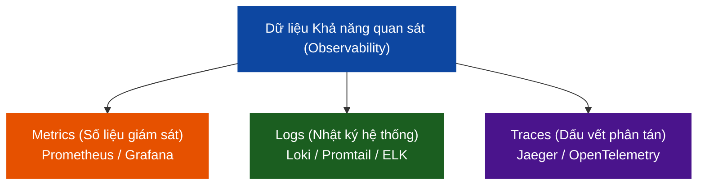

# 📊 MODULE 6 — GIÁM SÁT & KHẢ NĂNG QUAN SÁT (OBSERVABILITY)

Chào mừng bạn đến với Module về **Khả năng quan sát (Observability)**. Trong môi trường DevSecOps hiện đại, nơi hệ thống chuyển dịch mạnh mẽ sang Microservices và Kubernetes, việc biết được hệ thống có đang chạy ổn định và an toàn hay không là một thách thức cực kỳ lớn. Observability giúp bạn thu thập, phân tích và trực quan hóa toàn bộ dữ liệu hoạt động của hệ thống để phát hiện sự cố trước khi người dùng kịp nhận ra.

---

## 🔍 Dữ liệu Khả năng quan sát: Metrics vs Logs vs Traces

Khả năng quan sát toàn diện được xây dựng trên **Ba trụ cột cốt lõi (Three Pillars of Observability)**:



### 1. Metrics (Số liệu giám sát) — Trả lời câu hỏi: "Hệ thống có lỗi không?"
*   **Đặc điểm**: Số liệu thống kê định lượng theo thời gian (v.d. RAM sử dụng %, số lượng request/giây, tỷ lệ lỗi 5xx). Dữ liệu nhẹ, lưu trữ lâu, dùng để vẽ đồ thị và kích hoạt cảnh báo (Alerting).
*   **Công cụ**: Prometheus, Grafana.

### 2. Logs (Nhật ký hệ thống) — Trả lời câu hỏi: "Tại sao hệ thống lỗi?"
*   **Đặc điểm**: Nhật ký chi tiết của các sự kiện diễn ra trong ứng dụng và hệ thống (v.d. Stack trace của exception, SQL query bị fail). Dữ liệu nặng, chi tiết, dùng để điều tra nguyên nhân gốc rễ (Root Cause Analysis).
*   **Công cụ**: Grafana Loki & Promtail, ELK Stack (Elasticsearch, Logstash, Kibana).

### 3. Traces (Dấu vết phân tán) — Trả lời câu hỏi: "Lỗi xảy ra ở bước nào trong luồng đi?"
*   **Đặc điểm**: Dấu vết của một Request đi qua nhiều microservice khác nhau (v.d. Client -> API Gateway -> Auth Service -> Cart Service -> Database). Dùng để phân tích độ trễ (Latency) và nghẽn cổ chai.
*   **Công cụ**: Jaeger, Zipkin, OpenTelemetry.

---

## 📁 Cấu trúc Module 6

Module này tập trung hướng dẫn bạn làm chủ 2 trụ cột đầu tiên (Metrics & Logs) bằng công nghệ hiện đại, siêu nhẹ, chuẩn CNCF:

```
06-observability/
├── observability-overview.md            # File này (Giới thiệu tổng quan)
│
├── prometheus-grafana/                  # Sub-module 01: Prometheus & Grafana
│   ├── prometheus-grafana-guide.md      # Lý thuyết thu thập metrics & lập dashboard
│   └── labs/
│       └── lab-prometheus-grafana/      # Lab thực hành dựng hệ thống giám sát app Node.js
│
└── elk-loki-logging/                    # Sub-module 02: Logging tập trung với Loki
    ├── elk-loki-guide.md                # Lý thuyết so sánh ELK vs Loki & Cơ chế Log Labeling
    └── labs/
        └── lab-elk-loki/                # Lab thực hành thu thập log container thời gian thực
```

---

## 🚀 Lộ trình Học tập

*   👉 **[Bước 1: Bắt đầu với Prometheus & Grafana](./prometheus-grafana/prometheus-grafana-guide.md)** để học cách giám sát metrics và cấu hình Dashboard trực quan hóa đẹp mắt.
*   👉 **[Bước 2: Học về Quản lý Log tập trung với Loki & Promtail](./elk-loki-logging/elk-loki-guide.md)** để nắm vững kỹ thuật thu thập, phân loại nhãn và truy vấn log hệ thống.
