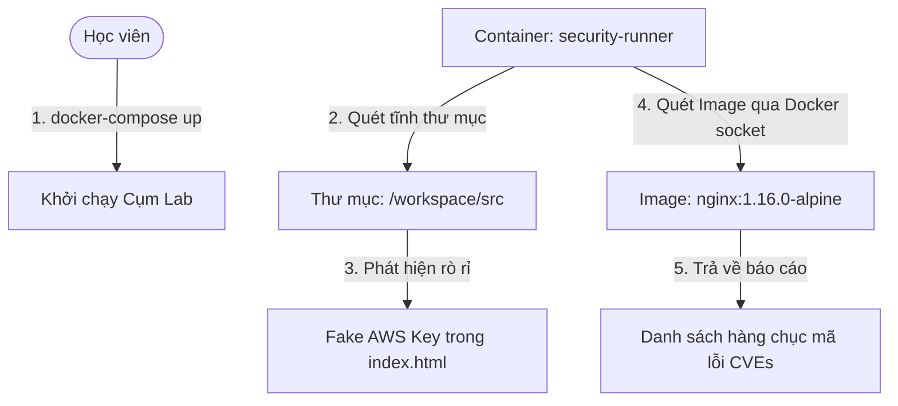

# 🧪 Lab 05: Quét Lỗ hổng Bảo mật & Rò rỉ Secret tự động với Trivy (Security Scanning Lab)

## 📌 Lý do bài thực hành này tồn tại (Why this Lab?)
Trong DevSecOps, **Chốt chặn Bảo mật Tự động** là vũ khí mạnh nhất để ngăn chặn code lỗi hoặc cấu hình thiếu an toàn bị đẩy lên môi trường Production.
Bài lab này hướng dẫn bạn cách sử dụng **Trivy** — công cụ quét an toàn vô địch về tốc độ và độ nhẹ — để thực thi hai nhiệm vụ thực chiến:
1.  **Quét tĩnh Thư mục (Filesystem Scan)**: Phát hiện các thông tin nhạy cảm (như API Keys, AWS Access Token) bị Developer cố tình hoặc vô ý hardcode bên trong mã nguồn.
2.  **Quét Container Image (Container Scanning)**: Quét một Docker Image lỗi thời để tìm ra toàn bộ danh sách các lỗ hổng bảo mật hệ thống đang tồn tại bên trong nó.

---

## ⚙️ Sơ đồ Luồng Hoạt động trong Lab



---

## 🛠️ Các bước Thực hành Chi tiết

### Bước 1: Khởi động Cụm Lab
Hãy di chuyển vào thư mục bài lab và chạy lệnh sau để kéo các image siêu nhẹ và khởi chạy container:
```bash
docker-compose up -d
```
*Lưu ý: Môi trường này chỉ chứa 2 container rất nhẹ là Target Web Nginx (1.16.0) và Trivy Security Runner. Quá trình khởi động chỉ mất khoảng 5-10 giây!*

### Bước 2: Quét rò rỉ thông tin nhạy cảm (Secret Leaks Scan)
Hãy giả lập vai trò là một chốt chặn CI/CD, chạy Trivy để quét toàn bộ thư mục mã nguồn hiện tại (`/workspace`) xem có ai lỡ tay hardcode key hay mật khẩu không:
```bash
docker exec -it devsecops-security-runner trivy fs /workspace
```
*Hãy quan sát màn hình kết quả quét. Ở mục **Secret**, Trivy sẽ cảnh báo màu đỏ cực lớn phát hiện **AWS Access Key ID** và **AWS Secret Access Key** nằm chính xác tại dòng số 18 và 19 của file `/workspace/src/index.html`!*

### Bước 3: Quét lỗ hổng Container Image (Container Scanning)
Bây giờ, hãy thực hiện quét Docker Image của Target Web Server (`nginx:1.16.0-alpine`) xem có an toàn để deploy lên Production hay không:
```bash
docker exec -it devsecops-security-runner trivy image nginx:1.16.0-alpine
```
*Lưu ý: Trong lần chạy đầu tiên, Trivy sẽ mất khoảng 10-15 giây để tự động tải Cơ sở dữ liệu lỗ hổng bảo mật (Vulnerability Database) mới nhất.*
*Màn hình sẽ hiển thị một danh sách rất dài các lỗ hổng hệ điều hành được phân loại theo mức độ: **CRITICAL**, **HIGH**, **MEDIUM**, **LOW** đi kèm các mã số CVE quốc tế và trạng thái đã có bản vá (fixed version) hay chưa.*

### Bước 4: Tích hợp Pipeline — Lọc mức độ nghiêm trọng và tự động dừng (Fail)
Trong môi trường CI/CD thực tế, chúng ta không muốn pipeline bị ngắt (fail) bởi các lỗi nhỏ (LOW) vì sẽ gây phiền hà cho developer. Chúng ta chỉ muốn chặn đứng pipeline nếu phát hiện lỗi **HIGH** hoặc **CRITICAL**.
Hãy chạy lệnh sau để ra lệnh cho Trivy: *Chỉ quét lỗi HIGH, CRITICAL và nếu phát hiện, hãy trả về mã lỗi Exit Code = 1 (khiến hệ thống CI/CD như Jenkins hiểu và tự động hủy Job build)*:
```bash
docker exec -it devsecops-security-runner trivy image --severity HIGH,CRITICAL --exit-code 1 nginx:1.16.0-alpine
```
*Lệnh này sẽ trả về danh sách rút gọn các lỗi nghiêm trọng nhất. Hãy chạy lệnh kiểm tra Exit Code ngay sau đó trên terminal máy host của bạn:*
*   **Trên Windows (PowerShell)**: `$Lastexitcode` (Kết quả sẽ trả về `1`!)
*   **Trên Linux/macOS**: `echo $?` (Kết quả sẽ trả về `1`!)
*Nhờ Exit Code = 1 này, các công cụ CI/CD sẽ lập tức dừng quy trình build, chặn không cho image không an toàn này được đẩy lên môi trường Production!*

### Bước 5: Dọn dẹp môi trường
Sau khi hoàn thành thực hành, tắt cụm container:
```bash
docker-compose down
```

---

## 🎯 Tổng kết Bài học
Qua bài thực hành này, bạn đã:
*   Làm chủ công cụ quét bảo mật đa năng **Trivy**.
*   Hiểu cách hoạt động của cơ chế quét tĩnh phát hiện rò rỉ bí mật (Secret Leaks).
*   Thực hiện thành công quét lỗ hổng Docker Image (Container Scanning).
*   Biết cách thiết lập bộ lọc mức độ (`--severity`) và cơ chế chặn đứng pipeline (`--exit-code 1`) để tự động hóa an ninh trong CI/CD.
