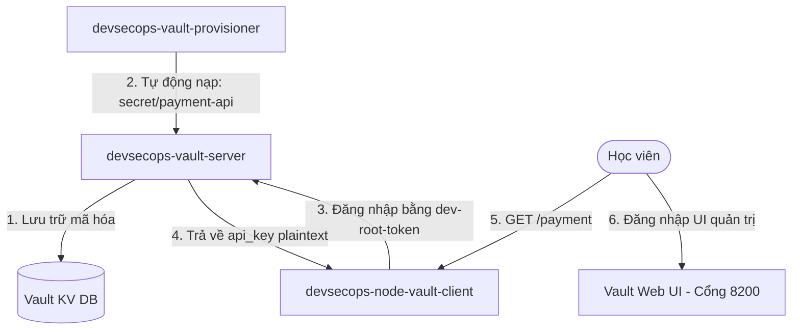

# 🧪 Lab 06: Quản lý Bí mật An toàn với HashiCorp Vault (HashiCorp Vault Lab)

## 📌 Lý do bài thực hành này tồn tại (Why this Lab?)
Việc lưu trữ mật khẩu, khóa API dưới dạng plain-text tĩnh trong mã nguồn hoặc biến môi trường là rủi ro an ninh nghiêm trọng.
Bài lab này hướng dẫn bạn xây dựng giải pháp **Quản trị Bí mật Tập trung (Centralized Secret Management)**:
1.  Khởi chạy **HashiCorp Vault Server** bảo mật.
2.  Tự động nạp API Key nhạy cảm vào database lưu trữ của Vault.
3.  Xây dựng ứng dụng **Node.js Client** tự động xác thực qua token bảo mật và kéo (fetch) API Key từ Vault API về bộ nhớ tạm thời khi khởi động (Memory-only, không lưu xuống đĩa, không ghi ra biến môi trường tĩnh).

---

## ⚙️ Sơ đồ Quy trình Hoạt động trong Lab



---

## 🛠️ Các bước Thực hành Chi tiết

### Bước 1: Khởi động Hệ thống Vault
Hãy di chuyển vào thư mục bài lab và chạy lệnh khởi chạy các container dịch vụ:
```bash
docker-compose up -d
```
*Lưu ý: Docker Compose sẽ tự động dựng máy chủ Vault ở chế độ Development (mã hóa hoàn toàn trong RAM, tự động mở khóa unseal và gán root token `dev-root-token` để thực hành dễ nhất). Container `vault-provisioner` sẽ tự động chờ Vault sẵn sàng rồi nạp secret `api_key = stripe-live-token-secret-998877`.*

### Bước 2: Kiểm tra Logs của Ứng dụng Node.js Client
Hãy xem cách ứng dụng Node.js tự động giao tiếp với Vault để lấy API Key khi khởi động:
```bash
docker logs devsecops-node-vault-client
```
*Bạn sẽ thấy output in ra dòng thông báo:*
```
[Vault Client] Đang kết nối tới Vault tại: http://vault:8200...
[Vault Client] Kết nối Vault thành công! Đã lấy API Key: [stri****************]
Ứng dụng Client đang chạy trên cổng 4000.
```
*Lưu ý: API Key đã được kéo về RAM của ứng dụng và tự động che giấu (Masking) ở file logs, ngăn chặn hoàn toàn việc rò rỉ chìa khóa thanh toán ra ngoài hệ thống Logging tập trung!*

### Bước 3: Xác minh Ứng dụng Hoạt động
Hãy mở trình duyệt truy cập đường dẫn: [http://localhost:4000/payment](http://localhost:4000/payment).
Bạn sẽ nhận được phản hồi JSON thông báo thanh toán thành công, hiển thị API Key ở dạng đã được mã hóa che giấu.

### Bước 4: Khám phá Giao diện Web Quản trị (Web UI) của Vault
Một trong những điểm tuyệt vời nhất của HashiCorp Vault là giao diện đồ họa Web UI cực kỳ chuyên nghiệp và trực quan:
1.  Mở trình duyệt truy cập địa chỉ: [http://localhost:8200](http://localhost:8200).
2.  Ở khung **Method**, chọn **Token**.
3.  Gõ token đăng nhập là root token ta đã gán: `dev-root-token` rồi nhấn **Sign In**.
4.  Nhấp vào Secrets Engine tên là **secret/**. Bạn sẽ thấy mục **payment-api**.
5.  Click vào **payment-api**, bạn sẽ nhìn thấy dữ liệu API Key bí mật đang được lưu trữ cực kỳ an toàn bên trong! Bạn có thể chỉnh sửa phiên bản secret hoặc tạo mới trực tiếp từ giao diện này.

### Bước 5: Dọn dẹp môi trường
Tắt toàn bộ container thực hành:
```bash
docker-compose down
```

---

## 🎯 Tổng kết Bài học
Qua bài thực hành này, bạn đã:
*   Khởi dựng và vận hành máy chủ bảo mật **HashiCorp Vault**.
*   Hiểu cách hoạt động của Secrets Engine dạng Key-Value (KV v2).
*   Lập trình thành công ứng dụng Node.js kết nối an toàn qua REST API của Vault để lấy Credentials tự động khi chạy.
*   Làm quen với giao diện Web UI quản trị an ninh cao cấp của Vault.
