# 🛡️ MODULE 7 — TÍCH HỢP BẢO MẬT CI/CD (DEVSECOPS PIPELINE)

Chào mừng bạn đến với Module thực chiến cốt lõi của DevSecOps: **Tích hợp bảo mật vào quy trình CI/CD (DevSecOps Pipeline)**. Trong quy trình phát triển phần mềm truyền thống, bảo mật (Security) thường là bước cuối cùng trước khi deploy (thường làm thủ công và mất nhiều tuần). DevSecOps thay đổi hoàn toàn điều đó bằng triết lý **Shift Left (Chuyển dịch về bên trái)** — tự động hóa và tích hợp kiểm tra bảo mật vào từng dòng code ngay khi lập trình viên commit.

---

## 🔍 Kiến trúc Một Pipeline CI/CD Tích hợp Bảo mật Toàn diện

Trong Module này, bạn sẽ học cách thiết lập một Pipeline tự động tích hợp đầy đủ các chốt chặn an ninh:

```mermaid
graph LR
    Code[1. Lập trình viên Commit] -->|SAST / SCA Scan| CI[2. Jenkins / GitHub Actions]
    CI -->|Compliance-as-Code check| Pack[3. Đóng gói & Scan Container Image]
    Pack -->|Secret Management injection| Deploy[4. Deploy lên K8s / Staging]
    Deploy -->|DAST Scan / Dynamic Test| Prod[5. Sản phẩm An toàn]
    
    style Code fill:#bbdefb,stroke:#1e88e5,color:#000
    style CI fill:#d1c4e9,stroke:#5e35b1,color:#000
    style Pack fill:#ffe082,stroke:#ffb300,color:#000
    style Deploy fill:#c8e6c9,stroke:#43a047,color:#000
    style Prod fill:#ffcc80,stroke:#f57c00,color:#000
```



### 1. SAST (Tĩnh) & SCA (Phụ thuộc) — Quét ngay khi Code
*   **SAST (Static Application Security Testing)**: Quét và phân tích mã nguồn tĩnh để tìm lỗi logic bảo mật (SQL Injection, Hardcoded Secrets, Buffer Overflow).
*   **SCA (Software Composition Analysis)**: Quét danh sách các thư viện phụ thuộc (Dependencies) bên thứ ba để phát hiện các thư viện bị dính mã lỗi bảo mật đã được công bố công khai (CVEs).
*   **Công cụ**: SonarQube, Trivy (fs scan), Snyk.

### 2. Compliance-as-Code — Kiểm soát Tuân thủ cấu hình tự động
*   **Mục tiêu**: Tự động chặn đứng các tệp tin cấu hình hạ tầng (Dockerfile, K8s YAML, Terraform tf) thiếu an toàn trước khi chúng được khởi chạy.
*   **Công cụ**: Open Policy Agent (OPA), Conftest.

### 3. Secret Management — Quản lý Bí mật Động
*   **Mục tiêu**: Loại bỏ hoàn toàn việc lưu API key, mật khẩu database trong code hay biến môi trường tĩnh. Sử dụng cơ chế nạp khóa động khi chạy.
*   **Công cụ**: HashiCorp Vault.

---

## 📁 Cấu trúc Module 7

Module này được phân chia thành 3 sub-module thực tế:

```
07-devsecops-pipeline/
├── devsecops-pipeline-overview.md       # File này (Giới thiệu tổng quan)
│
├── security-scanning/                   # Sub-module 01: Quét bảo mật tự động
│   ├── security-scanning-guide.md       # Lý thuyết SAST, DAST, SCA và cách chọn công cụ
│   └── labs/
│       └── lab-pipeline-security/       # Lab: Quét an toàn ứng dụng nodejs với Trivy & OWASP ZAP
│
├── secret-management/                   # Sub-module 02: Quản lý Secrets với Vault
│   ├── secret-management-guide.md       # Lý thuyết Dynamic Secrets, Tokenization của Vault
│   └── labs/
│       └── lab-vault-secrets/           # Lab: Dựng Vault, nạp secret và viết App lấy secret động
│
└── compliance-as-code/                  # Sub-module 03: Kiểm duyệt tuân thủ (Compliance-as-Code)
    ├── compliance-as-code-guide.md      # Lý thuyết ngôn ngữ Rego, chính sách OPA
    └── labs/
        └── lab-opa-conftest/            # Lab: Viết chính sách Rego tự động kiểm duyệt Dockerfile
```

---

## 🚀 Lộ trình Học tập

*   👉 **[Bước 1: Quét bảo mật mã nguồn & ứng dụng](./security-scanning/security-scanning-guide.md)** (SAST, DAST, SCA với Trivy).
*   👉 **[Bước 2: Học quản lý bí mật nâng cao với Vault](./secret-management/secret-management-guide.md)**.
*   👉 **[Bước 3: Thực thi chính sách hạ tầng an toàn với OPA Conftest](./compliance-as-code/compliance-as-code-guide.md)**.
