# 🛡️ MODULE 7 — TÍCH HỢP BẢO MẬT CI/CD (DEVSECOPS PIPELINE)

Chào mừng bạn đến với Module thực chiến cốt lõi của DevSecOps: **Tích hợp bảo mật vào quy trình CI/CD (DevSecOps Pipeline)**. Trong quy trình phát triển phần mềm truyền thống, bảo mật (Security) thường là bước cuối cùng trước khi deploy (thường làm thủ công và mất nhiều tuần). DevSecOps thay đổi hoàn toàn điều đó bằng triết lý **Shift Left (Chuyển dịch về bên trái)** — tự động hóa và tích hợp kiểm tra bảo mật vào từng dòng code ngay khi lập trình viên commit.

---

## 🔍 Kiến trúc Một Pipeline CI/CD Tích hợp Bảo mật Toàn diện

Trong Module này, bạn sẽ học cách thiết lập một Pipeline tự động tích hợp đầy đủ các chốt chặn an ninh:

```mermaid
graph LR
    Code[1. Lập trình viên Commit] -->|SAST / SCA Scan| CI[2. Jenkins / GitHub Actions]
    CI -->|Compliance-as-Code check| Pack[3. Đóng gói & Scan Container Image]
    Pack -->|Secret Management injection| Deploy[4. Deploy lên K8s / Staging]
    Deploy -->|DAST Scan / Dynamic Test| Prod[5. Sản phẩm An toàn]
    
    style Code fill:#bbdefb,stroke:#1e88e5,color:#000
    style CI fill:#d1c4e9,stroke:#5e35b1,color:#000
    style Pack fill:#ffe082,stroke:#ffb300,color:#000
    style Deploy fill:#c8e6c9,stroke:#43a047,color:#000
    style Prod fill:#ffcc80,stroke:#f57c00,color:#000
```



### 1. SAST (Tĩnh) & SCA (Phụ thuộc) — Quét ngay khi Code
*   **SAST (Static Application Security Testing)**: Quét và phân tích mã nguồn tĩnh để tìm lỗi logic bảo mật (SQL Injection, Hardcoded Secrets, Buffer Overflow).
*   **SCA (Software Composition Analysis)**: Quét danh sách các thư viện phụ thuộc (Dependencies) bên thứ ba để phát hiện các thư viện bị dính mã lỗi bảo mật đã được công bố công khai (CVEs).
*   **Công cụ**: SonarQube, Trivy (fs scan), Snyk.

### 2. Compliance-as-Code — Kiểm soát Tuân thủ cấu hình tự động
*   **Mục tiêu**: Tự động chặn đứng các tệp tin cấu hình hạ tầng (Dockerfile, K8s YAML, Terraform tf) thiếu an toàn trước khi chúng được khởi chạy.
*   **Công cụ**: Open Policy Agent (OPA), Conftest.

### 3. Secret Management — Quản lý Bí mật Động
*   **Mục tiêu**: Loại bỏ hoàn toàn việc lưu API key, mật khẩu database trong code hay biến môi trường tĩnh. Sử dụng cơ chế nạp khóa động khi chạy.
*   **Công cụ**: HashiCorp Vault.

---

## 📁 Cấu trúc Module 7

Module này được phân chia thành 3 sub-module thực tế:

```
07-devsecops-pipeline/
├── devsecops-pipeline-overview.md       # File này (Giới thiệu tổng quan)
│
├── security-scanning/                   # Sub-module 01: Quét bảo mật tự động
│   ├── security-scanning-guide.md       # Lý thuyết SAST, DAST, SCA và cách chọn công cụ
│   └── labs/
│       └── lab-pipeline-security/       # Lab: Quét an toàn ứng dụng nodejs với Trivy & OWASP ZAP
│
├── secret-management/                   # Sub-module 02: Quản lý Secrets với Vault
│   ├── secret-management-guide.md       # Lý thuyết Dynamic Secrets, Tokenization của Vault
│   └── labs/
│       └── lab-vault-secrets/           # Lab: Dựng Vault, nạp secret và viết App lấy secret động
│
└── compliance-as-code/                  # Sub-module 03: Kiểm duyệt tuân thủ (Compliance-as-Code)
    ├── compliance-as-code-guide.md      # Lý thuyết ngôn ngữ Rego, chính sách OPA
    └── labs/
        └── lab-opa-conftest/            # Lab: Viết chính sách Rego tự động kiểm duyệt Dockerfile
```

---

## 🚀 Lộ trình Học tập

*   👉 **[Bước 1: Quét bảo mật mã nguồn & ứng dụng](./security-scanning/security-scanning-guide.md)** (SAST, DAST, SCA với Trivy).
*   👉 **[Bước 2: Học quản lý bí mật nâng cao với Vault](./secret-management/secret-management-guide.md)**.
*   👉 **[Bước 3: Thực thi chính sách hạ tầng an toàn với OPA Conftest](./compliance-as-code/compliance-as-code-guide.md)**.

---

## 📚 Tài nguyên Đọc thêm Chất lượng cao (Recommended Blog Readings)

Khám phá các bài blog thực tế và kinh nghiệm nâng cao để xây dựng và bảo vệ Pipeline CI/CD toàn diện:

### 1. 🇻🇳 [Shift-Left Security: Đưa bảo mật vào Pipeline CI/CD như thế nào cho đúng?](https://viblo.asia/p/shift-left-security-dua-bao-mat-vao-pipeline-cicd-nhu-the-nao-cho-dung-RnB5p7vOlPG)
*   **Nguồn**: Cộng đồng Viblo.asia / DevOps Việt Nam (Đạt 14k+ views, 180+ upvotes).
*   **Giá trị thực tiễn**: Bài viết là cẩm nang hướng dẫn từng bước để hiện thực hóa triết lý "Bảo mật từ gốc" (*Shift-Left Security*). Tác giả giải thích chi tiết cách lồng ghép các công cụ quét tự động vào từng giai đoạn của Pipeline mà không làm nghẽn tiến độ của Dev:
    *   Quét mã nguồn tĩnh (*SAST* - SonarQube) ngay khi commit để tìm lỗi logic.
    *   Quét thư viện phụ thuộc (*SCA* - Trivy/Snyk) để chặn thư viện dính lỗ hổng bảo mật (*CVEs*).
    *   Quét cấu hình hạ tầng (*Dockerfile/K8s linting* - Conftest/OPA) để ngăn chặn lỗi cấu hình sai (*misconfigurations*).
    *   Quét Docker Image (*Container Scanning* - Trivy) trước khi đẩy lên Registry.
    *   Chạy quét động (*DAST* - OWASP ZAP) trên môi trường Staging.
*   **Lý do cần đọc**: Giúp bạn có cái nhìn toàn diện về cách tổ chức và thiết lập một hệ thống bảo mật tự động hóa đa lớp trong doanh nghiệp.

### 2. 🇬🇧 [How to Secure Your Secrets in Git: A Gitleaks + HashiCorp Vault Guide (Cách Bảo Vệ Bí Mật Trong Git: Hướng Dẫn Sử Dụng Gitleaks + Vault)](https://blog.gitguardian.com/how-to-secure-your-secrets-in-git-a-gitleaks-hashicorp-vault-guide/)
*   **Nguồn**: GitGuardian Blog / Medium (Bài viết đoạt giải thưởng về nội dung bảo mật chuỗi cung ứng).
*   **Bản dịch & Tóm tắt cốt lõi**: Phân tích hiểm họa khôn lường của việc để lộ mật khẩu, API keys, certificates trên các kho chứa mã nguồn (*Git repositories*), kể cả trong repository nội bộ. Tác giả đề xuất giải pháp phòng thủ 2 lớp cực kỳ nghiêm ngặt:
    1.  **Lớp 1 (Ngăn chặn từ máy Client)**: Hướng dẫn cài đặt Gitleaks kết hợp với Git hooks (`pre-commit`) để quét tự động toàn bộ mã nguồn cục bộ. Nếu phát hiện lập trình viên vô tình chèn API Key dạng plain-text, commit sẽ ngay lập tức bị chặn và từ chối.
    2.  **Lớp 2 (Truyền khóa động lúc Runtime)**: Thay thế hoàn toàn mọi hardcoded secrets bằng cơ chế dynamic injection. Toàn bộ thông tin nhạy cảm được lưu trữ tập trung tại HashiCorp Vault. Khi ứng dụng khởi chạy (trong Docker/K8s), nó sẽ sử dụng Vault AppRole hoặc Token để gọi Vault API và tự động nạp dynamic credentials vào bộ nhớ đệm (*RAM*), bảo đảm secrets không bao giờ bị lưu trên ổ đĩa hay Git.

