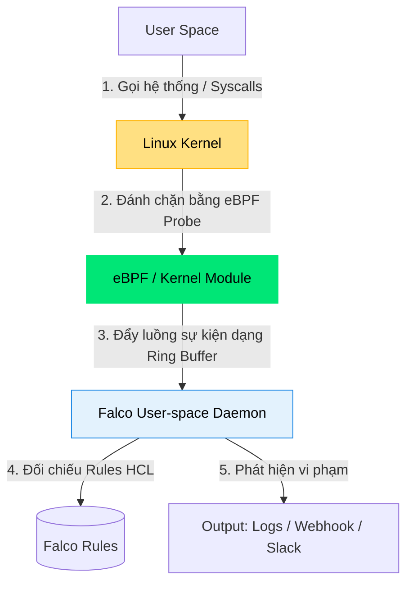

# 🚨 Sub-module 01: Giám sát Runtime Security & Ứng phó Sự cố (Falco & Incident Response)

Sub-module này cung cấp kiến thức nền tảng và nâng cao về **Runtime Security** — giám sát và bảo vệ ứng dụng khi đang vận hành thực tế bằng công cụ CNCF hàng đầu **Falco**, kết hợp cơ chế nhân Linux **eBPF**.

---

## 1. Tại sao cần Giám sát Runtime?

Tất cả các chốt chặn tĩnh như SAST, SCA hay quét Container Image chỉ giúp bạn phát hiện những lỗ hổng **đã biết** tại thời điểm build. 
Tuy nhiên, khi ứng dụng chạy trên môi trường thực tế (Runtime), hacker vẫn có thể khai báo tấn công thông qua các lỗ hổng chưa được công bố (**Zero-day Vulnerabilities**). Khi hacker đã chiếm quyền điều khiển container thành công (v.d: Remote Code Execution):
*   Họ sẽ lập tức chạy lệnh `sh` hoặc `bash` để tương tác với OS.
*   Họ sẽ tìm cách đọc các tệp tin nhạy cảm của Linux như `/etc/shadow`, `/etc/passwd`.
*   Họ sẽ tải xuống các đoạn script độc hại và ghi đè vào các thư mục hệ thống như `/bin` hay `/usr/bin`.
Để phát hiện những hành động phá hoại này, ta phải giám sát liên tục các hành vi ở mức **Hệ điều hành / Nhân Kernel (OS/Kernel level)**.

---

## 2. Bản chất Cơ chế hoạt động của Falco qua eBPF

**Falco** (phát triển bởi Sysdig và được CNCF chứng nhận) là bộ máy giám sát hành vi runtime hàng đầu hiện nay.



### 2.1. eBPF (Extended Berkeley Packet Filter) là gì?
Trước đây, để can thiệp vào nhân Linux, người ta phải viết các Kernel Modules rất nguy hiểm, có thể làm sập (Crash) toàn bộ hệ thống máy chủ nếu có lỗi code.
**eBPF** thay đổi hoàn toàn điều đó. eBPF cho phép chạy các chương trình nhỏ, an toàn trực tiếp **bên trong nhân Linux Kernel** mà không cần sửa đổi mã nguồn kernel hay load thêm module ngoài. Các chương trình eBPF chạy ở chế độ Sandboxed, được xác thực độ an toàn tuyệt đối trước khi chạy bởi eBPF Verifier.

### 2.2. Cách Falco hoạt động
1.  **Đánh chặn Syscalls**: Khi bất kỳ tiến trình nào chạy (như container gọi lệnh `cat /etc/passwd`), nó bắt buộc phải gửi một lệnh gọi hệ thống (**System Call - Syscall** như `openat`, `execve`) xuống Kernel. eBPF probe của Falco sẽ lập tức đánh chặn và bắt giữ sự kiện này.
2.  **Đẩy lên User Space**: Lệnh gọi hệ thống được chuyển cực nhanh qua bộ nhớ đệm (Ring Buffer) lên phần mềm Falco chạy ở User Space.
3.  **So khớp Quy tắc (Rules Engine)**: Falco phân tích cú pháp sự kiện và đối chiếu với các quy tắc bảo mật được định nghĩa sẵn.
4.  **Bắn cảnh báo**: Nếu phát hiện hành vi vi phạm, Falco xuất cảnh báo lập tức (Slack, Webhook, stdout).

---

## 3. Cấu trúc Viết Luật của Falco (Falco Rules)

Falco Rules sử dụng định dạng YAML rất tường minh, gồm 3 thành phần chính:
1.  **List**: Danh sách các từ khóa tái sử dụng.
2.  **Macro**: Các điều kiện lọc logic viết gọn để tái sử dụng.
3.  **Rule**: Quy tắc thực tế định nghĩa điều kiện chặn và thông báo lỗi.

*Ví dụ quy tắc phát hiện container tự ý chạy Bash Shell:*
```yaml
- rule: Spawn Shell in Container
  desc: Phát hiện hành vi mở terminal (bash/sh) inside container
  condition: container.id != host and spawned_process and proc.name in (bash, sh)
  output: "🚨 CẢNH BÁO RUNTIME: Phát hiện mở Shell trong Container (user=%user.name %proc.cmdline container_id=%container.id image=%container.image.repository)"
  priority: WARNING
```

---

## 4. ⚔️ Diễn Tập Thực Chiến SecOps: Lab Firedrill Với Falco

Để kiểm chứng khả năng phản ứng nhanh của kỹ sư SecOps trước các cuộc tấn công thời gian thực (Runtime Attacks), chúng ta sẽ tiến hành một bài diễn tập thực chiến **"SecOps Firedrill"** giả lập hành vi thâm nhập của hacker và quy trình phát hiện tự động bằng Falco.

### A. Kịch bản Diễn tập (Firedrill Scenario)
1. **Thâm nhập**: Hacker lợi dụng một lỗi bảo mật ứng dụng để truy cập thành công vào container.
2. **Khai thác phá hoại (Malicious Activities)**:
   * Hacker cố tình mở một terminal tương tác (`sh` hoặc `bash`) bên trong container để thám thính.
   * Hacker thực hiện đọc trộm thông tin nhạy cảm của hệ thống bằng lệnh: `cat /etc/shadow`.
3. **Phòng thủ & Báo động**: Falco sử dụng eBPF probe để bắt giữ toàn bộ các system call này, so khớp luật bảo mật và ngay lập tức bắn cảnh báo lên console hoặc kênh chat Slack của đội ngũ SecOps.

### B. Hướng dẫn Từng Bước Diễn Tập trên Docker CLI
Nếu bạn đã khởi chạy dịch vụ Falco trên máy chủ (qua bài lab chi tiết), bạn có thể tự mình giả lập vai trò hacker để kiểm tra hệ thống:

```bash
# 1. Khởi chạy một container ứng dụng giả lập chạy ngầm (nạn nhân)
docker run -d --name victim-app-container alpine sleep 3600

# 2. Bước diễn tập 1: Hacker thực hiện "Exec" trái phép để mở Shell
docker exec -it victim-app-container sh

# 3. Bước diễn tập 2: Bên trong container, hacker đọc trộm file nhạy cảm
# (Chạy lệnh này trực tiếp trong terminal sh của container)
cat /etc/shadow

# Thoát ra ngoài container
exit
```

### C. Kết Quả Cảnh Báo Từ Falco
Ngay lập tức, bạn kiểm tra nhật ký hoạt động của container Falco bằng lệnh:
```bash
docker logs falco
```
Ref: Bạn sẽ thấy các dòng log cảnh báo màu sắc tương ứng xuất hiện:
* `🚨 CẢNH BÁO RUNTIME: Phát hiện mở Shell trong Container... proc.cmdline=sh container_id=...`
* `🚨 CẢNH BÁO RUNTIME: Phát hiện đọc file nhạy cảm... proc.cmdline=cat /etc/shadow container_id=...`

Thông qua bài diễn tập này, bạn đã thực sự làm chủ quy trình phát hiện xâm nhập chủ động ở tầng nhân hệ điều hành, giúp bảo vệ an toàn cho hệ thống microservices trước mọi mối đe dọa ẩn mình!

---

## 📚 Tài liệu đọc thêm khuyến nghị

### 🇻🇳 [Diễn Tập Ứng Phó Sự Cố Runtime Thực Tế Với Falco (SecOps Firedrill)](./blog/falco-incident-response-firedrill.md)
*   **Chi tiết**: Hướng dẫn dịch thuật và biên soạn chi tiết từ Sysdig Security Research về quy trình xây dựng kịch bản Firedrill chuyên nghiệp.
*   **Giá trị thực tiễn**: Khám phá kiến trúc chi tiết của Falco eBPF, hướng dẫn từng bước viết luật Falco tùy biến nâng cao để bắt các hành vi tấn công tinh vi, và quy trình tự động hóa kích hoạt Incident Response (như tự động cách ly/hủy Pod khi phát hiện có mã độc).
*   **Liên kết nguồn gốc**: [Sysdig Blog - Container Runtime Security with Falco](https://sysdig.com/blog/container-security-falco/)

### 🇬🇧 Tài liệu chính thống (Official Docs)
*   **[Falco Rules Reference](https://falco.org/docs/rules/)** — Tài liệu tra cứu toàn bộ các trường dữ liệu và cách viết filter của Falco.
*   **[eBPF Official Website](https://ebpf.io/)** — Tìm hiểu sâu sắc công nghệ thay đổi bộ mặt hệ điều hành eBPF.

---

## 🚀 Bước tiếp theo
Hãy thực hành bài Lab tự chạy một container Falco và viết cấu hình luật để bắt gọn hành vi hacker mở shell và sửa file `/etc` inside container:

👉 **[Bắt đầu bài Lab thực hành: Falco Runtime](./labs/lab-incident-response/lab-instructions.md)**
