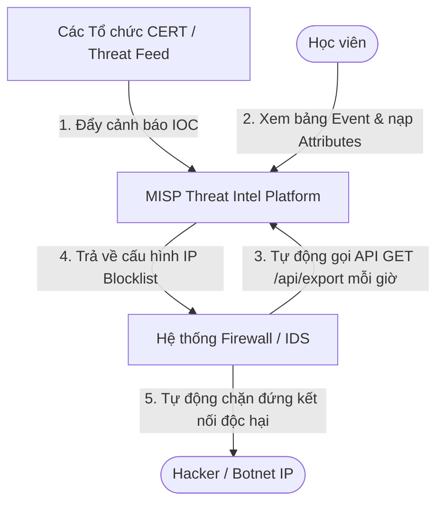

# 🧪 Lab 09: Quản lý Chỉ số Nguy cơ & Tích hợp Tự động hóa với MISP (MISP Threat Intel Lab)

## 📌 Lý do bài thực hành này tồn tại (Why this Lab?)
Để chủ động phòng thủ trước các đợt tấn công nguy hiểm, SecOps bắt buộc phải sử dụng **Threat Intelligence (Tình báo mối đe dọa)**.
Nền tảng **MISP** giúp tập hợp và quản lý toàn bộ các Chỉ số Lây nhiễm (IOCs) thu thập từ các CERT quốc tế. Tuy nhiên, nếu chỉ lưu trữ thụ động trên giao diện web thì vô giá trị.
Bài lab này hướng dẫn bạn:
1. Khám phá giao diện quản trị **Events & Attributes (IOCs)** của máy chủ MISP.
2. Tìm hiểu cách tích hợp tự động hóa: Cách MISP **xuất (Export) API dữ liệu IOC thô** để cung cấp cho các thiết bị mạng/Firewall/IDS tự động tải và chặn đứng hacker mà không cần cấu hình thủ công!

---

## ⚙️ Sơ đồ Quy trình Tự động hóa Threat Intel



---

## 🛠️ Các bước Thực hành Chi tiết

### Bước 1: Khởi động Máy chủ MISP
Hãy di chuyển vào thư mục bài lab và chạy Docker Compose để khởi chạy container:
```bash
docker-compose up -d
```
*Lưu ý: Docker sẽ khởi động máy chủ MISP Mock siêu nhẹ viết bằng Python, sẵn sàng hoạt động trong 1 giây!*

### Bước 2: Khám phá Bảng điều khiển MISP Web UI
1.  Mở trình duyệt truy cập địa chỉ: [http://localhost:8082](http://localhost:8082).
2.  Bạn sẽ thấy giao diện **MISP Threat Intelligence Platform**.
3.  Hãy đọc sự kiện an ninh đang được hiển thị:
    *   **Event**: *"APT32 Phishing Campaign Targeting Vietnam Banks"* (Chiến dịch lừa đảo APT32 nhắm vào các Ngân hàng Việt Nam).
    *   **Threat Level**: **High** (Cấp độ nguy hiểm Cao).
4.  Quan sát bảng **Attributes (Chỉ số lây nhiễm - IOCs)** đi kèm sự kiện này:
    *   Hacker sử dụng IP máy chủ C2 điều khiển: `198.51.100.45` (Loại: `ip-dst`).
    *   Hacker sử dụng tên miền giả mạo ngân hàng: `secure-ebank-login.com` (Loại: `domain`).
    *   Hacker sử dụng payload mã độc có mã băm: `e3b0c44298fc1c...` (Loại: `sha256`).

### Bước 3: Tìm hiểu Tích hợp Tự động hóa qua API
Để tự động hóa chặn IP độc hại ở lớp Firewall:
1.  Nhấp vào nút màu tím **Xem API Xuất cấu hình Firewall (Suricata/IP list)** hoặc truy cập trực tiếp địa chỉ: [http://localhost:8082/api/export/firewall](http://localhost:8082/api/export/firewall).
2.  Bạn sẽ thấy output trả về một danh sách IP thô chuẩn định dạng cấu hình Blocklist:
    ```
    # MISP Automated Threat Intel IP Blocklist
    198.51.100.45 # BLOCKED: APT32 Phishing Campaign Targeting Vietnam Banks (C2 Server IP)
    ```
3.  **Cơ chế hoạt động trong thực tế**: Các kỹ sư SecOps sẽ cấu hình các bộ định tuyến/Firewall/IDS (như pfSense, Suricata, Fortigate) lập lịch cronjob cứ mỗi 1 giờ gọi API GET này một lần để nạp dải IP bị cấm. Khi có bất kỳ máy chủ nội bộ nào cố tình kết nối ra IP `198.51.100.45` (hoặc ngược lại), Firewall sẽ lập tức Drop kết nối tự động, bẻ gãy chiến dịch của hacker!

### Bước 4: Dọn dẹp môi trường
Tắt container sau khi hoàn thành thực hành:
```bash
docker-compose down
```

---

## 🎯 Tổng kết Bài học
Qua bài thực hành này, bạn đã:
*   Hiểu bản chất và vai trò của **Threat Intelligence (Tình báo mối đe dọa)** trong SecOps.
*   Nắm vững cấu trúc của **Events** và các loại chỉ số **Attributes (IOCs)** trên hệ thống MISP.
*   Hiểu luồng tự động hóa tích hợp: cách xuất dữ liệu qua API để cung cấp danh sách IP blocklist động cho các hệ thống an ninh mạng tự động cập nhật chính sách chặn đứng hacker.
