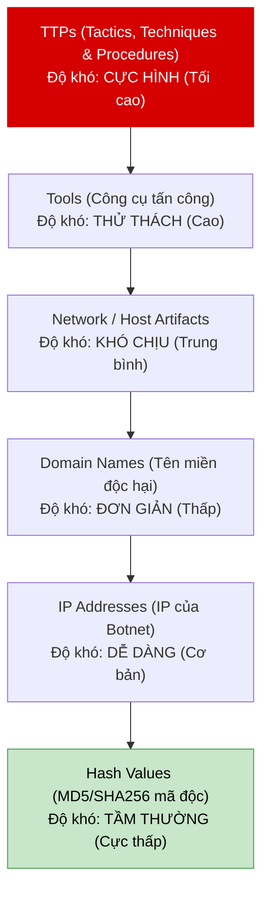

# 🕵️ Sub-module 02: Threat Intelligence & Quản trị Nguy cơ với MISP (Threat Intelligence)

Sub-module này cung cấp kiến thức nền tảng và nâng cao về **Threat Intelligence (Tình báo mối đe dọa)** — kỹ thuật thu thập, phân tích và chia sẻ các nguy cơ an ninh mạng toàn cầu bằng nền tảng mã nguồn mở hàng đầu **MISP**.

---

## 1. Threat Intelligence là gì?

Trong thế giới an ninh mạng phòng thủ, bạn không thể chiến đấu đơn độc trong bóng tối. Hacker luôn thay đổi phương thức tấn công và chia sẻ các công cụ tấn công trên Deepweb/Darkweb.
**Threat Intelligence (Tình báo mối đe dọa)** là tri thức dựa trên bằng chứng về một mối đe dọa hiện hữu hoặc mới nổi đối với tài sản thông tin của doanh nghiệp. Nó giúp chuyển dịch trạng thái bảo mật từ **Bị động (Reactive - đợi bị tấn công mới chống đỡ)** sang **Chủ động (Proactive - thu thập thông tin để phòng thủ trước)**.

---

## 2. Chỉ số Lây nhiễm (IOCs) & Kim tự tháp Nỗi đau (Pyramid of Pain)

Trong SecOps, các thông tin dấu vết của hacker để lại được gọi là **Chỉ số Lây nhiễm (Indicators of Compromise - IOCs)**. David J. Bianco đã đưa ra khái niệm kinh điển **Kim tự tháp Nỗi đau (Pyramid of Pain)** để thể hiện mức độ khó khăn gây ra cho hacker khi bạn chủ động chặn đứng từng loại IOC:

### 2.1. Các mức độ của Kim tự tháp Nỗi đau:
1.  **Hash Values (Mã băm mã độc - MD5/SHA256)**: Hacker chỉ cần thay đổi 1 ký tự trong code, mã băm sẽ thay đổi hoàn toàn. Việc chặn Hash cực kỳ dễ cho bạn nhưng gây **tầm thường** cho hacker.
2.  **IP Addresses (Địa chỉ IP)**: IP có thể dễ dàng thay đổi qua Proxy/VPN/Tor. Chặn IP gây khó dễ **dễ dàng** cho hacker.
3.  **Domain Names (Tên miền)**: Mua tên miền mới mất phí và thời gian đăng ký. Chặn tên miền gây **đơn giản** cho hacker.
4.  **Network/Host Artifacts (Dấu vết mạng/host)**: Các chuỗi User-agent đặc trưng, cấu trúc URI của malware. Chặn phần này khiến hacker **khó chịu** vì phải cấu hình lại malware.
5.  **Tools (Công cụ)**: Chặn đứng chữ ký của công cụ scan (v.d: phát hiện ZAP, Nmap). Hacker phải tự viết công cụ mới hoặc sửa code sâu. Gây **thử thách** lớn.
6.  **TTPs (Tactics, Techniques, and Procedures)**: Bản chất hành vi tấn công (v.d: cách thức leo thang đặc quyền). Nếu bạn chặn được TTPs, bạn đã bẻ gãy hoàn toàn chiến thuật của hacker, bắt buộc chúng phải học lại từ đầu. Gây ra **nỗi đau tối cao** cho đối thủ!

---

## 3. Nền tảng MISP (Malware Information Sharing Platform)

**MISP** là nền tảng chia sẻ thông tin mối đe dọa mạng mã nguồn mở hàng đầu, được hàng ngàn tổ chức chính phủ, ngân hàng và CERT toàn cầu tin dùng.

### 3.1. Các thành phần dữ liệu cốt lõi trong MISP:
*   **Events (Sự kiện)**: Bản ghi mô tả chi tiết về một chiến dịch tấn công hoặc mối đe dọa (ví dụ: *"Chiến dịch Ransomware tấn công hệ thống Ngân hàng 2026"*).
*   **Attributes (Thuộc tính - IOCs)**: Các giá trị IOC cụ thể nằm trong Event (ví dụ: địa chỉ IP của máy chủ C2, file hash của mã độc).
*   **Galaxies**: Các thông tin phân loại nâng cao, gắn kết Event với các nhóm APT (Advanced Persistent Threat) khét tiếng toàn cầu hoặc kỹ thuật trong framework **MITRE ATT&CK**.
*   **Feeds**: Các nguồn dữ liệu Threat Intelligence tự động đẩy từ bên ngoài vào MISP để cập nhật liên tục các IP/Domain độc hại mới nhất mỗi giờ.

---

## 📚 Tài liệu đọc thêm khuyến nghị

*   **[MISP Book - Official Documentation](https://www.misp-project.org/documentation/)** — Hướng dẫn toàn diện cài đặt, sử dụng và tích hợp MISP API.
*   **[The Pyramid of Pain - David J. Bianco Blog](https://detect-respond.blogspot.com/2013/03/the-pyramid-of-pain.html)** — Bài viết gốc khai sinh khái niệm Pyramid of Pain nổi tiếng ngành SecOps.

---

## 🚀 Bước tiếp theo
Hãy thực hành bài Lab tự dựng một cụm MISP siêu gọn nhẹ để tìm hiểu giao diện, cách thức tạo Event, nạp thuộc tính Attributes (IOCs) và cách xuất (Export) dữ liệu IOC để tích hợp chặn đứng IP độc hại ở lớp Firewall/IDS:

👉 **[Bắt đầu bài Lab thực hành: MISP Intel](./labs/lab-misp-intel/lab-instructions.md)**
