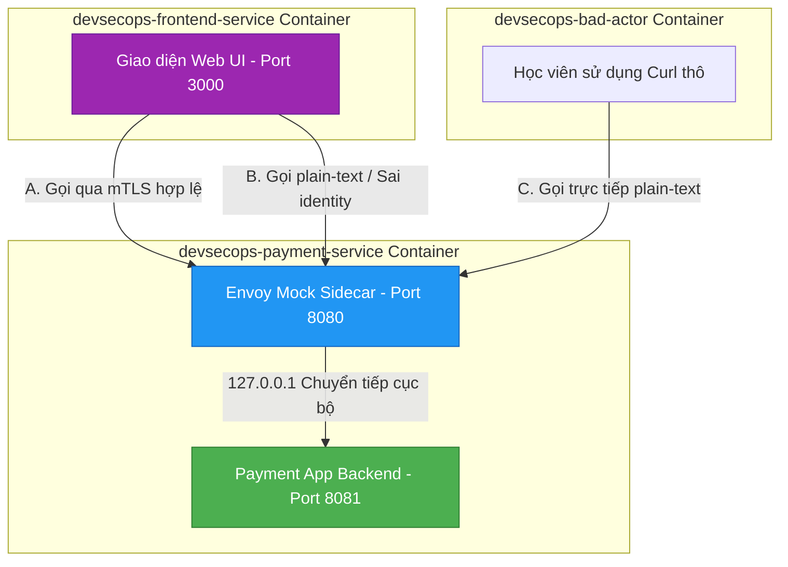

# 🧪 Lab 09: Mạng An toàn Zero-Trust với Service Mesh Istio (Zero Trust & mTLS)

## 📌 Lý do bài thực hành này tồn tại (Why this Lab?)
Trong kiến trúc Microservices, nếu hacker xâm nhập thành công vào một container, chúng có thể tự do quét mạng nội bộ và thực hiện các cuộc gọi API trái phép tới các dịch vụ nhạy cảm khác (Lateral Movement).
Bài thực hành này giúp bạn làm quen và vận hành trực quan cơ chế bảo mật cốt lõi của **Service Mesh Istio**:
1.  **PeerAuthentication (mTLS)**: Ép buộc mã hóa toàn bộ đường truyền dữ liệu giữa các dịch vụ, chặn đứng mọi kết nối plain-text không an toàn ở mức hạ tầng mạng.
2.  **AuthorizationPolicy (RBAC)**: Phân quyền chi tiết ở mức ứng dụng (Ai được quyền gọi dịch vụ nào, qua HTTP method nào, truy cập đường dẫn URL nào).

Thông qua việc tương tác trực quan với giao diện Web đẹp mắt và chỉnh sửa trực tiếp các tệp tin manifest YAML chuẩn của Kubernetes/Istio ngay tại máy cá nhân, bạn sẽ hiểu sâu sắc bản chất hoạt động của bộ đôi quyền lực này.

---

## ⚙️ Sơ đồ Kiến trúc & Kịch bản Kiểm thử



---

## 🛠️ Các bước Thực hành Chi tiết

### Bước 1: Khởi chạy cụm Lab
Di chuyển vào thư mục bài lab và khởi chạy các container bằng lệnh sau:
```bash
docker-compose up -d
```
*Docker sẽ khởi dựng 3 container: ứng dụng Frontend (cổng 3000), ứng dụng Payment được bảo vệ bởi Mock Envoy Sidecar (cổng 8080), và một container Bad-actor dùng để mô phỏng hacker mạng nội bộ.*

### Bước 2: Khám phá giao diện Web UI và Thử nghiệm chế độ Permissive
1. Mở trình duyệt Web và truy cập vào địa chỉ: [http://localhost:3000](http://localhost:3000).
2. Hãy thử nghiệm gửi các yêu cầu bằng cách click vào các nút bấm bên trái:
   * **🔓 Gọi Plain-text (Không mTLS)**: Kết quả trả về **SUCCESS (200)**. Bởi vì mặc định trong file `manifests/peer-authentication.yaml`, chế độ mTLS đang ở trạng thái `PERMISSIVE` (Chấp nhận cả HTTP thường lẫn HTTPS mTLS).
   * **🔒 Gọi mTLS (Frontend Service)**: Kết quả trả về **SUCCESS (200)**. Cuộc gọi đi qua kênh mTLS an toàn với định danh danh tính `frontend-service-account`.
   * **🚨 Giả lập Hacker (Sai Identity)**: Kết quả trả về **BLOCKED (403 FORBIDDEN)** kèm thông báo `RBAC: access denied`. Tại sao cuộc gọi này bị chặn? Vì mặc dù truyền qua mTLS, định danh gửi đi là `hacker-service-account`, không trùng khớp với chính sách được cấu hình trong `manifests/authorization-policy.yaml` (chỉ cho phép `frontend-service-account`).

### Bước 3: Thiết lập STRICT mTLS để bảo vệ hạ tầng mạng
Mục tiêu là chặn đứng toàn bộ các cuộc gọi không mã hóa plain-text đi vào microservice Payment.
1. Mở file [peer-authentication.yaml](./manifests/peer-authentication.yaml) trên trình soạn thảo.
2. Sửa giá trị của cấu hình `mode` từ `PERMISSIVE` thành `STRICT`:
```yaml
spec:
  mtls:
    mode: STRICT
```
3. Lưu file cấu hình lại. Sidecar Proxy sẽ tự động phát hiện cấu hình thay đổi thời gian thực thông qua shared volume!
4. Trở lại trình duyệt Web [http://localhost:3000](http://localhost:3000):
   * Hãy click lại nút **🔓 Gọi Plain-text (Không mTLS)**.
   * Lần này kết quả sẽ ngay lập tức bị **BLOCKED (403 FORBIDDEN)** với thông báo lỗi chuẩn của Envoy:
     `upstream connect error or disconnect/reset before headers. reset reason: connection termination (mTLS STRICT mode enforced by Istio)`.
   * Thử click nút **🔒 Gọi mTLS (Frontend Service)**. Kết quả vẫn trả về **SUCCESS (200)** hoàn hảo.
   
*Như vậy, chế độ STRICT mTLS đã bảo vệ thành công biên mạng microservice Payment khỏi mọi truy cập không an toàn!*

### Bước 4: Kiểm chứng trực tiếp bằng Curl từ Bad Actor Container
Để chứng minh hacker nằm chung mạng nội bộ cũng không thể "sniff" hay thực hiện các cuộc gọi trái phép thô sơ khi đã bật mTLS STRICT:
1. Mở Terminal máy host và chui vào container `devsecops-bad-actor`:
```bash
docker exec -it devsecops-bad-actor sh
```
2. Thực hiện lệnh `curl` trực tiếp đến cổng của Sidecar Payment:
```bash
curl -i http://payment-service:8080/pay
```
3. Bạn sẽ nhận được phản hồi lỗi `403 Forbidden` do vi phạm chính sách STRICT mTLS:
```http
HTTP/1.0 403 Forbidden
Content-Type: text/plain; charset=utf-8

upstream connect error or disconnect/reset before headers. reset reason: connection termination (mTLS STRICT mode enforced by Istio)
```
4. Gõ `exit` để thoát khỏi container của hacker.

### Bước 5: Dọn dẹp môi trường Lab
Sau khi hoàn tất bài thực hành, hãy dọn dẹp các tài nguyên mạng và container:
```bash
docker-compose down
```

---

## 🎯 Tổng kết Bài học
Qua bài thực hành thực tế này, bạn đã tự tay kiểm chứng:
*   **Bản chất Zero-Trust**: Không tin tưởng bất kỳ ai trong mạng nội bộ, mọi giao tiếp microservices phải được mã hóa song phương mTLS đầu-cuối.
*   **Sức mạnh của Istio Sidecar**: Ép buộc chính sách bảo mật biên mà lập trình viên không cần sửa đổi một dòng code nguồn của ứng dụng.
*   **Phối hợp Nhịp nhàng**: PeerAuthentication (ngăn chặn kẻ trộm nghe lén, ép buộc mTLS) và AuthorizationPolicy (kiểm soát chi tiết quyền gọi API dựa trên danh tính được xác thực bảo mật mật mã).
