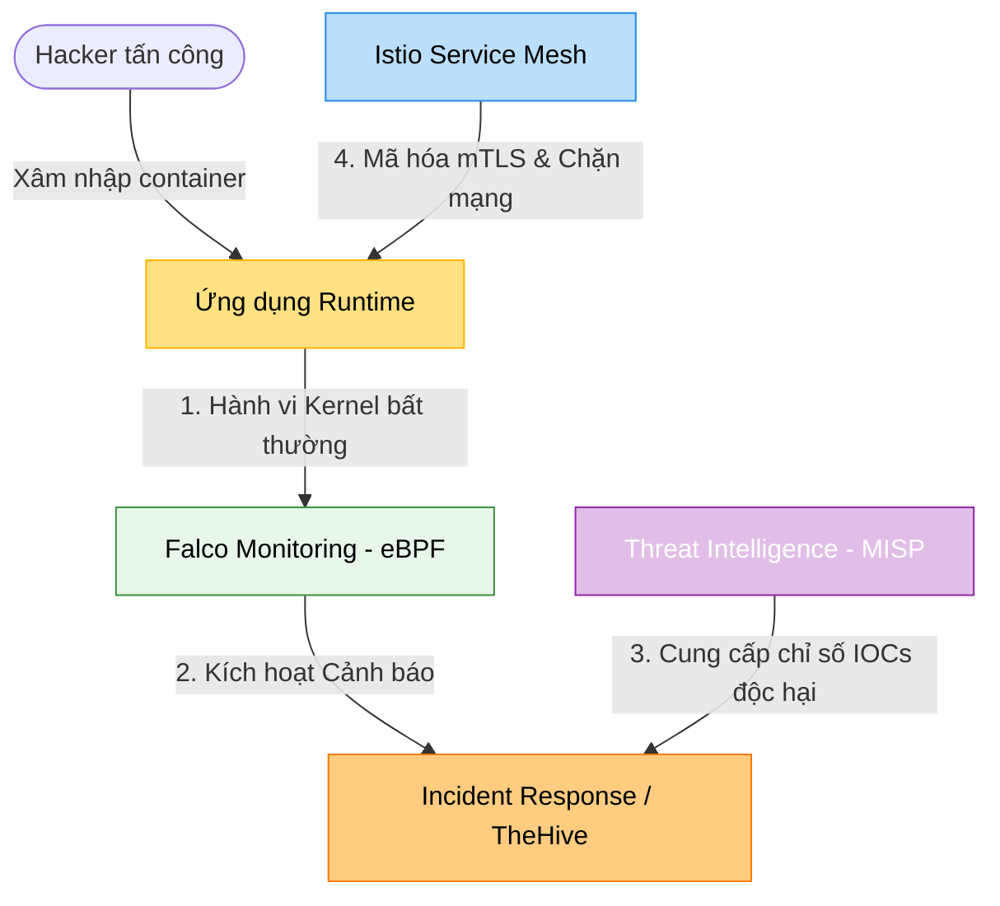

# 🛡️ MODULE 8 — VẬN HÀNH AN NINH & PHÒNG THỦ (SECURITY OPERATIONS - SecOps)

Chào mừng bạn đến với Module nâng cao cuối cùng của lộ trình DevSecOps: **Vận hành An ninh & Phòng thủ (Security Operations - SecOps)**. Ở các module trước, bạn đã học cách quét bảo mật trong pipeline (tĩnh). Tuy nhiên, trong thực tế, các cuộc tấn công tinh vi luôn diễn ra ở môi trường **Runtime (khi ứng dụng đang chạy)**. SecOps giúp bạn giám sát liên tục hệ thống, phát hiện các hành vi bất thường của hacker và xây dựng mạng lưới Zero-trust bảo vệ dữ liệu tuyệt đối.

---

## 🔍 Kiến trúc Vận hành An ninh Phòng thủ Chủ động (SecOps Architecture)

Trong Module này, bạn sẽ học cách thiết kế và vận hành hệ thống giám sát và phòng thủ runtime:



### 1. Runtime Security & Incident Response — Giám sát Hành vi Kernel
*   **Mục tiêu**: Giám sát sâu các tiến trình chạy inside container thông qua lớp nhân Linux Kernel bằng công nghệ **eBPF**. Phát hiện tức thời các hành vi bất thường (v.d: container tự ý chạy bash shell, ghi đè file cấu hình hệ thống `/etc/shadow`).
*   **Công cụ**: Falco, TheHive.

### 2. Threat Intelligence — Thu thập Mối đe dọa toàn cầu
*   **Mục tiêu**: Thu thập, phân loại và chia sẻ các Chỉ số Lây nhiễm (Indicators of Compromise - IOCs) như danh sách IP của botnet, mã hash của mã độc để chủ động chặn đứng tấn công.
*   **Công cụ**: MISP (Malware Information Sharing Platform).

### 3. Service Mesh & Zero Trust — Không bao giờ tin tưởng, Luôn xác minh
*   **Mục tiêu**: Thiết lập cơ chế **Zero Trust Network**. Mã hóa toàn bộ giao tiếp nội bộ giữa các microservices bằng **mTLS (Mutual TLS)** và cấu hình Authorization Policies chặn đứng các kết nối không hợp lệ.
*   **Công cụ**: Istio Service Mesh.

---

## 📁 Cấu trúc Module 8

Module này được phân chia thành 3 sub-module chuyên sâu:

```
08-security-operations/
├── security-operations-overview.md      # File này (Giới thiệu tổng quan)
│
├── incident-response/                   # Sub-module 01: Giám sát Runtime
│   ├── incident-response-guide.md       # Lý thuyết Falco, eBPF và ứng phó sự cố
│   └── labs/
│       └── lab-incident-response/       # Lab: Giám sát runtime container với Falco
│
├── threat-intelligence/                 # Sub-module 02: Threat Intelligence
│   ├── threat-intelligence-guide.md     # Lý thuyết về IOCs, kiến trúc MISP
│   └── labs/
│       └── lab-misp-intel/              # Lab: Cấu hình và quản trị nguy cơ trên MISP
│
└── service-mesh-zero-trust/             # Sub-module 03: Zero Trust Service Mesh
    ├── service-mesh-zero-trust-guide.md # Lý thuyết Service Mesh, mTLS, Envoy Proxy
    └── labs/
        └── lab-istio-mtls/              # Lab: Mô phỏng mã hóa mTLS và viết AuthorizationPolicy
```

---

## 🚀 Lộ trình Học tập

*   👉 **[Bước 1: Giám sát Runtime với Falco](./incident-response/incident-response-guide.md)**.
*   👉 **[Bước 2: Tìm hiểu Threat Intelligence với MISP](./threat-intelligence/threat-intelligence-guide.md)**.
*   👉 **[Bước 3: Xây dựng mạng Zero Trust với Istio mTLS](./service-mesh-zero-trust/service-mesh-zero-trust-guide.md)**.
